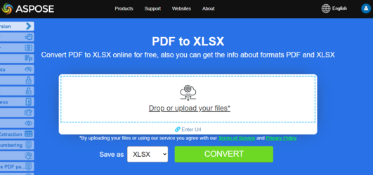

Aspose.PDF for PHP API lets you render your PDF files to Excel [XLS](https://docs.fileformat.com/spreadsheet/xls/) and [XLSX](https://docs.fileformat.com/spreadsheet/xlsx/) file formats. We already have another API, known as [Aspose.Cells for PHP via Java](https://products.aspose.com/cells/php-java), that provides the capability to create and manipulate existing Excel workbooks. It also provides the capability to transform Excel workbooks to PDF format.

{}
**Try to convert PDF to Excel online**

Aspose.PDF for PHP presents you online free application ["PDF to XLSX"](https://products.aspose.app/pdf/conversion/pdf-to-xlsx), where you may try to investigate the functionality and quality it works.

[](https://products.aspose.app/pdf/conversion/pdf-to-xlsx)
{}

## Convert PDF to Excel XLS

To convert PDF files to XLS format, Aspose.PDF has a class called [ExcelSaveOptions](https://reference.aspose.com/pdf/java/com.aspose.pdf/ExcelSaveOptions). An object of the [ExcelSaveOptions](https://reference.aspose.com/pdf/java/com.aspose.pdf/ExcelSaveOptions) class is passed as a second argument to the Document.Save(..) method.

Converting a PDF file into XLSX format is part of the library from Aspose.PDF for PHP 18.6 version. In order to convert PDF files to XLSX format, you need to set format as XLSX using setFormat() method of [ExcelSaveOptions](https://reference.aspose.com/pdf/java/com.aspose.pdf/ExcelSaveOptions) Class.

Following code snippets shows how to convert a PDF file into XLS and XLSX format:

```php
// Load the input PDF document using the Document class.
$document = new Document($inputFile);

// Create an instance of the ExcelSaveOptions class to specify the save options.
$saveOption = new ExcelSaveOptions();

// Set the output format to XLS.
// $saveOption->setFormat(ExcelSaveOptions_ExcelFormat::$XMLSpreadSheet2003);

// Set the output format to XLSX.
$saveOption->setFormat(ExcelSaveOptions_ExcelFormat::$XLSX);

// Save the PDF document as an Excel file using the specified save options.
$document->save($outputFile, $saveOption);
```
