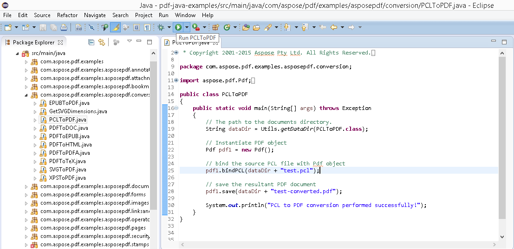

## Baixar do GitHub

Todos os exemplos do Aspose.PDF para Android via Java estão hospedados em [Github](https://github.com/aspose-pdf/Aspose.PDF-for-Java). Você pode clonar o repositório usando seu cliente Github favorito ou baixar o arquivo ZIP de [aqui](https://github.com/aspose-pdf/Aspose.PDF-for-Java/archive/master.zip).

Extraia o conteúdo do arquivo ZIP para qualquer pasta no seu computador. Todos os exemplos estão localizados na pasta **Examples** folder.

O projeto usa o sistema de construção Maven. Qualquer IDE moderno pode abrir ou importar o projeto e suas dependências facilmente. Abaixo mostramos como usar IDEs populares para compilar e executar os exemplos.

### IntelliJ IDEA

Clique no menu **File** e escolha **Open**. Navegue até a pasta do projeto e selecione o arquivo **pom.xml**.

Ele abrirá o projeto e baixará as dependências automaticamente. Na aba **Project**, navegue pelos exemplos na pasta **src/main/java**. Para executar um exemplo, basta clicar com o botão direito no arquivo e escolher "Run ..", o exemplo será executado e a saída será mostrada na janela de console integrada.

### Eclipse

Clique no menu **File** e escolha **Import**. Selecione **Maven** - Existing Maven Projects.

Navegue até a pasta que você clonou ou baixou do GitHub e selecione o arquivo **pom.xml**.

Ele abrirá o projeto e baixará as dependências automaticamente. Na aba **Package Explorer**, navegue pelos exemplos na pasta **src/main/java**. Para executar um exemplo, basta clicar com o botão direito no arquivo e escolher **Run As** - **Java Application**, o exemplo será executado e a saída será mostrada na janela de console integrada.

### NetBeans

Clique no menu **File** e escolha **Open Project**. Navegue até a pasta que você clonou ou baixou do GitHub. O ícone da pasta **Examples** mostrará que é um projeto Maven. Selecione Examples e abra-a.

Ele abrirá o projeto e baixará as dependências automaticamente. Na aba Projects, navegue pelos exemplos em **source packages**. Para executar um exemplo, basta clicar com o botão direito no arquivo e escolher **Run File**, o exemplo será executado e a saída será exibida na janela de saída do console incorporada.

### Contribuir

Se você deseja adicionar ou melhorar um exemplo, incentivamos que contribua para o projeto. Todos os exemplos e projetos de demonstração neste repositório são de código aberto e podem ser usados livremente em suas próprias aplicações.

Para contribuir, você pode fazer um fork do repositório, editar o código-fonte e criar um pull request. Revisaremos as alterações e as incluiremos no repositório se considerarmos úteis.

