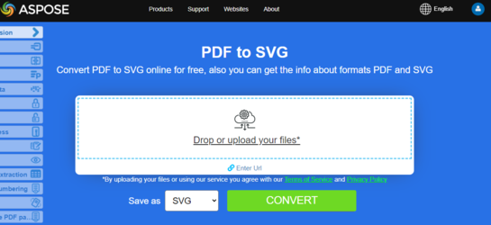

## Go Converter PDF para Imagem

Neste artigo, mostraremos as opções para converter PDF em formatos de imagem.

Documentos digitalizados anteriormente costumam ser salvos no formato de arquivo PDF. No entanto, você precisa editá‑los em um editor gráfico ou enviá‑los posteriormente em formato de imagem? Temos uma ferramenta universal para você converter PDF em imagens usando **Aspose.PDF for Go via C++**.
A tarefa mais comum é quando você precisa salvar um documento PDF inteiro ou algumas páginas específicas de um documento como um conjunto de imagens. **Aspose.PDF for Go via C++** permite converter PDF para os formatos JPG e PNG para simplificar as etapas necessárias para obter suas imagens a partir de um arquivo PDF específico.

**Aspose.PDF for Go via C++** suporta várias conversões de PDF para formatos de imagem. Por favor, verifique a seção [Aspose.PDF Formatos de Arquivo Compatíveis](https://docs.aspose.com/pdf/go-cpp/supported-file-formats/).

## Converter PDF para JPEG

O trecho de código Go fornecido demonstra como converter a primeira página de um documento PDF em uma imagem JPEG usando a biblioteca Aspose.PDF:

1. Abra um documento PDF.
1. Converter uma Página para JPEG usando [PageToJpg](https://reference.aspose.com/pdf/go-cpp/convert/pagetojpg/) função.
1. Feche o documento PDF e libere quaisquer recursos alocados.

```go

    package main

    import "github.com/aspose-pdf/aspose-pdf-go-cpp"
    import "log"

    func main() {
      // Open(filename string) opens a PDF-document with filename
      pdf, err := asposepdf.Open("sample.pdf")
      if err != nil {
        log.Fatal(err)
      }
      // PageToJpg(num int32, resolution_dpi int32, filename string) saves the specified page as Jpg-image file
      err = pdf.PageToJpg(1, 100, "sample_page1.jpg")
      if err != nil {
        log.Fatal(err)
      }
      // Close() releases allocated resources for PDF-document
      defer pdf.Close()
    }
```

{}
**Tente converter PDF para JPEG online**

Aspose.PDF para Go apresenta a você um aplicativo online gratuito ["PDF para JPEG"](https://products.aspose.app/pdf/conversion/pdf-to-jpg), onde você pode tentar investigar a funcionalidade e a qualidade com que funciona.

[](https://products.aspose.app/pdf/conversion/pdf-to-jpg)
{}

## Converter PDF para TIFF

O trecho de código Go fornecido demonstra como converter a primeira página de um documento PDF em uma imagem TIFF usando a biblioteca Aspose.PDF:

1. Abra um documento PDF.
1. Converter uma Página para TIFF usando [PageToTiff](https://reference.aspose.com/pdf/go-cpp/convert/pagetotiff/) função.
1. Feche o documento PDF e libere quaisquer recursos alocados.

```go

    package main

    import "github.com/aspose-pdf/aspose-pdf-go-cpp"
    import "log"

    func main() {
      // Open(filename string) opens a PDF-document with filename
      pdf, err := asposepdf.Open("sample.pdf")
      if err != nil {
        log.Fatal(err)
      }
      // PageToTiff(num int32, resolution_dpi int32, filename string) saves the specified page as Tiff-image file
      err = pdf.PageToTiff(1, 100, "sample_page1.tiff")
      if err != nil {
        log.Fatal(err)
      }
      // Close() releases allocated resources for PDF-document
      defer pdf.Close()
    }
```

{}
**Tente converter PDF para TIFF online**

Aspose.PDF para Go apresenta a você um aplicativo online gratuito ["PDF para TIFF"](https://products.aspose.app/pdf/conversion/pdf-to-tiff), onde você pode tentar investigar a funcionalidade e a qualidade com que funciona.

[](https://products.aspose.app/pdf/conversion/pdf-to-tiff)
{}

## Converter PDF para PNG

O trecho de código Go fornecido demonstra como converter a primeira página de um documento PDF em uma imagem PNG usando a biblioteca Aspose.PDF:

1. Abra um documento PDF.
1. Converter uma página para PNG usando [PageToPng](https://reference.aspose.com/pdf/go-cpp/convert/pagetopng/) função.
1. Feche o documento PDF e libere quaisquer recursos alocados.

```go

    package main

    import "github.com/aspose-pdf/aspose-pdf-go-cpp"
    import "log"

    func main() {
      // Open(filename string) opens a PDF-document with filename
      pdf, err := asposepdf.Open("sample.pdf")
      if err != nil {
        log.Fatal(err)
      }
      // PageToPng(num int32, resolution_dpi int32, filename string) saves the specified page as Png-image file
      err = pdf.PageToPng(1, 100, "sample_page1.png")
      if err != nil {
        log.Fatal(err)
      }
      // Close() releases allocated resources for PDF-document
      defer pdf.Close()
    }
```

{}
**Tente converter PDF para PNG online**

Como exemplo de como nossos aplicativos gratuitos funcionam, por favor, verifique a próxima funcionalidade.

Aspose.PDF para Go apresenta a você um aplicativo online gratuito ["PDF para PNG"](https://products.aspose.app/pdf/conversion/pdf-to-png), onde você pode tentar investigar a funcionalidade e a qualidade com que funciona.

[](https://products.aspose.app/pdf/conversion/pdf-to-png)
{}

**Scalable Vector Graphics (SVG)** é uma família de especificações de um formato de arquivo baseado em XML para gráficos vetoriais bidimensionais, tanto estáticos quanto dinâmicos (interativos ou animados). A especificação SVG é um padrão aberto que está em desenvolvimento pelo World Wide Web Consortium (W3C) desde 1999.

## Converter PDF para SVG

O trecho de código Go fornecido demonstra como converter a primeira página de um documento PDF em uma imagem SVG usando a biblioteca Aspose.PDF:

1. Abra um documento PDF.
1. Converter uma página para SVG usando [PageToSvg](https://reference.aspose.com/pdf/go-cpp/convert/pagetosvg/) função.
1. Feche o documento PDF e libere quaisquer recursos alocados.

```go

    package main

    import "github.com/aspose-pdf/aspose-pdf-go-cpp"
    import "log"

    func main() {
      // Open(filename string) opens a PDF-document with filename
      pdf, err := asposepdf.Open("sample.pdf")
      if err != nil {
        log.Fatal(err)
      }
      // PageToSvg(num int32, filename string) saves the specified page as Svg-image file
      err = pdf.PageToSvg(1, "sample_page1.svg")
      if err != nil {
        log.Fatal(err)
      }
      // Close() releases allocated resources for PDF-document
      defer pdf.Close()
    }
```

{}
**Tente converter PDF para SVG online**

Aspose.PDF para Go apresenta a você um aplicativo online gratuito ["PDF para SVG"](https://products.aspose.app/pdf/conversion/pdf-to-svg), onde você pode tentar investigar a funcionalidade e a qualidade com que funciona.

[](https://products.aspose.app/pdf/conversion/pdf-to-svg)
{}

## Converter PDF para DICOM

O trecho de código Go fornecido demonstra como converter a primeira página de um documento PDF em uma imagem DICOM usando a biblioteca Aspose.PDF:

1. Abra um documento PDF.
1. Converter uma página para DICOM usando [PageToDICOM](https://reference.aspose.com/pdf/go-cpp/convert/pagetodicom/) função.
1. Feche o documento PDF e libere quaisquer recursos alocados.

```go

    package main

    import "github.com/aspose-pdf/aspose-pdf-go-cpp"
    import "log"

    func main() {
      // Open(filename string) opens a PDF-document with filename
      pdf, err := asposepdf.Open("sample.pdf")
      if err != nil {
        log.Fatal(err)
      }
      // PageToDICOM(num int32, resolution_dpi int32, filename string) saves the specified page as DICOM-image file
      err = pdf.PageToDICOM(1, 100, "sample_page1.dcm")
      if err != nil {
        log.Fatal(err)
      }
      // Close() releases allocated resources for PDF-document
      defer pdf.Close()
    }
```

## Converter PDF para BMP

O trecho de código Go fornecido demonstra como converter a primeira página de um documento PDF em uma imagem BMP usando a biblioteca Aspose.PDF:

1. Abra um documento PDF.
1. Converter uma página para BMP usando [PageToBmp](https://reference.aspose.com/pdf/go-cpp/convert/pagetobmp/) função.
1. Feche o documento PDF e libere quaisquer recursos alocados.

```go

    package main

    import "github.com/aspose-pdf/aspose-pdf-go-cpp"
    import "log"

    func main() {
      // Open(filename string) opens a PDF-document with filename
      pdf, err := asposepdf.Open("sample.pdf")
      if err != nil {
        log.Fatal(err)
      }
      // PageToBmp(num int32, resolution_dpi int32, filename string) saves the specified page as Bmp-image file
      err = pdf.PageToBmp(1, 100, "sample_page1.bmp")
      if err != nil {
        log.Fatal(err)
      }
      // Close() releases allocated resources for PDF-document
      defer pdf.Close()
    }
```