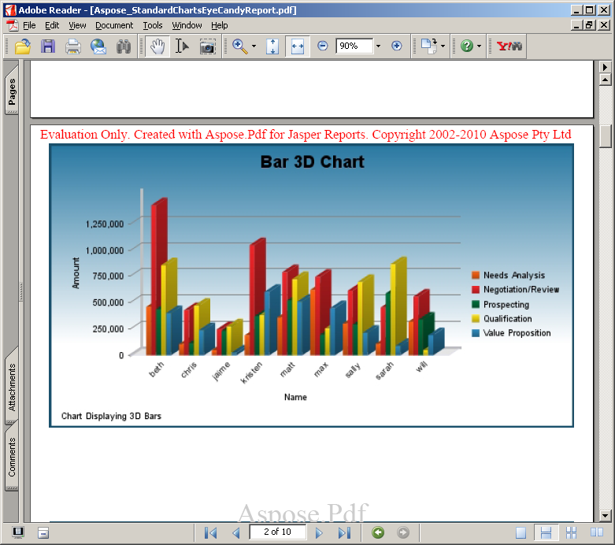

---
title: Trabalhando com JasperServer
linktitle: Working with JasperServer
type: docs
weight: 20
description: Explore how to efficiently work with JasperServer using Aspose.PDF. Export reports to professional PDFs with ease.
lastmod: "2021-06-05"
---

## <ins>Defina o parâmetro do exportador LicenseFile em applicationContext.xml

{}

Este método é usado com JasperServer.

{}

1. Baixe a licença para o seu computador e copie-a para ```<InstallDir>\apache-tomcat\webapps\jasperserver\WEB-INF``` folder, where  ```<InstallDir>``` que significa o diretório de instalação do JasperServer.
2. Locate the ```<InstallDir>\apache-tomcat\webapps\jasperserver\WEB-INF\applicationContext.xml``` file and add the following lines:

```xml
 <bean id="AsposeExportParameters" class="comcom.aspose.pdf.jr3_7_0.jasperreports.JrPdfExportParametersBean">
    <property name="licenseFile" value="C:/jasperserver-pro-3.7.1/apache-tomcat/webapps/jasperserver-pro/WEB-  
    INF/Aspose.Total.JasperReports.lic"/>
</bean>
```

{}
Note: Please note that installation path should not contain any spaces, for example C:/Program Files/JasperServer… as that causes problems when accessing the license file.
{}

## Verify that License Works

Exporte qualquer relatório para formato PDF e verifique se o relatório contém mensagem de avaliação. Se não houver mensagem de avaliação, a licença está funcionando corretamente.

Aspose.PDF for JasperReports injeta uma marca d'água ao trabalhar no modo de avaliação



Aspose.PDF for JasperReports injects a watermark when working in evaluation mode


