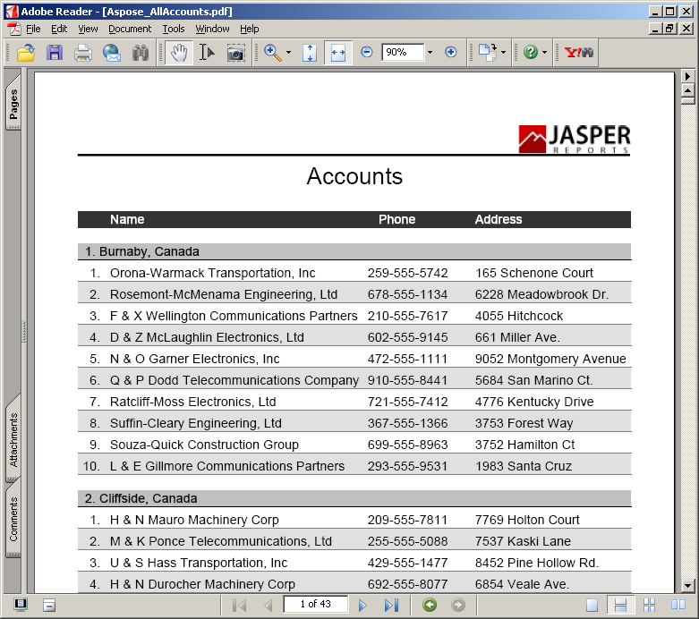

{}

Esta galeria demonstra relatórios PDF exportados por Aspose.PDF for JasperReports.

{}

Os relatórios mostrados abaixo são baseados em dados de exemplo instalados com o JasperServer.

## Relatório de todas as contas

## Relatório das lojas Supermart

## Relatório de gráficos padrão Aegean

## Relatório de gráficos padrão Aegean

## Relatório de gráficos padrão eye candy

## Relatório de gráficos padrão eye candy

## Relatório de gráficos padrão eye candy

## Relatório de gráficos padrão

## Relatório de gráficos padrão

