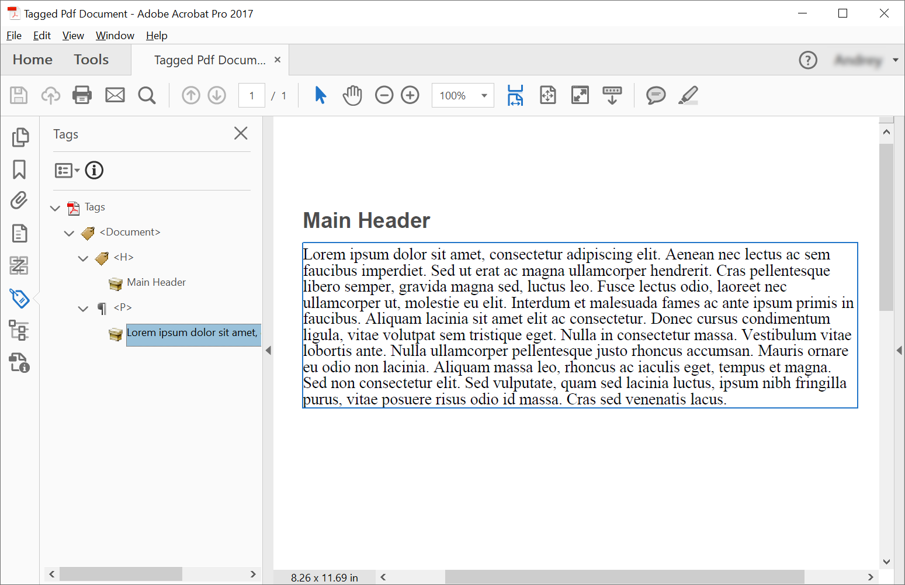

<script type="application/ld+json">
{
    "@context": "https://schema.org",
    "@type": "TechArticle",
    "headline": "Criar PDF Marcado usando C#",
    "alternativeHeadline": "Como criar PDF Marcado",
    "author": {
        "@type": "Person",
        "name":"Anastasiia Holub",
        "givenName": "Anastasiia",
        "familyName": "Holub",
        "url":"https://www.linkedin.com/in/anastasiia-holub-750430225/"
    },
    "genre": "geração de documentos PDF",
    "keywords": "criar, marcado, pdf",
    "wordcount": "302",
    "proficiencyLevel":"Iniciante",
    "publisher": {
        "@type": "Organization",
        "name": "Equipe de Documentação Aspose.PDF",
        "url": "https://products.aspose.com/pdf",
        "logo": "https://www.aspose.cloud/templates/aspose/img/products/pdf/aspose_pdf-for-net.svg",
        "alternateName": "Aspose",
        "sameAs": [
            "https://facebook.com/aspose.pdf/",
            "https://twitter.com/asposepdf",
            "https://www.youtube.com/channel/UCmV9sEg_QWYPi6BJJs7ELOg/featured",
            "https://www.linkedin.com/company/aspose",
            "https://stackoverflow.com/questions/tagged/aspose",
            "https://aspose.quora.com/",
            "https://aspose.github.io/"
        ],
        "contactPoint": [
            {
                "@type": "ContactPoint",
                "telephone": "+1 903 306 1676",
                "contactType": "vendas",
                "areaServed": "US",
                "availableLanguage": "en"
            },
            {
                "@type": "ContactPoint",
                "telephone": "+44 141 628 8900",
                "contactType": "vendas",
                "areaServed": "GB",
                "availableLanguage": "en"
            },
            {
                "@type": "ContactPoint",
                "telephone": "+61 2 8006 6987",
                "contactType": "vendas",
                "areaServed": "AU",
                "availableLanguage": "en"
            }
        ]
    },
    "url": "/net/create-tagged-pdf/",
    "mainEntityOfPage": {
        "@type": "WebPage",
        "@id": "/net/create-tagged-pdf/"
    },
    "dateModified": "2022-02-04",
    "description": "Este artigo explica como criar elementos de estrutura para documento PDF Marcado programaticamente usando Aspose.PDF para .NET."
}
</script>
Criar um PDF Marcado significa adicionar (ou criar) certos elementos ao documento que permitirão que o documento seja validado de acordo com os requisitos do PDF/UA. Esses elementos são frequentemente chamados de Elementos Estruturais.

O seguinte trecho de código também funciona com a biblioteca [Aspose.PDF.Drawing](/pdf/pt/net/drawing/).

## Criando PDF Marcado (Cenário Simples)

Para criar elementos estruturais em um Documento PDF Marcado, o Aspose.PDF oferece métodos para criar um elemento estrutural usando a interface [ITaggedContent](https://reference.aspose.com/pdf/net/aspose.pdf.tagged/itaggedcontent). O trecho de código a seguir mostra como criar um PDF Marcado que contém 2 elementos: cabeçalho e parágrafo.

```csharp
private static void CreateTaggedPdfDocument01()
{
    // Criar Documento PDF
    var document = new Document();

    // Obter Conteúdo para trabalhar com TaggedPdf
    ITaggedContent taggedContent = document.TaggedContent;
    var rootElement = taggedContent.RootElement;
    // Definir Título e Idioma para o Documento
    taggedContent.SetTitle("Documento PDF Marcado");
    taggedContent.SetLanguage("en-US");

    // 
    HeaderElement mainHeader = taggedContent.CreateHeaderElement();
    mainHeader.SetText("Cabeçalho Principal");

    ParagraphElement paragraphElement = taggedContent.CreateParagraphElement();
    paragraphElement.SetText("Lorem ipsum dolor sit amet, consectetur adipiscing elit. " +
    "Aenean nec lectus ac sem faucibus imperdiet. Sed ut erat ac magna ullamcorper hendrerit. " +
    "Cras pellentesque libero semper, gravida magna sed, luctus leo. Fusce lectus odio, laoreet" +
    "nec ullamcorper ut, molestie eu elit. Interdum et malesuada fames ac ante ipsum primis in faucibus." +
    "Aliquam lacinia sit amet elit ac consectetur. Donec cursus condimentum ligula, vitae volutpat" +
    "sem tristique eget. Nulla in consectetur massa. Vestibulum vitae lobortis ante. Nulla ullamcorper" +
    "pellentesque justo rhoncus accumsan. Mauris ornare eu odio non lacinia. Aliquam massa leo, rhoncus" +
    "ac iaculis eget, tempus et magna. Sed non consectetur elit. Sed vulputate, quam sed lacinia luctus," +
    "ipsum nibh fringilla purus, vitae posuere risus odio id massa. Cras sed venenatis lacus.");

    rootElement.AppendChild(mainHeader);
    rootElement.AppendChild(paragraphElement);

    // Salvar Documento PDF Marcado
    document.Save("C:\\Samples\\TaggedPDF\\Sample1.pdf");
}
```
Obteremos o seguinte documento após a criação:



## Criando PDF marcado com elementos aninhados (Criando Árvore de Elementos de Estrutura)

Em alguns casos, precisamos criar uma estrutura mais complexa, por exemplo, colocar citações em parágrafo.
Para criar uma árvore de elementos de estrutura, devemos usar o método [AppendChild](https://reference.aspose.com/pdf/net/aspose.pdf.logicalstructure/element/methods/appendchild).
O seguinte trecho de código mostra como criar uma árvore de elementos de estrutura de um Documento PDF Marcado:

```csharp
private static void CreateTaggedPdfDocument02()
{
    // Criar Documento Pdf
    var document = new Document();

    // Obter Conteúdo para trabalhar com TaggedPdf
    ITaggedContent taggedContent = document.TaggedContent;
    var rootElement = taggedContent.RootElement;
    // Definir Título e Idioma para o Documento
    taggedContent.SetTitle("Documento PDF Marcado");
    taggedContent.SetLanguage("en-US");

    HeaderElement header1 = taggedContent.CreateHeaderElement(1);
    header1.SetText("Cabeçalho Nível 1");

    ParagraphElement paragraphWithQuotes = taggedContent.CreateParagraphElement();
    paragraphWithQuotes.StructureTextState.Font = FontRepository.FindFont("Calibri");
    paragraphWithQuotes.StructureTextState.MarginInfo = new MarginInfo(10, 5, 10, 5);

    SpanElement spanElement1 = taggedContent.CreateSpanElement();
    spanElement1.SetText("Lorem ipsum dolor sit amet, consectetur adipiscing elit. Aenean nec lectus ac sem faucibus imperdiet. Sed ut erat ac magna ullamcorper hendrerit. Cras pellentesque libero semper, gravida magna sed, luctus leo. Fusce lectus odio, laoreet nec ullamcorper ut, molestie eu elit. Interdum et malesuada fames ac ante ipsum primis in faucibus. Aliquam lacinia sit amet elit ac consectetur. Donec cursus condimentum ligula, vitae volutpat sem tristique eget. Nulla in consectetur massa. Vestibulum vitae lobortis ante. Nulla ullamcorper pellentesque justo rhoncus accumsan. Mauris ornare eu odio non lacinia. Aliquam massa leo, rhoncus ac iaculis eget, tempus et magna. Sed non consectetur elit. ");
    QuoteElement quoteElement = taggedContent.CreateQuoteElement();
    quoteElement.SetText("Sed vulputate, quam sed lacinia luctus, ipsum nibh fringilla purus, vitae posuere risus odio id massa.");
    quoteElement.StructureTextState.FontStyle = FontStyles.Bold | FontStyles.Italic;
    SpanElement spanElement2 = taggedContent.CreateSpanElement();
    spanElement2.SetText(" Sed non consectetur elit.");

    paragraphWithQuotes.AppendChild(spanElement1);
    paragraphWithQuotes.AppendChild(quoteElement);
    paragraphWithQuotes.AppendChild(spanElement2);

    rootElement.AppendChild(header1);
    rootElement.AppendChild(paragraphWithQuotes);

    // Salvar Documento PDF Marcado
    document.Save("C:\\Samples\\TaggedPDF\\Sample2.pdf");
}
```
Obteremos o seguinte documento após a criação:


## Estruturando o Texto com Estilo

Para estruturar o texto com estilo em um Documento PDF Etiquetado, Aspose.PDF oferece propriedades [Font](https://reference.aspose.com/pdf/net/aspose.pdf.logicalstructure/structuretextstate/properties/font), [FontSize](https://reference.aspose.com/pdf/net/aspose.pdf.logicalstructure/structuretextstate/properties/fontsize), [FontStyle](https://reference.aspose.com/pdf/net/aspose.pdf.logicalstructure/structuretextstate/properties/fontstyle) e [ForegroundColor](https://reference.aspose.com/pdf/net/aspose.pdf.logicalstructure/structuretextstate/properties/foregroundcolor) da Classe [StructureTextState](https://reference.aspose.com/pdf/net/aspose.pdf.logicalstructure/structuretextstate). O seguinte trecho de código mostra como estilizar a estrutura de texto em um Documento PDF Etiquetado:

```csharp
// Para exemplos completos e arquivos de dados, por favor, vá para https://github.com/aspose-pdf/Aspose.PDF-for-.NET
// O caminho para o diretório de documentos.
string dataDir = RunExamples.GetDataDir_AsposePdf_WorkingDocuments();

// Criar Documento Pdf
Document document = new Document();

// Obter Conteúdo para trabalhar com TaggedPdf
ITaggedContent taggedContent = document.TaggedContent;

// Definir Título e Idioma para Documento
taggedContent.SetTitle("Documento Pdf Etiquetado");
taggedContent.SetLanguage("en-US");

ParagraphElement p = taggedContent.CreateParagraphElement();
taggedContent.RootElement.AppendChild(p);

// Em Desenvolvimento
p.StructureTextState.FontSize = 18F;
p.StructureTextState.ForegroundColor = Color.Red;
p.StructureTextState.FontStyle = FontStyles.Italic;

p.SetText("Texto itálico vermelho.");

// Salvar Documento Pdf Etiquetado
document.Save(dataDir + "StyleTextStructure.pdf");
```
## Ilustrando Elementos de Estrutura

Para ilustrar elementos de estrutura em um Documento PDF Marcado, Aspose.PDF oferece a classe [IllustrationElement](https://reference.aspose.com/pdf/net/aspose.pdf.logicalstructure/illustrationelement). O seguinte trecho de código mostra como ilustrar elementos de estrutura em um Documento PDF Marcado:

```csharp
// Para exemplos completos e arquivos de dados, por favor vá para https://github.com/aspose-pdf/Aspose.PDF-for-.NET
// O caminho para o diretório de documentos.
string dataDir = RunExamples.GetDataDir_AsposePdf_WorkingDocuments();

// Criar Documento PDF
Document document = new Document();

// Obter Conteúdo para trabalhar com TaggedPdf
ITaggedContent taggedContent = document.TaggedContent;

// Definir Título e Idioma para Documento
taggedContent.SetTitle("Documento PDF Marcado");
taggedContent.SetLanguage("en-US");

// Em Desenvolvimento
IllustrationElement figure1 = taggedContent.CreateFigureElement();
taggedContent.RootElement.AppendChild(figure1);
figure1.AlternativeText = "Figura Um";
figure1.Title = "Imagem 1";
figure1.SetTag("Fig1");
figure1.SetImage("image.png");

// Salvar Documento PDF Marcado
document.Save(dataDir + "IllustrationStructureElements.pdf");

```
## Validar PDF com Tags

Aspose.PDF para .NET oferece a capacidade de validar o Documento PDF com Tags PDF/UA. A validação do padrão PDF/UA suporta:

- Verificações para XObjects
- Verificações para Ações
- Verificações para Conteúdo Opcional
- Verificações para Arquivos Embutidos
- Verificações para Campos de Acroform (Validar Linguagem Natural e Nome Alternativo e Assinaturas Digitais)
- Verificações para Campos de Formulário XFA
- Verificações para Configurações de Segurança
- Verificações para Navegação
- Verificações para Anotações

O trecho de código abaixo mostra como validar o Documento PDF com Tags. Os problemas correspondentes serão exibidos no relatório de log em XML.

```csharp
// Para exemplos completos e arquivos de dados, por favor vá para https://github.com/aspose-pdf/Aspose.PDF-for-.NET
// O caminho para o diretório de documentos.
string dataDir = RunExamples.GetDataDir_AsposePdf_WorkingDocuments();
string inputFileName = dataDir + "StructureElements.pdf";
string outputLogName = dataDir + "ua-20.xml";

using (var document = new Aspose.Pdf.Document(inputFileName))
{
    bool isValid = document.Validate(outputLogName, Aspose.Pdf.PdfFormat.PDF_UA_1);

}
```

<script type="application/ld+json">
{
    "@context": "http://schema.org",
    "@type": "SoftwareApplication",
    "name": "Biblioteca Aspose.PDF para .NET",
    "image": "https://www.aspose.cloud/templates/aspose/img/products/pdf/aspose_pdf-for-net.svg",
    "url": "https://www.aspose.com/",
    "publisher": {
        "@type": "Organization",
        "name": "Aspose.PDF",
        "url": "https://products.aspose.com/pdf",
        "logo": "https://www.aspose.cloud/templates/aspose/img/products/pdf/aspose_pdf-for-net.svg",
        "alternateName": "Aspose",
        "sameAs": [
            "https://facebook.com/aspose.pdf/",
            "https://twitter.com/asposepdf",
            "https://www.youtube.com/channel/UCmV9sEg_QWYPi6BJJs7ELOg/featured",
            "https://www.linkedin.com/company/aspose",
            "https://stackoverflow.com/questions/tagged/aspose",
            "https://aspose.quora.com/",
            "https://aspose.github.io/"
        ],
        "contactPoint": [
            {
                "@type": "ContactPoint",
                "telephone": "+1 903 306 1676",
                "contactType": "vendas",
                "areaServed": "US",
                "availableLanguage": "en"
            },
            {
                "@type": "ContactPoint",
                "telephone": "+44 141 628 8900",
                "contactType": "vendas",
                "areaServed": "GB",
                "availableLanguage": "en"
            },
            {
                "@type": "ContactPoint",
                "telephone": "+61 2 8006 6987",
                "contactType": "vendas",
                "areaServed": "AU",
                "availableLanguage": "en"
            }
        ]
    },
    "offers": {
        "@type": "Offer",
        "price": "1199",
        "priceCurrency": "USD"
    },
    "applicationCategory": "Biblioteca de Manipulação de PDF para .NET",
    "downloadUrl": "https://www.nuget.org/packages/Aspose.PDF/",
    "operatingSystem": "Windows, MacOS, Linux",
    "screenshot": "https://docs.aspose.com/pdf/net/create-pdf-document/screenshot.png",
    "softwareVersion": "2022.1",
    "aggregateRating": {
        "@type": "AggregateRating",
        "ratingValue": "5",
        "ratingCount": "16"
    }
}
</script>
```

