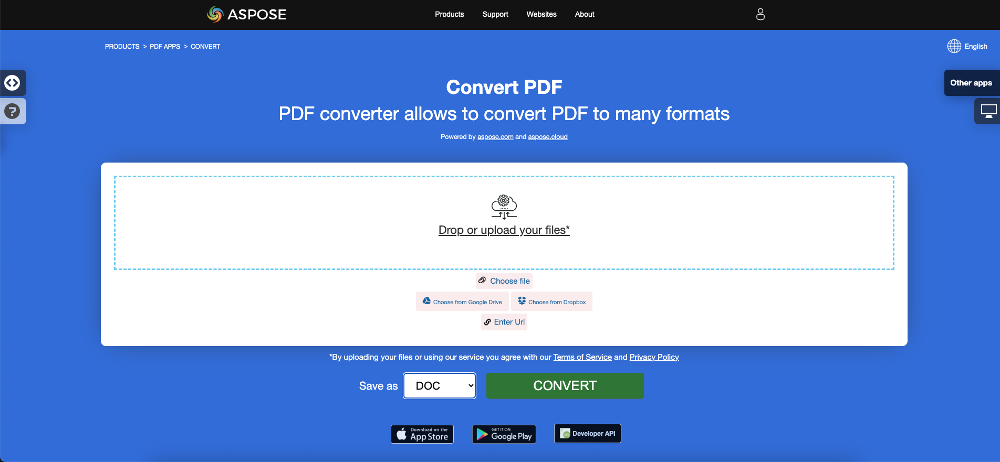

Uma das tarefas mais populares e necessárias ao trabalhar com documentos pdf é salvar esses arquivos em um formato ou outro, ou seja, converter. A conversão de documentos é a conversão de tipos de arquivos de um formato de arquivo para outro conforme você precisa. Você pode converter um grande número de documentos de uma vez ou um único.

Os arquivos PDF podem conter não apenas texto, mas também imagens, botões clicáveis, hiperlinks, fontes embutidas, assinaturas, carimbos, etc. Os usuários que estão convertendo um arquivo PDF para algum outro formato estão interessados em fazê-lo para poder editar o conteúdo do PDF.
**Nossa biblioteca Aspose.PDF para .NET** permite que você converta seus documentos PDF para os formatos mais populares e vice-versa de forma bem-sucedida, rápida e fácil.
**Nossa biblioteca Aspose.PDF para .NET** permite que você converta seus documentos PDF para os formatos mais populares e vice-versa de forma bem-sucedida, rápida e fácil.

## Como usar o Aspose.PDF para conversão

A próxima seção descreve as opções mais populares para conversão de documentos PDF.
Após aprender os exemplos de código, você entenderá que a biblioteca Aspose.PDF para .NET oferece soluções bastante universais que ajudarão você a resolver as tarefas de conversão de documentos.
O Aspose.PDF suporta o maior número de formatos de documentos populares, tanto para carregamento quanto para salvamento.

Chamo sua atenção para o fato de que esta seção descreve apenas conversões populares.
Para uma lista completa dos formatos suportados, consulte a seção [Formatos de Arquivo Suportados pelo Aspose.PDF](https://docs.aspose.com/pdf/net/supported-file-formats/).

O Aspose.PDF para .NET permite converter documentos PDF para vários formatos e também converter de outros formatos para PDF.
Aspose.PDF para .NET permite a conversão de documentos PDF para vários formatos e também a conversão de outros formatos para PDF.

Documentos Word são os mais versáteis e editáveis possíveis. Converter PDF para Word manualmente é uma tarefa muito demorada. Neste artigo, você aprenderá como converter PDF para Word programaticamente em C#.

- [Converta PDF para Microsoft Word](/pdf/pt/net/convert-pdf-to-word/) - você pode converter seu documento PDF para o formato Word com C#

Formatos numéricos são necessários não apenas para tornar os dados na tabela mais fáceis de ler, mas também para tornar a tabela mais fácil de usar. Claro, se você precisar converter tais dados de um documento PDF para o formato Excel, use nossa biblioteca Aspose.PDF.

- [Converta PDF para Microsoft Excel](/pdf/pt/net/convert-pdf-to-excel/) - esta seção descreve como converter documento PDF para XLSX, ODS, CSV e SpreadSheetML

O formato PowerPoint é usado para criar várias apresentações. Arquivos PPT contêm um grande número de slides ou páginas contendo várias informações.

- [Converta PDF para Microsoft PowerPoint](/pdf/pt/net/convert-pdf-to-powerpoint/) - aqui estamos falando sobre converter PDF para PowerPoint acompanhando o processo de conversão
- [Converter PDF para Microsoft PowerPoint](/pdf/pt/net/convert-pdf-to-powerpoint/) - aqui estamos falando sobre converter PDF para PowerPoint acompanhando o processo de conversão

HyperText Markup Language é uma linguagem de descrição de documentos hipertexto, uma linguagem padrão para criar páginas web. Com Aspose.PDF para .NET você pode facilmente converter documentos HTML e vice-versa.

- [Converter formato HTML para arquivo PDF](/pdf/pt/net/convert-html-to-pdf/) - artigo sobre diferentes aspectos da conversão de HTML para PDF
- [Converter arquivo PDF para formato HTML](/pdf/pt/net/convert-pdf-to-html/) - converta seus documentos PDF para arquivos HTML como páginas separadas ou como uma página única

Existem muitos formatos de imagem que precisam ser convertidos para PDF para diferentes finalidades. Aspose.PDF permite a conversão dos formatos de imagens mais populares e vice-versa.

- [Converter formatos de Imagens para arquivo PDF](/pdf/pt/net/convert-images-format-to-pdf/) - Aspose.PDF permite que você converta diferentes formatos de imagens para arquivo PDF
- [Converter PDF para vários formatos de Imagens](/pdf/pt/net/convert-pdf-to-images-format/) - converta páginas de PDF como imagens em JPEG, PNG e outros formatos
- [Converter PDF para vários formatos de imagens](/pdf/pt/net/convert-pdf-to-images-format/) - converte páginas de PDF como imagens em JPEG, PNG e outros formatos

Esta seção inclui formatos como: EPUB, Markdown, PCL, XPS, LATex/TeX, Texto e PostScript.

- [Converter outros formatos de arquivo para PDF](/pdf/pt/net/convert-other-files-to-pdf/) - este tópico descreve a conversão com vários formatos como EPUB, XPS, Postscript, texto e outros
- [Converter arquivo PDF para outros formatos](/pdf/pt/net/convert-pdf-to-other-files/) - este tópico descreve o modo de conversão de um documento PDF para vários formatos

PDF/A é uma versão do PDF projetada para o arquivamento a longo prazo de documentos eletrônicos.
Se for honesto, externamente, é muito difícil determinar se é PDF ou PDF/A. Para verificar este arquivo, são utilizados validadores. Confira os seguintes artigos para uma conversão de qualidade de PDF para PDF/A e vice-versa.

- [Converter PDF para formatos PDF/A](/pdf/pt/net/convert-pdf-to-pdfa/) - a biblioteca .NET da Aspose.PDF tem um modo fácil de converter PDF para PDF/A
- [Converter formato PDF/A para PDF](/pdf/pt/net/convert-pdfa-to-pdf/) - converte PDF/A para formato PDF com C# de maneira fácil, rápida e com alta qualidade
- [Converter PDF/A para formato PDF](/pdf/pt/net/convert-pdfa-to-pdf/) - converter PDF/A para formato PDF com C# de maneira fácil, rápida e com alta qualidade

## Tente converter arquivos PDF online

{}
**Tente converter arquivos PDF online**

Você pode experimentar a funcionalidade de conversão usando nossos Aspose PDF APPS:

{}
