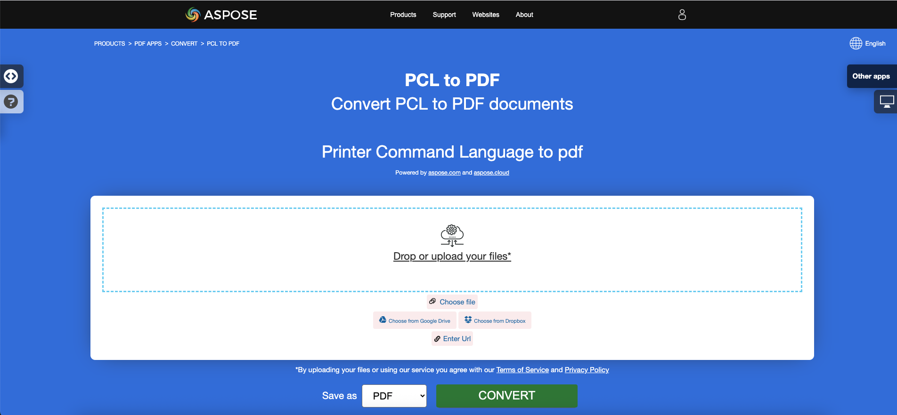

## Visão Geral

Este artigo explica como **converter vários outros tipos de formatos de arquivo para PDF usando C#**. Ele abrange os seguintes tópicos.

O seguinte trecho de código também funciona com a biblioteca [Aspose.PDF.Drawing](/pdf/net/drawing/).

_Formato_: **EPUB**
- [C# EPUB para PDF](#csharp-convert-epub-to-pdf)
- [C# Converter EPUB para PDF](#csharp-convert-epub-to-pdf)
- [C# Como converter arquivo EPUB para PDF](#csharp-convert-epub-to-pdf)

_Formato_: **Markdown**
- [C# Markdown para PDF](#csharp-convert-markdown-to-pdf)
- [C# Converter Markdown para PDF](#csharp-convert-markdown-to-pdf)
- [C# Como converter arquivo Markdown para PDF](#csharp-convert-markdown-to-pdf)
- [C# Como converter arquivo Markdown para PDF](#csharp-convert-markdown-to-pdf)

_Formato_: **MD**
- [C# MD para PDF](#csharp-convert-md-to-pdf)
- [C# Converter MD para PDF](#csharp-convert-md-to-pdf)
- [C# Como converter arquivo MD para PDF](#csharp-convert-md-to-pdf)

_Formato_: **PCL**
- [C# PCL para PDF](#csharp-convert-pcl-to-pdf)
- [C# Converter PCL para PDF](#csharp-convert-pcl-to-pdf)
- [C# Como converter arquivo PCL para PDF](#csharp-convert-pcl-to-pdf)

_Formato_: **Texto**
- [C# Texto para PDF](#csharp-convert-text-to-pdf)
- [C# Converter Texto para PDF](#csharp-convert-text-to-pdf)
- [C# Como converter arquivo de Texto para PDF](#csharp-convert-text-to-pdf)

_Formato_: **TXT**
- [C# TXT para PDF](#csharp-convert-txt-to-pdf)
- [C# Converter TXT para PDF](#csharp-convert-txt-to-pdf)
- [C# Como converter arquivo TXT para PDF](#csharp-convert-txt-to-pdf)

_Formato_: **Texto Simples**
- [C# Texto Simples para PDF](#csharp-convert-plain-text-to-pdf)
- [C# Converter Texto Simples para PDF](#csharp-convert-plain-text-to-pdf)
- [C# Como converter arquivo de Texto Simples para PDF](#csharp-convert-plain-text-to-pdf)
- [C# Como converter arquivo de texto simples para PDF](#csharp-convert-plain-text-to-pdf)

_Formato_: **TXT Pré-formatado**
- [C# Texto Pré-formatado para PDF](#csharp-convert-pre-formatted-txt-to-pdf)
- [C# Converter Texto Pré-formatado para PDF](#csharp-convert-pre-formatted-txt-to-pdf)
- [C# Como converter arquivo de Texto Pré-formatado para PDF](#csharp-convert-pre-formatted-txt-to-pdf)

_Formato_: **Texto Pré**
- [C# Texto Pré para PDF](#csharp-convert-pre-text-to-pdf)
- [C# Converter Texto Pré para PDF](#csharp-convert-pre-text-to-pdf)
- [C# Como converter arquivo de Texto Pré para PDF](#csharp-convert-pre-text-to-pdf)

_Formato_: **XPS**
- [C# XPS para PDF](#csharp-convert-xps-to-pdf)
- [C# Converter XPS para PDF](#csharp-convert-xps-to-pdf)
- [C# Como converter arquivo XPS para PDF](#csharp-convert-xps-to-pdf)

## Converter EPUB para PDF

**Aspose.PDF para .NET** permite converter arquivos EPUB para o formato PDF facilmente.

<abbr title="publicação eletrônica">EPUB</abbr> (abreviação de publicação eletrônica) é um padrão de e-book livre e aberto do Fórum Internacional de Publicação Digital (IDPF).
<abbr title="publicação eletrônica">EPUB</abbr> (abreviação de publicação eletrônica) é um padrão de e-book livre e aberto do International Digital Publishing Forum (IDPF).

EPUB também suporta conteúdo de layout fixo. O formato é destinado como um único formato que editoras e casas de conversão podem usar internamente, bem como para distribuição e venda. Ele substitui o padrão Open eBook. A versão EPUB 3 também é endossada pelo Book Industry Study Group (BISG), uma associação comercial líder do setor de livros para práticas padrão, pesquisa, informação e eventos, para o empacotamento de conteúdo.

{}
**Tente converter EPUB para PDF online**

Aspose.PDF for .NET apresenta a você uma aplicação gratuita online ["EPUB para PDF"](https://products.aspose.app/pdf/conversion/epub-to-pdf), onde você pode tentar investigar a funcionalidade e a qualidade com que funciona.

[](https://products.aspose.app/pdf/conversion/epub-to-pdf)
{}

<a name="csharp-convert-epub-to-pdf" id="csharp-convert-epub-to-pdf"><strong><em>Passos:</em> Converter EPUB para PDF em C#</strong></a>
<a name="csharp-convert-epub-to-pdf" id="csharp-convert-epub-to-pdf"><strong><em>Passos:</em> Converter EPUB para PDF em C#</strong></a>

1. Crie uma instância da classe [EpubLoadOptions](https://reference.aspose.com/pdf/net/aspose.pdf/epubloadoptions).
2. Crie uma instância da classe [Document](https://reference.aspose.com/pdf/net/aspose.pdf/document) com o nome do arquivo fonte e opções mencionadas.
3. Salve o documento com o nome de arquivo desejado.

O seguinte trecho de código mostra como converter arquivos EPUB para o formato PDF com C#.

```csharp
public static void ConvertEPUBtoPDF()
{
    EpubLoadOptions option = new EpubLoadOptions();
    Document pdfDocument= new Document(_dataDir + "WebAssembly.epub", option);
    pdfDocument.Save(_dataDir + "epub_test.pdf");
}
```

Você também pode definir o tamanho da página para a conversão. Para definir um novo tamanho de página, você cria um objeto `SizeF` e o passa para o construtor [EpubLoadOptions](https://reference.aspose.com/pdf/net/aspose.pdf/epubloadoptions/constructors/main).

```csharp
public static void ConvertEPUBtoPDFAdv()
{
    EpubLoadOptions option = new EpubLoadOptions(new SizeF(1190, 1684));
    Document pdfDocument= new Document(_dataDir + "WebAssembly.epub", option);
    pdfDocument.Save(_dataDir + "epub_test.pdf");
}
```
## Converter Markdown para PDF

**Este recurso é suportado pela versão 19.6 ou superior.**

{}
**Tente converter Markdown para PDF online**

Aspose.PDF para .NET apresenta a você a aplicação gratuita online ["Markdown para PDF"](https://products.aspose.app/pdf/conversion/md-to-pdf), onde você pode experimentar investigar a funcionalidade e a qualidade com que funciona.

[](https://products.aspose.app/pdf/conversion/md-to-pdf)
{}

Aspose.PDF para .NET oferece a funcionalidade de criar um documento PDF com base em arquivo de dados [Markdown](https://daringfireball.net/projects/markdown/syntax). Para converter o Markdown para PDF, você precisa inicializar o [Documento](https://reference.aspose.com/pdf/net/aspose.pdf/document) usando [MdLoadOptions](https://reference.aspose.com/pdf/net/aspose.pdf/mdloadoptions).

O seguinte trecho de código mostra como usar essa funcionalidade com a biblioteca Aspose.PDF:

<a name="csharp-convert-markdown-to-pdf" id="csharp-convert-markdown-to-pdf"><strong><em>Passos:</em> Converter Markdown para PDF em C#</strong></a> |
<a name="csharp-convert-markdown-to-pdf" id="csharp-convert-markdown-to-pdf"><strong><em>Passos:</em> Converter Markdown para PDF em C#</strong></a> |
<a name="csharp-convert-md-to-pdf" id="csharp-convert-md-to-pdf"><strong><em>Passos:</em> Converter MD para PDF em C#</strong></a>

1. Crie uma instância da classe [MdLoadOptions ](https://reference.aspose.com/pdf/net/aspose.pdf/mdloadoptions/).
2. Crie uma instância da classe [Document](https://reference.aspose.com/pdf/net/aspose.pdf/document) com o nome do arquivo fonte e opções mencionadas.
3. Salve o documento com o nome de arquivo desejado.

```csharp
// O caminho para o diretório de documentos.
string dataDir = RunExamples.GetDataDir_AsposePdf_DocumentConversion();
// Abrir documento Markdown
Document pdfDocument = new Document(dataDir + "sample.md", new MdLoadOptions());
// Salvar documento em formato PDF
pdfDocument.Save(dataDir + "MarkdownToPDF.pdf");
```

## Converter PCL para PDF

<abbr title="Printer Command Language">PCL</abbr> (Linguagem de Comando de Impressora) é uma linguagem de impressora desenvolvida pela Hewlett-Packard para acessar recursos padrão de impressoras.
<abbr title="Printer Command Language">PCL</abbr> (Printer Command Language) é uma linguagem de impressora desenvolvida pela Hewlett-Packard para acessar recursos padrão de impressoras.

{}
**Tente converter PCL para PDF online**

O Aspose.PDF para .NET apresenta uma aplicação gratuita online ["PCL para PDF"](https://products.aspose.app/pdf/conversion/pcl-to-pdf), onde você pode tentar investigar a funcionalidade e a qualidade com que funciona.

[](https://products.aspose.app/pdf/conversion/pcl-to-pdf)
{}

**Atualmente, apenas PCL5 e versões anteriores são suportadas**

<table>
    <thead>
        <tr>
            <th>
                Conjuntos de Comandos
            </th>
            <th>
                Suporte
            </th>
            <th>
                Exceções
            </th>
            <th>
                Descrição
            </th>
        </tr>
    </thead>
    <tbody>
        <tr>
            <td>
                Comandos de controle de trabalho

        <tr>
            <td>
                Comandos de controle de trabalho
            </td>
            <td>
                +
            </td>
            <td>
                Modo de impressão duplex
            </td>
            <td>
                Controlar o processo de impressão: número de cópias, bandeja de saída, impressão simplex/duplex, deslocamentos esquerdo e superior, etc.
            </td>
        </tr>
        <tr>
            <td>
                Comandos de controle de página
            </td>
            <td>
                +
            </td>
            <td>
                Comando de Salto de Perfuração
            </td>
            <td>
                Especificar tamanho da página, margens, orientação da página, distâncias entre linhas, entre caracteres, etc.
            </td>
        </tr>
        <tr>
            <td>
                Comandos de Posicionamento do Cursor
            </td>
            <td>
                +
            </td>
            <td>
                &nbsp;
            </td>
            <td>
                Especificar a posição do cursor e, portanto, as origens de texto, imagens raster ou vetoriais e detalhes.
            </td>
        </tr>
```

Especificar a posição do cursor e, portanto, as origens de textos, imagens raster ou vetoriais e detalhes.
```

Comandos de seleção de fonte
```

+
```

1. Comando de Dados de Impressão Transparente.
2. Fontes suaves embutidas. Na versão atual, em vez de criar uma fonte suave, nossa biblioteca seleciona
   uma fonte adequada das fontes TrueType "duras" existentes instaladas na máquina alvo.
   A adequação é definida pela proporção largura/altura.
   Esta funcionalidade funciona apenas para fontes Bitmap e TrueType e não
   garante que o texto impresso com a fonte suave será relevante ao do arquivo fonte.
   Porque os códigos de caracteres na fonte suave podem não corresponder aos padrões.
3. Conjuntos de Símbolos Definidos pelo Usuário.
```

<li>Conjuntos de Símbolos Definidos pelo Usuário.</li>
</ol>
</td>
<td>
Permitir carregar fontes suaves (embutidas) do arquivo PCL e gerenciá-las na memória.
</td>
</tr>
<tr>
<td>
Comandos de gráficos raster
</td>
<td>
+
</td>
<td>
Apenas preto e branco
</td>
<td>
Permitir carregar imagens raster do arquivo PCL para a memória, especificar parâmetros raster. <br
> como largura, altura, tipo de compressão, resolução etc.
</td>
</tr>
<tr>
<td>
Comandos de cores
</td>
<td>
+
</td>
<td>
&nbsp;
</td>
<td>
Permitir coloração para todos os objetos imprimíveis.
</td>
</tr>
<tr>
<td>
Comandos do Modelo de Impressão
```

Comandos de impressão de modelo
+
Permite preencher texto, imagens raster e áreas retangulares com padrões raster pré-definidos e padrões definidos pelo usuário, especificar modo de transparência para padrões e imagem raster de origem. Os padrões pré-definidos são de hachura, cruzeta e sombreamento.

Comandos de preenchimento de área retangular
+
Permite a criação e o preenchimento de áreas retangulares com padrões.

Comandos de gráficos vetoriais HP-GL/2
+
Comando de Vetor com Tela (SV), Comando de Modo de Transparência (TR), Comando de Dados Transparentes (TD), RO
```
Comando de Vetor Selecionado (SV), Modo de Transparência (TR), Comando de Dados Transparentes (TD), RO (Rotacionar Sistema de Coordenadas), Comando de Fontes Escaláveis ou Bitmap (SB), Comando de Inclinação de Caractere (SL) e Espaço Extra (ES) não são implementados e os comandos DV (Definir Caminho de Texto Variável) são realizados em versão beta.

Permitir o carregamento de imagens vetoriais HP-GL/2 de um arquivo PCL na memória. A imagem vetorial tem uma origem no canto inferior esquerdo da área imprimível, pode ser escalada, transladada, rotacionada e recortada. A imagem vetorial pode conter texto, como etiquetas, e figuras geométricas, como retângulo, círculo, elipse, linha, arco, curva bezier e figuras complexas compostas de formas simples. Figuras fechadas, incluindo letras de etiquetas, podem ser preenchidas com preenchimento sólido ou padrão vetorial. O padrão pode ser espinha de peixe, cruzamento, sombreamento, raster definido pelo usuário, espinha de peixe PCL ou cruzamento PCL.

                 hachura, cruzamento, sombreamento, raster definido pelo usuário, hachura PCL ou cruzamento e PCL
                definido pelo usuário. Os padrões PCL são raster. Etiquetas podem ser rotacionadas, escaladas e direcionadas individualmente
                em quatro direções: para cima, para baixo, para a esquerda e para a direita. As direções Esquerda e Direita envolvem
                um arranjo de letras um após o outro. As direções para Cima e para Baixo envolvem um arranjo de letras um sob o outro.
            </td>
        </tr>
        <tr>
            <td>
                Macroses
            </td>
            <td>
                ―
            </td>
            <td>
                &nbsp;
            </td>
            <td>
                Permitir carregar uma sequência de comandos PCL na memória e usar essa sequência várias vezes, por exemplo,
                para imprimir cabeçalho de página ou definir um formato para um conjunto de páginas.
            </td>
        </tr>
        <tr>
            <td>
                Texto Unicode
            </td>
            <td>
                ―
            </td>
```

### Conversão de um arquivo PCL para o formato PDF

Para permitir a conversão de PCL para PDF, o Aspose.PDF possui a classe [`PclLoadOptions`](https://reference.aspose.com/pdf/net/aspose.pdf/pclloadoptions) que é usada para inicializar o objeto LoadOptions.
```

```html
<table>
    <tbody>
        <tr>
            <td>
                Permitir a impressão de caracteres não ASCII. Não implementado devido à falta de arquivos de amostra com <br> texto Unicode
            </td>
        </tr>
        <tr>
            <td>
                PCL6 (PCL-XL)
            </td>
            <td>
                Realizado apenas na versão Beta devido à falta de arquivos de teste. Fontes incorporadas também não são suportadas.<br> A extensão JetReady não é suportada porque é impossível ter a especificação JetReady.
            </td>
            <td>
                Formato de arquivo binário.
            </td>
        </tr>
    </tbody>
</table>
```
Para permitir a conversão de PCL para PDF, a Aspose.PDF possui a classe [`PclLoadOptions`](https://reference.aspose.com/pdf/net/aspose.pdf/pclloadoptions) que é usada para inicializar o objeto LoadOptions.

O seguinte trecho de código mostra o processo de conversão de um arquivo PCL em formato PDF.

<a name="csharp-convert-pcl-to-pdf" id="csharp-convert-pcl-to-pdf"><strong><em>Passos:</em> Converter PCL para PDF em C#</strong></a>

1. Crie uma instância da classe [PclLoadOptions](https://reference.aspose.com/pdf/net/aspose.pdf/pclloadoptions/).
2. Crie uma instância da classe [Document](https://reference.aspose.com/pdf/net/aspose.pdf/document/) com o nome do arquivo fonte e opções mencionadas.
3. Salve o documento com o nome de arquivo desejado.

```csharp
public static void ConvertPCLtoPDF()
{
    PclLoadOptions options = new PclLoadOptions();
    Document pdfDocument = new Document(_dataDir + "demo.pcl", options);
    pdfDocument.Save(_dataDir + "pcl_test.pdf");
}
```

Você também pode monitorar a detecção de erros durante o processo de conversão.
Você também pode monitorar a detecção de erros durante o processo de conversão.

```csharp
public static void ConvertPCLtoPDFAvdanced()
{
    PclLoadOptions options = new PclLoadOptions { SupressErrors = true };
    Document pdfDocument= new Document(_dataDir + "demo.pcl", options);
    if (options.Exceptions!=null)
        foreach (var ex in options.Exceptions)
        {
            Console.WriteLine(ex.Message);
        }
    pdfDocument.Save(_dataDir + "pcl_test.pdf");
}
```

### Problemas Conhecidos

1. A origem das cadeias de texto e imagens pode ser ligeiramente diferente das do arquivo PCL fonte se a direção de impressão não for 0°. O mesmo se aplica a imagens vetoriais se o sistema de coordenadas do traçado vetorial estiver girado (comando RO precedido).
1. A origem das etiquetas em imagens vetoriais pode ser diferente das do arquivo PCL fonte se as etiquetas forem influenciadas por uma sequência de comandos: Origem da Etiqueta (LO), Definir Caminho de Texto Variável (DV), Direção Absoluta (DI) ou Direção Relativa (DR).
1.
1. Se o arquivo PCL analisado contiver fontes Intellifont ou Universal, uma exceção será lançada, porque as fontes Intellifont e Universal não são suportadas de forma alguma.
1. Se o arquivo PCL analisado contiver comandos de macros, o resultado da análise será muito diferente do arquivo original, porque os comandos de macros não são suportados.

## Converter Texto para PDF

**Aspose.PDF for .NET** suporta a funcionalidade de converter arquivo de texto simples e texto pré-formatado para o formato PDF.

Converter texto para PDF significa adicionar fragmentos de texto à página do PDF. No que diz respeito aos arquivos de texto, estamos lidando com 2 tipos de texto: pré-formatado (por exemplo, 25 linhas com 80 caracteres por linha) e texto não formatado (texto simples). Dependendo de nossas necessidades, podemos controlar essa adição nós mesmos ou confiá-la aos algoritmos da biblioteca.

{}
**Tente converter TEXTO para PDF online**

Aspose.PDF for .NET apresenta a você a aplicação gratuita online ["Texto para PDF"](https://products.aspose.app/pdf/conversion/txt-to-pdf), onde você pode tentar investigar a funcionalidade e a qualidade com que funciona.
Aspose.PDF para .NET apresenta a você a aplicação online gratuita ["Text to PDF"](https://products.aspose.app/pdf/conversion/txt-to-pdf), onde você pode tentar investigar a funcionalidade e a qualidade com que funciona.

[](https://products.aspose.app/pdf/conversion/txt-to-pdf)

### Converter arquivo de texto simples para PDF

No caso de um arquivo de texto simples, podemos usar a seguinte técnica:

<a name="csharp-convert-text-to-pdf" id="csharp-convert-text-to-pdf"><strong><em>Passos:</em> Converter Texto para PDF em C#</strong></a> |
<a name="csharp-convert-txt-to-pdf" id="csharp-convert-txt-to-pdf"><strong><em>Passos:</em> Converter TXT para PDF em C#</strong></a> |
<a name="csharp-convert-plain-text-to-pdf" id="csharp-convert-plain-text-to-pdf"><strong><em>Passos:</em> Converter Texto Simples para PDF em C#</strong></a>

1. Use um _TextReader_ para ler todo o texto;
2.
2.
3. Crie um novo objeto de [TextFragment](https://reference.aspose.com/pdf/net/aspose.pdf.text/textfragment/) e passe o objeto _TextReader_ para o seu construtor;
4. Adicione o objeto _TextFragment_ como parágrafo na coleção _Paragraphs_. Se a quantidade de texto for maior que a página, o algoritmo da biblioteca adiciona automaticamente páginas extras;
5. Use o método **Save** da classe [Document](https://reference.aspose.com/pdf/net/aspose.pdf/document/);

```csharp
// Para exemplos completos e arquivos de dados, por favor, visite https://github.com/aspose-pdf/Aspose.PDF-for-.NET
// O caminho para o diretório de documentos.
string dataDir = RunExamples.GetDataDir_AsposePdf_DocumentConversion();
// Leia o arquivo de texto de origem
TextReader tr = new StreamReader(dataDir + "log.txt");

// Instancie um objeto Document chamando seu construtor vazio
Document pdfDocument= new Document();

// Adicione uma nova página na coleção de Páginas do Documento
Page page = pdfDocument.Pages.Add();

// Crie uma instância de TextFragmet e passe o texto do objeto leitor para seu construtor como argumento
TextFragment text = new TextFragment(tr.ReadToEnd());

// Adicione um novo parágrafo de texto na coleção de parágrafos e passe o objeto TextFragment
page.Paragraphs.Add(text);

// Salve o arquivo PDF resultante
pdfDocument.Save(dataDir + "TexttoPDF_out.pdf");
```
### Converter arquivo de texto pré-formatado para PDF

Converter texto pré-formatado é como texto simples, mas você precisa realizar algumas ações adicionais, como definir margens, tipo de fonte e tamanho. Obviamente, a fonte deve ser monoespaçada (por exemplo, Courier New).

Siga estes passos para converter texto pré-formatado em PDF com C#:

<a name="csharp-convert-pre-text-to-pdf" id="csharp-convert-pre-text-to-pdf"><strong><em>Passos:</em> Converter Texto Pré em PDF em C#</strong></a> |
<a name="csharp-convert-pre-formatted-txt-to-pdf" id="csharp-convert-pre-formatted-txt-to-pdf"><strong><em>Passos:</em> Converter TXT Pré-formatado em PDF em C#</strong></a>

1. Leia todo o texto como um array de strings;
2. Instancie o objeto [Document](https://reference.aspose.com/pdf/net/aspose.pdf/document/) e adicione uma nova página na coleção [Pages](https://reference.aspose.com/pdf/net/aspose.pdf/document/pages/);
Neste caso, o algoritmo da biblioteca também adiciona páginas extras, mas podemos controlar esse processo nós mesmos.
O exemplo a seguir mostra como converter um arquivo de texto pré-formatado (80x25) para um documento PDF com tamanho de página A4.

```csharp
public static void ConvertPreFormattedTextToPdf()
{
    // Ler o arquivo de texto como array de string
    var lines = System.IO.File.ReadAllLines(_dataDir + "rfc822.txt");

    // Instanciar um objeto Document chamando seu construtor vazio
    Document pdfDocument= new Document();

    // Adicionar uma nova página na coleção Pages do Document
    Page page = pdfDocument.Pages.Add();

    // Definir margens esquerda e direita para melhor apresentação
    page.PageInfo.Margin.Left = 20;
    page.PageInfo.Margin.Right = 10;
    page.PageInfo.DefaultTextState.Font = FontRepository.FindFont("Courier New");
    page.PageInfo.DefaultTextState.FontSize = 12;

    foreach (var line in lines)
    {
        // verificar se a linha contém o caractere "form feed"
        // ver https://pt.wikipedia.org/wiki/Quebra_de_p%C3%A1gina
        if (line.StartsWith("\x0c"))
        {
            page = pdfDocument.Pages.Add();
            page.PageInfo.Margin.Left = 20;
            page.PageInfo.Margin.Right = 10;
            page.PageInfo.DefaultTextState.Font = FontRepository.FindFont("Courier New");
            page.PageInfo.DefaultTextState.FontSize = 12;
        }
        else
        {
            // Criar uma instância de TextFragment e
            // passar a linha para seu
            // construtor como argumento
            TextFragment text = new TextFragment(line);

            // Adicionar um novo parágrafo de texto na coleção de parágrafos e passar o objeto TextFragment
            page.Paragraphs.Add(text);
        }
    }

    // Salvar o arquivo PDF resultante
    pdfDocument.Save(_dataDir + "TexttoPDF_out.pdf");
}
```
## Converter XPS para PDF

**Aspose.PDF para .NET** suporta a funcionalidade de converter arquivos <abbr title="Especificação de Papel XML">XPS</abbr> para o formato PDF. Confira este artigo para resolver suas tarefas.

O tipo de arquivo XPS é principalmente associado à Especificação de Papel XML pela Microsoft Corporation. A Especificação de Papel XML (XPS), anteriormente conhecida como Metro e que engloba o conceito de marketing Next Generation Print Path (NGPP), é uma iniciativa da Microsoft para integrar a criação e visualização de documentos em seu sistema operacional Windows.

{}

O formato de arquivo é basicamente um arquivo XML zipado que é principalmente usado para distribuição e armazenamento. É muito difícil de editar e principalmente implementado pela Microsoft.

{}

Para converter XPS para PDF com Aspose.PDF para .NET, introduzimos uma classe chamada [XpsLoadOption](https://reference.aspose.com/pdf/net/aspose.pdf/xpsloadoptions) que é usada para inicializar um objeto [LoadOptions](https://reference.aspose.com/pdf/net/aspose.pdf/loadoptions).
Para converter XPS em PDF com o Aspose.PDF para .NET, introduzimos uma classe chamada [XpsLoadOption](https://reference.aspose.com/pdf/net/aspose.pdf/xpsloadoptions) que é usada para inicializar um objeto [LoadOptions](https://reference.aspose.com/pdf/net/aspose.pdf/loadoptions).

{}

Tanto no XP quanto no Windows 7, você deve encontrar uma impressora XPS pré-instalada se procurar no Painel de Controle e depois em Impressoras. Para criar esses arquivos, você pode usar essa impressora como dispositivo de saída. No Windows 7, você deve ser capaz de simplesmente clicar duas vezes no arquivo para abri-lo em um visualizador de XPS. Você também pode baixar o visualizador de XPS no site da Microsoft.

{}

O seguinte trecho de código mostra o processo de conversão de um arquivo XPS para o formato PDF com C#.

<a name="csharp-convert-xps-to-pdf" id="csharp-convert-xps-to-pdf"><strong><em>Passos:</em> Converter XPS para PDF em C#</strong></a>

1. Crie uma instância da classe [XpsLoadOptions](https://reference.aspose.com/pdf/net/aspose.pdf/xpsloadoptions/). 
2.
2.
3. Salve o documento em formato PDF com o nome de arquivo desejado.

```csharp
// Para exemplos completos e arquivos de dados, por favor vá para https://github.com/aspose-pdf/Aspose.PDF-for-.NET
// O caminho para o diretório de documentos.
string dataDir = RunExamples.GetDataDir_AsposePdf_DocumentConversion();

// Instancie o objeto LoadOption usando a opção de carregamento XPS
Aspose.Pdf.LoadOptions options = new XpsLoadOptions();

// Crie o objeto documento
Aspose.Pdf.Document pdfDocument = new Aspose.Pdf.Document(dataDir + "XPSToPDF.xps", options);

// Salve o documento PDF resultante
document.Save(dataDir + "XPSToPDF_out.pdf");
```

{}
**Tente converter o formato XPS para PDF online**

Aspose.PDF para .NET apresenta a você a aplicação gratuita online ["XPS para PDF"](https://products.aspose.app/pdf/conversion/xps-to-pdf/), onde você pode tentar investigar a funcionalidade e a qualidade com que funciona.

[](https://products.aspose.app/pdf/conversion/xps-to-pdf/)
{}
{}

## Converter PostScript para PDF

**Aspose.PDF para .NET** suporta a conversão de arquivos PostScript para o formato PDF. Uma das funcionalidades do Aspose.PDF é que você pode definir um conjunto de pastas de fontes para ser usado durante a conversão.

Para converter um arquivo PostScript para o formato PDF, o Aspose.PDF para .NET oferece a classe [PsLoadOptions](https://reference.aspose.com/pdf/net/aspose.pdf/psloadoptions) que é usada para inicializar o objeto LoadOptions. Posteriormente, este objeto pode ser passado como argumento ao construtor do objeto Document, o que ajudará o Motor de Renderização de PDF a determinar o formato do documento fonte.

O seguinte trecho de código pode ser usado para converter um arquivo PostScript em formato PDF com Aspose.PDF para .NET:

```csharp
// Para exemplos completos e arquivos de dados, por favor, vá para https://github.com/aspose-pdf/Aspose.PDF-for-.NET
// O caminho para o diretório dos documentos.
string _dataDir = RunExamples.GetDataDir_AsposePdf_DocumentConversion();
// Criar uma nova instância de PsLoadOptions
PsLoadOptions options = new PsLoadOptions();
// Abrir documento .ps com as opções de carga criadas
Document pdfDocument = new Document(_dataDir + "input.ps", options);
// Salvar documento
pdfDocument.Save(dataDir + "PSToPDF.pdf");
```
Além disso, você pode definir um conjunto de pastas de fontes que serão usadas durante a conversão:

```csharp
public static void ConvertPostscriptToPDFAvdanced()
{
    PsLoadOptions options = new PsLoadOptions
    {
        FontsFolders = new [] { @"c:\tmp\fonts1", @"c:\tmp\fonts2"}
    };
    Document pdfDocument = new Document(_dataDir + "input.ps", options);
    pdfDocument.Save(_dataDir + "ps_test.pdf");
}
```

## Converter XML para PDF

O formato XML é usado para armazenar dados estruturados. Existem várias maneiras de converter XML para PDF no Aspose.PDF:

1. Transformar qualquer dado XML em HTML usando XSLT e converter HTML para PDF conforme descrito abaixo
1. Gerar documento XML usando o Esquema XSD do Aspose.PDF
1. Usar documento XML baseado no padrão XSL-FO

{}
**Tente converter XML para PDF online**

Aspose.PDF para .NET apresenta a você a aplicação gratuita online ["XML para PDF"](https://products.aspose.app/pdf/conversion/xml-to-pdf), onde você pode tentar investigar a funcionalidade e a qualidade com que funciona.
{}

Aspose.PDF para .NET apresenta a você a aplicação gratuita online ["XML para PDF"](https://products.aspose.app/pdf/conversion/xml-to-pdf), onde você pode experimentar a funcionalidade e a qualidade com que funciona.

[](https://products.aspose.app/pdf/conversion/xml-to-pdf)

## Converter XSL-FO para PDF

A conversão de arquivos XSL-FO para PDF pode ser implementada usando a técnica tradicional do Aspose.PDF - instanciar o objeto [Document](https://reference.aspose.com/page/net/aspose.page/document) com [XslFoLoadOptions](https://reference.aspose.com/pdf/net/aspose.pdf/xslfoloadoptions). No entanto, às vezes você pode se deparar com uma estrutura de arquivo incorreta. Para este caso, o conversor XSL-FO permite definir a estratégia de tratamento de erro. Você pode escolher `ThrowExceptionImmediately`, `TryIgnore` ou `InvokeCustomHandler`.

```csharp
public static void Convert_XSLFO_to_PDF()
{
    // Instanciar objeto XslFoLoadOption
    var options = new XslFoLoadOptions(".\\samples\\employees.xslt");
    // Definir estratégia de tratamento de erro
    options.ParsingErrorsHandlingType = XslFoLoadOptions.ParsingErrorsHandlingTypes.ThrowExceptionImmediately;
    // Criar objeto Document
    var pdfDocument = new Aspose.Pdf.Document(".\\samples\\employees.xml", options);
    pdfDocument.Save(_dataDir + "data_xml.pdf");
}
```
## Converter LaTeX/TeX para PDF

O formato de arquivo LaTeX é um formato de arquivo de texto com marcação na derivada LaTeX da família de linguagens TeX, e LaTeX é um formato derivado do sistema TeX. LaTeX (ˈleɪtɛk/lay-tek ou lah-tek) é um sistema de preparação de documentos e linguagem de marcação de documentos. É amplamente utilizado para a comunicação e publicação de documentos científicos em muitos campos, incluindo matemática, física e ciência da computação. Também desempenha um papel proeminente na preparação e publicação de livros e artigos que contêm materiais multilíngues complexos, como sânscrito e árabe, incluindo edições críticas. LaTeX utiliza o programa de composição tipográfica TeX para formatar sua saída, e é escrito na linguagem macro TeX.

{}
**Tente converter LaTeX/TeX para PDF online**

Aspose.PDF for .NET apresenta a você a aplicação gratuita online ["LaTex para PDF"](https://products.aspose.app/pdf/conversion/tex-to-pdf), onde você pode experimentar a funcionalidade e a qualidade com que funciona.

[](https://products.aspose.app/pdf/conversion/tex-to-pdf)
[](https://products.aspose.app/pdf/conversion/tex-to-pdf)
{}

Aspose.PDF para .NET suporta a funcionalidade de converter arquivos TeX para o formato PDF e para realizar essa necessidade, o namespace Aspose.Pdf possui uma classe chamada [LatexLoadOptions](https://reference.aspose.com/pdf/net/aspose.pdf/latexloadoptions) que oferece as capacidades de carregar arquivos LaTeX e renderizar a saída em formato PDF usando a [classe Document](https://reference.aspose.com/pdf/net/aspose.pdf/document).
O seguinte trecho de código mostra o processo de conversão de um arquivo LaTeX para o formato PDF com C#.

```csharp
public static void ConvertTeXtoPDF()
{
    // Instanciar objeto de opção de carregamento LaTeX
    TeXLoadOptions options = new TeXLoadOptions();
    // Criar objeto Documento
    Aspose.Pdf.Document pdfDocument= new Aspose.Pdf.Document(_dataDir + "samplefile.tex", options);
    // Salvar a saída em arquivo PDF
    pdfDocument.Save(_dataDir + "TeXToPDF_out.pdf");
}
```
