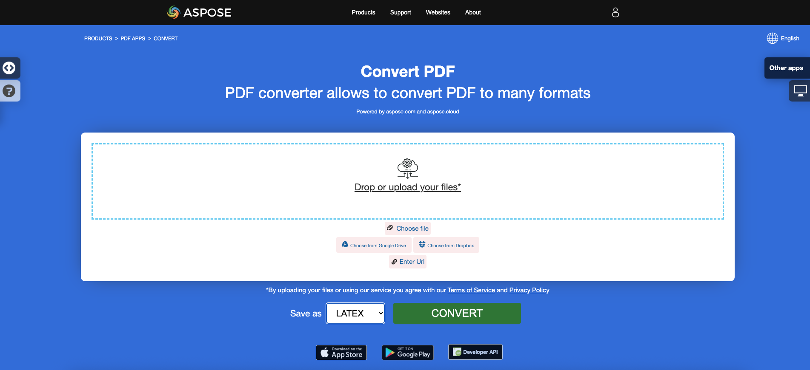

<script type="application/ld+json">
{
    "@context": "https://schema.org",
    "@type": "TechArticle",
    "headline": "Convert PDF to EPUB, LaTeX, Text, XPS in C#",
    "alternativeHeadline": "Add PDF format conversion to EPUB, LaTeX, Text, XPS in C#",
    "abstract": "Aspose.PDF for .NET apresenta um recurso poderoso que permite a conversão perfeita de arquivos PDF em vários formatos, incluindo EPUB, LaTeX, Texto, XPS e Markdown. Essa funcionalidade melhora a acessibilidade e usabilidade dos documentos, permitindo que os desenvolvedores integrem facilmente diversas conversões de formatos de arquivo em suas aplicações C#, atendendo assim a um público mais amplo e otimizando o conteúdo para diferentes plataformas.",
    "author": {
        "@type": "Person",
        "name": "Anastasiia Holub",
        "givenName": "Anastasiia",
        "familyName": "Holub",
        "url": "https://www.linkedin.com/in/anastasiia-holub-750430225/"
    },
    "genre": "pdf document generation",
    "wordcount": "1827",
    "proficiencyLevel": "Beginner",
    "publisher": {
        "@type": "Organization",
        "name": "Aspose.PDF for .NET",
        "url": "https://products.aspose.com/pdf",
        "logo": "https://www.aspose.cloud/templates/aspose/img/products/pdf/aspose_pdf-for-net.svg",
        "alternateName": "Aspose",
        "sameAs": [
            "https://facebook.com/aspose.pdf/",
            "https://twitter.com/asposepdf",
            "https://www.youtube.com/channel/UCmV9sEg_QWYPi6BJJs7ELOg/featured",
            "https://www.linkedin.com/company/aspose",
            "https://stackoverflow.com/questions/tagged/aspose",
            "https://aspose.quora.com/",
            "https://aspose.github.io/"
        ],
        "contactPoint": [
            {
                "@type": "ContactPoint",
                "telephone": "+1 903 306 1676",
                "contactType": "sales",
                "areaServed": "US",
                "availableLanguage": "en"
            },
            {
                "@type": "ContactPoint",
                "telephone": "+44 141 628 8900",
                "contactType": "sales",
                "areaServed": "GB",
                "availableLanguage": "en"
            },
            {
                "@type": "ContactPoint",
                "telephone": "+61 2 8006 6987",
                "contactType": "sales",
                "areaServed": "AU",
                "availableLanguage": "en"
            }
        ]
    },
    "url": "/net/convert-pdf-to-other-files/",
    "mainEntityOfPage": {
        "@type": "WebPage",
        "@id": "/net/convert-pdf-to-other-files/"
    },
    "dateModified": "2025-04-04",
    "description": "Aspose.PDF pode realizar não apenas tarefas simples e fáceis, mas também lidar com objetivos mais complexos. Confira a próxima seção para usuários e desenvolvedores avançados."
}
</script>

Este artigo explica como converter PDF para diferentes formatos usando C#. Ele cobre os seguintes tópicos.

- [Converter PDF para EPUB](#csharp-convert-pdf-to-epub)
- [Converter PDF para LaTeX/TeX](#csharp-convert-pdf-to-latex)
- [Converter PDF para Texto Simples](#csharp-convert-pdf-to-plain-text)
- [Converter PDF para XPS](#csharp-convert-pdf-to-xps)
- [Converter PDF para Markdown](#csharp-convert-pdf-to-markdown)

## Converter PDF para EPUB

{}
**Tente converter PDF para EPUB online**

<a name="csharp-convert-pdf-to-epub" id="csharp-convert-pdf-to-epub"><strong>Converter PDF para EPUB</strong></a>

Aspose.PDF for .NET apresenta a você uma aplicação online gratuita ["PDF para EPUB"](https://products.aspose.app/pdf/conversion/pdf-to-epub), onde você pode tentar investigar a funcionalidade e a qualidade com que funciona.

[](https://products.aspose.app/pdf/conversion/pdf-to-epub)
{}

**<abbr title="Publicação Eletrônica">EPUB</abbr>** é um padrão de e-book livre e aberto do International Digital Publishing Forum (IDPF). Os arquivos têm a extensão .epub.
O EPUB é projetado para conteúdo refluível, o que significa que um leitor EPUB pode otimizar o texto para um dispositivo de exibição específico. O EPUB também suporta conteúdo de layout fixo. O formato é destinado a ser um formato único que editores e casas de conversão podem usar internamente, bem como para distribuição e venda. Ele substitui o padrão Open eBook.

O seguinte trecho de código também funciona com a biblioteca [Aspose.PDF.Drawing](/pdf/pt/net/drawing/).

Aspose.PDF for .NET também suporta a funcionalidade de converter documentos PDF para o formato EPUB. Aspose.PDF for .NET possui uma classe chamada EpubSaveOptions que pode ser usada como o segundo argumento para o método [`Document.Save(..)`](https://reference.aspose.com/pdf/pt/net/aspose.pdf/document/methods/save/index), para gerar um arquivo EPUB.
Por favor, tente usar o seguinte trecho de código para atender a esse requisito com C#.

```csharp
// For complete examples and data files, visit https://github.com/aspose-pdf/Aspose.PDF-for-.NET
private static void ConvertPDFtoEPUB()
{
    // The path to the documents directory
    var dataDir = RunExamples.GetDataDir_AsposePdf_DocumentConversion();

    // Open PDF document
    using (var document = new Aspose.Pdf.Document(dataDir + "PDFToEPUB.pdf"))
    {
        // Instantiate Epub Save options
        EpubSaveOptions options = new EpubSaveOptions();
        // Specify the layout for contents
        options.ContentRecognitionMode = EpubSaveOptions.RecognitionMode.Flow;

        // Save ePUB document
        document.Save(dataDir + "PDFToEPUB_out.epub", options);
    }
}
```

## Converter PDF para LaTeX/TeX

<a name="csharp-convert-pdf-to-latex" id="csharp-convert-pdf-to-latex"><strong>Converter PDF para LaTeX/TeX</strong></a>

**Aspose.PDF for .NET** suporta a conversão de PDF para LaTeX/TeX.
O formato de arquivo LaTeX é um formato de arquivo de texto com a marcação especial e usado em sistemas de preparação de documentos baseados em TeX para impressão de alta qualidade.

{}
**Tente converter PDF para LaTeX/TeX online**

Aspose.PDF for .NET apresenta a você uma aplicação online gratuita ["PDF para LaTeX"](https://products.aspose.app/pdf/conversion/pdf-to-tex), onde você pode tentar investigar a funcionalidade e a qualidade com que funciona.

[](https://products.aspose.app/pdf/conversion/pdf-to-tex)
{}

Para converter arquivos PDF para TeX, Aspose.PDF possui a classe [LaTeXSaveOptions](https://reference.aspose.com/pdf/pt/net/aspose.pdf/latexsaveoptions) que fornece a propriedade OutDirectoryPath para salvar imagens temporárias durante o processo de conversão.

O seguinte trecho de código mostra o processo de conversão de arquivos PDF para o formato TEX com C#.

```csharp
// For complete examples and data files, visit https://github.com/aspose-pdf/Aspose.PDF-for-.NET
private static void ConvertPDFtoTeX()
{
    // The path to the documents directory
    var dataDir = RunExamples.GetDataDir_AsposePdf_DocumentConversion();

    // Open PDF document
    using (var document = new Aspose.Pdf.Document(dataDir + "PDFToTeX.pdf"))
    {
        // Instantiate LaTex save option          
        LaTeXSaveOptions saveOptions = new LaTeXSaveOptions();

        // Specify the output directory
        string pathToOutputDirectory = dataDir;

        // Set the output directory path for save option object
        saveOptions.OutDirectoryPath = pathToOutputDirectory;

        // Save PDF document into LaTex format           
        document.Save(dataDir + "PDFToTeX_out.tex", saveOptions);
    }
}
```

## Converter PDF para Texto

<a name="csharp-convert-pdf-to-plain-text" id="csharp-convert-pdf-to-plain-text"><strong>Converter PDF para Texto Simples</strong></a>

**Aspose.PDF for .NET** suporta a conversão de todo o documento PDF e de uma única página para um arquivo de Texto.

### Converter todo o documento PDF para arquivo de Texto

Você pode converter um documento PDF para um arquivo TXT usando o método [Visit](https://reference.aspose.com/pdf/pt/net/aspose.pdf.text/textabsorber/methods/visit/index) da classe [TextAbsorber](https://reference.aspose.com/pdf/pt/net/aspose.pdf.text/textabsorber).

O seguinte trecho de código explica como extrair os textos de todas as páginas.

```csharp
// For complete examples and data files, visit https://github.com/aspose-pdf/Aspose.PDF-for-.NET
private static void ConvertPDFtoTXT()
{
    // The path to the documents directory
    var dataDir = RunExamples.GetDataDir_AsposePdf_DocumentConversion();

    // Open PDF document
    using (var document = new Aspose.Pdf.Document(dataDir + "demo.pdf"))
    {
        var ta = new Aspose.Pdf.Text.TextAbsorber();
        ta.Visit(document);

        // Save the extracted text in text file
        File.WriteAllText(dataDir + "input_Text_Extracted_out.txt",ta.Text);
    }
}
```

{}
**Tente converter PDF para Texto online**

Aspose.PDF for .NET apresenta a você uma aplicação online gratuita ["PDF para Texto"](https://products.aspose.app/pdf/conversion/pdf-to-txt), onde você pode tentar investigar a funcionalidade e a qualidade com que funciona.

[](https://products.aspose.app/pdf/conversion/pdf-to-txt)
{}

### Converter página PDF para arquivo de texto

Você pode converter um documento PDF para um arquivo TXT com Aspose.PDF for .NET. Você deve usar o método `Visit` da classe `TextAbsorber` para resolver essa tarefa.

O seguinte trecho de código explica como extrair os textos de páginas específicas.

```csharp
// For complete examples and data files, visit https://github.com/aspose-pdf/Aspose.PDF-for-.NET
private static void ConvertPDFtoTXT()
{
    // The path to the documents directory
    var dataDir = RunExamples.GetDataDir_AsposePdf_DocumentConversion();

    // Open PDF document
    using (var document = new Aspose.Pdf.Document(dataDir + "demo.pdf"))
    {
        var ta = new Aspose.Pdf.Text.TextAbsorber();
        var pages = new [] {1, 3, 4};
        foreach (var page in pages)
        {
            ta.Visit(document.Pages[page]);
        }
    
        // Save the extracted text in text file
        File.WriteAllText(dataDir + "input_Text_Extracted_out.txt", ta.Text);
    }
}
```

## Converter PDF para XPS

<a name="csharp-convert-pdf-to-xps" id="csharp-convert-pdf-to-xps"><strong>Converter PDF para XPS</strong></a>

**Aspose.PDF for .NET** oferece a possibilidade de converter arquivos PDF para o formato <abbr title="Especificação de Papel XML">XPS</abbr>. Vamos tentar usar o trecho de código apresentado para converter arquivos PDF para o formato XPS com C#.

{}
**Tente converter PDF para XPS online**

Aspose.PDF for .NET apresenta a você uma aplicação online gratuita ["PDF para XPS"](https://products.aspose.app/pdf/conversion/pdf-to-xps), onde você pode tentar investigar a funcionalidade e a qualidade com que funciona.

[](https://products.aspose.app/pdf/conversion/pdf-to-xps)
{}

O tipo de arquivo XPS está principalmente associado à Especificação de Papel XML da Microsoft Corporation. A Especificação de Papel XML (XPS), anteriormente codinome Metro e subsumindo o conceito de marketing Next Generation Print Path (NGPP), é a iniciativa da Microsoft para integrar a criação e visualização de documentos no sistema operacional Windows.

Para converter arquivos PDF para XPS, Aspose.PDF possui a classe [XpsSaveOptions](https://reference.aspose.com/pdf/pt/net/aspose.pdf/xpssaveoptions) que é usada como o segundo argumento para o método [Document.Save(..)](https://reference.aspose.com/pdf/pt/net/aspose.pdf/document/methods/save/index) para gerar o arquivo XPS.

Desde o lançamento 24.2, Aspose.PDF implementou a conversão de PDF Pesquisável para XPS, mantendo o Texto Selecionável no XPS resultante. Para preservar o texto, é necessário definir a propriedade XpsSaveOptions.SaveTransparentTexts como verdadeira.

O seguinte trecho de código mostra o processo de conversão de um arquivo PDF para o formato XPS.

```csharp
// For complete examples and data files, visit https://github.com/aspose-pdf/Aspose.PDF-for-.NET
private static void ConvertPDFtoXPS()
{
    // The path to the documents directory
    var dataDir = RunExamples.GetDataDir_AsposePdf_DocumentConversion();

    using (var document = new Aspose.Pdf.Document(dataDir + "demo.pdf"))
    {
        var xpsOptions = new XpsSaveOptions
        {
            SaveTransparentTexts = true
        };

        // Save XPS document
        document.Save(dataDir + "PDFtoXPS_out.xps", xpsOptions);
    }
}
```

## Converter PDF para Markdown

<a name="csharp-convert-pdf-to-markdown" id="csharp-convert-pdf-to-markdown"><strong>Converter PDF para Markdown</strong></a>

**Aspose.PDF for .NET** oferece a possibilidade de converter arquivos PDF para o formato <abbr title="Markdown">MD</abbr>. Vamos tentar usar o trecho de código apresentado para converter arquivos PDF para o formato MD com C#.

Markdown é uma linguagem de marcação leve projetada para representar a formatação de texto simples com máxima legibilidade humana e legibilidade de máquina para linguagens de publicação avançadas.

### Otimizar o uso de imagens pelo conversor de PDF para Markdown

Você pode notar que em diretórios com imagens, o número de imagens é menor do que o número de imagens em arquivos PDF.

Como o arquivo markdown não pode definir o tamanho da imagem, sem a opção MarkdownSaveOptions.UseImageHtmlTag, o mesmo tipo de imagens com tamanhos diferentes é salvo como diferentes.

Para a opção habilitada MarkdownSaveOptions.UseImageHtmlTag, serão salvas imagens únicas, que são escaladas no documento pela tag img.

O código abre um documento PDF, configura os parâmetros para convertê-lo em um arquivo Markdown (salvando quaisquer imagens na pasta chamada "images") e salva o arquivo Markdown resultante no caminho de saída especificado.

O seguinte trecho de código mostra o processo de conversão de um arquivo PDF para o formato MD.

```csharp
// For complete examples and data files, visit https://github.com/aspose-pdf/Aspose.PDF-for-.NET
private static void ConvertPDFtoMarkup()
{
    // The path to the documents directory
    var dataDir = RunExamples.GetDataDir_AsposePdf_DocumentConversion();

    // Open PDF document
    using (var document = new Aspose.Pdf.Document(dataDir + "demo.pdf"))
    {
        // Create an instance of MarkdownSaveOptions to configure the Markdown export settings
        var saveOptions = new MarkdownSaveOptions()
        {
            // Set to false to prevent the use of HTML  tags for images in the Markdown output
            UseImageHtmlTag = false
        }
        
        // Specify the directory name where resources (like images) will be stored
        saveOptions.ResourcesDirectoryName = "images";

        // Save PDF document in Markdown format to the specified output file path using the defined save options   
        document.Save(dataDir + "PDFtoMarkup_out.md", saveOptions);
    }
}
```

### Converter PDF para MobiXml

MobiXML é um formato de eBook popular, projetado para ser usado em plataformas móveis.
O seguinte trecho de código explica como converter um documento PDF para um arquivo MobiXML.
```csharp
// For complete examples and data files, visit https://github.com/aspose-pdf/Aspose.PDF-for-.NET      
private static void ConvertPdfToMobiXml()
{
    // The path to the documents directory
    var dataDir = RunExamples.GetDataDir_AsposePdf_DocumentConversion();

    // Open PDF document
    using (var document = new Aspose.Pdf.Document(dataDir + "PDFToXML.pdf"))
    {
        // Save PDF document in XML format
        document.Save(dataDir + "PDFToXML_out.xml", Aspose.Pdf.SaveFormat.MobiXml);
    }
}
```