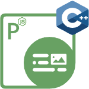

## Bem-vindo ao Aspose.PDF for Node.js via C++

Node.js é um ambiente de tempo de execução multiplataforma para aplicações de servidor e de rede escritas em JavaScript. Essencialmente, ele permite que você execute aplicações JavaScript fora de um contexto de navegador.

Aspose.PDF for Node.js via C++ é um kit de ferramentas poderoso que permite que o JavaScript seja executado e ajuda os desenvolvedores a realizar várias tarefas de PDF no ambiente Node.js.

Aspose.PDF for Node.js permite que os desenvolvedores manipulem arquivos PDF diretamente. Aspose.PDF for Node.js via C++ foi construído com base no uso da tecnologia WebAssembly e tem como base o Aspose.PDF for .NET.

## Capítulos

- [Novidades](/pdf/pt/nodejs-cpp/whatsnew/)
- [Visão geral](/pdf/pt/nodejs-cpp/overview/)
- [Começar](/pdf/pt/nodejs-cpp/get-started/)
- [Operações básicas](/pdf/pt/nodejs-cpp/basic-operations/)
- [Notas de Lançamento](https://releases.aspose.com/pdf/nodejscpp/release-notes/)

## Recursos do Aspose.PDF for Node.js

Os seguintes são os links para alguns recursos úteis que você pode precisar para concluir suas tarefas.

- [Aspose.PDF for Node.js Recursos](/pdf/pt/nodejs-cpp/key-features/)
- [Aspose.PDF for Node.js Notas de Lançamento](https://releases.aspose.com/pdf/nodejscpp/release-notes/)
- [Baixar Aspose.PDF for Node.js](https://releases.aspose.com/pdf/nodejscpp/)
- [Aspose.PDF for Node.js Página do Produto](https://products.aspose.com/pdf/nodejs-cpp/)
- [Aspose.PDF for Node.js Guia de Referência da API](https://reference.aspose.com/pdf/nodejs-cpp/)
- [Aspose.PDF for Node.js Fórum de Suporte Gratuito](https://forum.aspose.com/c/pdf/10)
- [Aspose.PDF for Node.js Helpdesk de Suporte Pago](https://helpdesk.aspose.com/)
