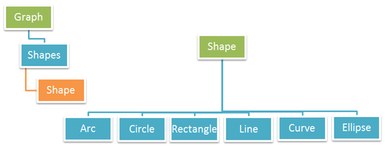

## O que é um Gráfico

Adicionar gráficos a documentos PDF é uma tarefa muito comum para desenvolvedores que trabalham com Adobe Acrobat Writer ou outros aplicativos de processamento de PDF. Existem muitos tipos de gráficos que podem ser usados em aplicações PDF.
[Aspose.PDF for Python via .NET](/pdf/python-net/) também suporta a adição de gráficos a documentos PDF. Para esse fim, a classe Graph é fornecida. Graph é um elemento de nível de parágrafo e pode ser adicionada à coleção Paragraphs em uma instância Page. Uma instância Graph contém uma coleção de Shapes.

Os seguintes tipos de formas são suportados pela classe [Graph](https://reference.aspose.com/pdf/python-net/aspose.pdf.drawing/graph/):

- [Arc](/pdf/python-net/add-arc/) - às vezes também chamado de bandeira é um par ordenado de vértices adjacentes, mas às vezes também chamado de linha dirigida.
- [Circle](/pdf/python-net/add-circle/) - exibe dados usando um círculo dividido em setores. Usamos um gráfico de círculo (também chamado de gráfico de pizza) para mostrar como os dados representam porções de um todo ou de um grupo.
- [Curve](/pdf/python-net/add-curve/) - é uma união conectada de linhas projetivas, cada linha encontrando outras três em pontos duplos comuns.
- [Line](/pdf/python-net/add-line) - gráficos de linha são usados para exibir dados contínuos e podem ser úteis na previsão de eventos futuros quando mostram tendências ao longo do tempo.
- [Rectangle](/pdf/python-net/add-rectangle/) - é uma das muitas formas fundamentais que você encontrará em gráficos, e pode ser muito útil para ajudar a resolver um problema.
- [Ellipse](/pdf/python-net/add-ellipse/) - é um conjunto de pontos em um plano, criando uma forma oval e curva.

Os detalhes acima também são mostrados nas figuras abaixo:

