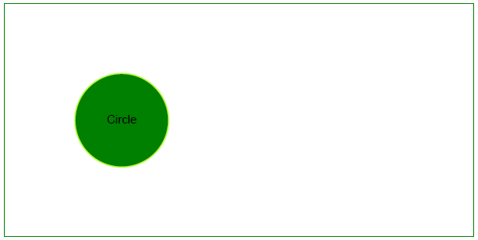

## Adicionar objeto Círculo

Como os gráficos de barras, os gráficos de círculos podem ser usados para exibir dados em várias categorias distintas. Ao contrário dos gráficos de barras, porém, os gráficos de círculos só podem ser usados quando você tem dados para todas as categorias que compõem o todo. Portanto, vamos dar uma olhada em adicionar um objeto [Círculo](https://reference.aspose.com/pdf/python-net/aspose.pdf.drawing/circle/) com Aspose.PDF para Python .NET.

Este exemplo ilustra como desenhar programaticamente um círculo dentro de um documento PDF usando Aspose.PDF para Python via .NET. Ao aproveitar o módulo de desenho, os desenvolvedores podem criar elementos gráficos complexos com controle preciso sobre sua aparência e posicionamento. Essa capacidade é essencial para aplicações que exigem a geração dinâmica de conteúdo gráfico dentro de PDFs, como diagramas técnicos, gráficos ou ilustrações personalizadas.

Siga os passos abaixo:

1. Crie a instância de [Document](https://reference.aspose.com/pdf/python-net/aspose.pdf/document/).
1. Crie um [Objeto de Desenho](https://reference.aspose.com/pdf/python-net/aspose.pdf.drawing/) com determinadas dimensões.
1. Defina a [borda](https://reference.aspose.com/pdf/python-net/aspose.pdf.drawing/graph/#properties) para o objeto de Desenho.
1. Adicione o objeto [Graph](https://reference.aspose.com/pdf/python-net/aspose.pdf.drawing/graph/) à coleção de parágrafos da página.
1. Salve nosso arquivo PDF.

```python

    import aspose.pdf as ap
    import aspose.pdf.drawing as drawing
    import datetime

    # Create PDF document
    document = ap.Document()

    # Add page
    page = document.pages.add()

    # Create Drawing object with certain dimensions
    graph = drawing.Graph(400, 200)

    # Set border for Drawing object
    border_info = ap.BorderInfo(ap.BorderSide.ALL, ap.Color.green)
    graph.border = border_info

    # Create a circle with the specified coordinates and radius
    circle = drawing.Circle(100, 100, 40)

    # Set the circle's color
    circle.graph_info = drawing.GraphInfo()
    circle.graph_info.color = ap.Color.green_yellow

    # Add the circle to the graph shapes
    graph.shapes.add(circle)

    # Add Graph object to paragraphs collection of page
    page.paragraphs.add(graph)

    # Save PDF document
    document.save(path_outfile)
```

Nosso círculo desenhado ficará assim:


## Criar objeto Círculo preenchido

Este exemplo mostra como adicionar um objeto Círculo que está preenchido com cor.

```python

    import aspose.pdf as ap
    import aspose.pdf.drawing as drawing
    import datetime

    # Create PDF document
    document = ap.Document()

    # Add page
    page = document.pages.add()

    # Create Drawing object with certain dimensions
    graph = drawing.Graph(400, 200)

    # Set border for Drawing object
    border_info = ap.BorderInfo(ap.BorderSide.ALL, ap.Color.green)
    graph.border = border_info

    # Create a filled circle
    circle = drawing.Circle(100, 100, 40)
    circle.graph_info = drawing.GraphInfo()
    circle.graph_info.color = ap.Color.green_yellow
    circle.graph_info.fill_color = ap.Color.green
    circle.text = ap.text.TextFragment("Circle")

    # Add the circle to the graph shapes
    graph.shapes.add(circle)

    # Add Graph object to paragraphs collection of page
    page.paragraphs.add(graph)

    # Save PDF document
    document.save(path_outfile)
```

Vamos ver o resultado de adicionar um Círculo preenchido:




