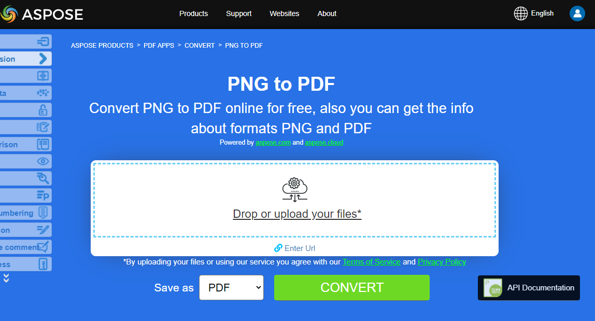

## Conversões de Imagens Python para PDF

**Aspose.PDF for Python via .NET** permite converter diferentes formatos de imagens para arquivos PDF. Nossa biblioteca demonstra trechos de código para converter os formatos de imagem mais populares, como - BMP, CGM, DICOM, EMF, JPG, PNG, SVG e TIFF.

## Converter BMP para PDF

Converter arquivos BMP para documento PDF usando a biblioteca **Aspose.PDF for Python via .NET**.

<abbr title="Bitmap Image File">BMP</abbr> imagens são arquivos com extensão. BMP representa arquivos de imagem bitmap que são usados para armazenar imagens digitais bitmap. Essas imagens são independentes do adaptador gráfico e também são chamadas de formato de bitmap independente de dispositivo (DIB).

Você pode converter arquivos BMP para PDF com a API Aspose.PDF for Python via .NET. Portanto, você pode seguir os passos a seguir para converter imagens BMP:

Etapas para Converter BMP para PDF em Python:

1. Crie um documento PDF vazio.
1. Crie a página que você precisa, por exemplo, criamos A4, mas você pode especificar seu próprio formato.
1. Posicione a imagem (do arquivo de entrada) dentro da página usando o retângulo definido.
1. Salve o documento como PDF.

Assim, o trecho de código a seguir segue estas etapas e mostra como converter BMP para PDF usando Python:

```python

    from io import FileIO
    from os import path
    import os
    import shutil
    import aspose.pdf as apdf
    import inspect

    path_infile = path.join(self.data_dir, infile)
    path_outfile = path.join(self.data_dir, "python", outfile)

    document = apdf.Document()
    rectangle = apdf.Rectangle(0, 0, 595, 842, True)  # A4 size in points
    page.add_image(path_infile, rectangle)
    document.save(path_outfile)

    print(infile + " converted into " + outfile)
```

{}
**Tente converter BMP para PDF online**

A Aspose lhe apresenta um aplicativo gratuito online ["BMP para PDF"](https://products.aspose.app/pdf/conversion/bmp-to-pdf/), onde você pode experimentar investigar a funcionalidade e a qualidade com que ele funciona.

[](https://products.aspose.app/pdf/conversion/bmp-to-pdf/)
{}

## Converter CGM para PDF

Converter um CGM (Computer Graphics Metafile) em PDF (ou outro formato suportado) usando Aspose.PDF for Python via .NET.

<abbr title="Computer Graphics Metafile">CGM</abbr> é uma extensão de arquivo para um formato Computer Graphics Metafile, comumente usado em CAD (design assistido por computador) e aplicações de gráficos de apresentação. CGM é um formato de gráficos vetoriais que suporta três diferentes métodos de codificação: binário (melhor para velocidade de leitura do programa), baseado em caracteres (produz o menor tamanho de arquivo e permite transferências de dados mais rápidas) ou codificação em texto claro (permite que os usuários leiam e modifiquem o arquivo com um editor de texto).

Confira o próximo trecho de código para converter arquivos CGM para o formato PDF.

Etapas para Converter CGM para PDF em Python:

1. Defina os Caminhos dos Arquivos
1. Defina as Opções de Carregamento para CGM.
1. Converta CGM para PDF
1. Imprima a Mensagem de Conversão

```python

    from io import FileIO
    from os import path
    import os
    import shutil
    import aspose.pdf as apdf
    import inspect

    path_infile = path.join(self.data_dir, infile)
    path_outfile = path.join(self.data_dir, "python", outfile)

    options = apdf.CgmLoadOptions()

    # Open PDF document
    document = apdf.Document(path_infile, options)
    document.save(path_outfile)
    print(infile + " converted into " + outfile)
```

## Converter DICOM para PDF

<abbr title="Digital Imaging and Communications in Medicine">DICOM</abbr> é o padrão da indústria médica para a criação, armazenamento, transmissão e visualização de imagens médicas digitais e documentos de pacientes examinados.

**Aspose.PDF for Python** permite converter imagens DICOM e SVG, mas por razões técnicas para adicionar imagens você precisa especificar o tipo de arquivo a ser adicionado ao PDF.

O trecho de código a seguir mostra como converter arquivos DICOM para o formato PDF com Aspose.PDF. Você deve carregar a imagem DICOM, colocar a imagem em uma página de um arquivo PDF e salvar a saída como PDF. Usamos a biblioteca adicional pydicom para definir as dimensões desta imagem. Se você quiser posicionar a imagem na página, pode pular este trecho de código.

1. Inicialize um novo 'ap.Document()' e adicione uma página
1. Insira a Imagem DICOM. Crie um apdf.Image(), defina seu tipo como DICOM e atribua o caminho do arquivo.
1. Ajuste o Tamanho da Página. Combine as dimensões da página PDF com o tamanho da imagem DICOM, removendo margens.
1. Adicione a imagem à página, salve o documento no arquivo de saída.

1. Carregue o arquivo DICOM.
1. Extraia as dimensões da imagem.
1. Imprima o tamanho da imagem.
1. Crie um novo documento PDF.
1. Prepare a imagem DICOM para PDF.
1. Defina o tamanho da página PDF e as margens.
1. Adicione a imagem à página.
1. Salve o PDF.
1. Imprima a mensagem de conversão.

```python

    from io import FileIO
    from os import path
    import os
    import shutil
    import aspose.pdf as apdf
    import inspect
    import pydicom


    path_infile = path.join(self.data_dir, infile)
    path_outfile = path.join(self.data_dir, "python", outfile)

    # Load the DICOM file
    dicom_file = pydicom.dcmread(path_infile)

    # Get the dimensions of the image
    rows = dicom_file.Rows
    columns = dicom_file.Columns

    # Print the dimensions
    print(f"DICOM image size: {rows} x {columns} pixels")

    # Initialize new Document
    document = apdf.Document()
    page = document.pages.add()
    image = apdf.Image()
    image.file_type = apdf.ImageFileType.DICOM
    image.file = path_infile

    # Set page dimensions

    page.page_info.height = rows
    page.page_info.width = columns
    page.page_info.margin.bottom = 0
    page.page_info.margin.top = 0
    page.page_info.margin.right = 0
    page.page_info.margin.left = 0
    page.paragraphs.add(image)

    document.save(path_outfile)
    print(infile + " converted into " + outfile)
```

{}
**Experimente converter DICOM para PDF online**

Aspose apresenta a você um aplicativo gratuito online ["DICOM para PDF"](https://products.aspose.app/pdf/conversion/dicom-to-pdf/), onde você pode experimentar investigar a funcionalidade e a qualidade com que ele funciona.

[](https://products.aspose.app/pdf/conversion/dicom-to-pdf/)
{}

## Converter EMF para PDF

<abbr title="Enhanced metafile format">EMF</abbr> armazena imagens gráficas de forma independente do dispositivo. Metafiles de EMF compreendem registros de comprimento variável em ordem cronológica que podem renderizar a imagem armazenada após a análise em qualquer dispositivo de saída.

O trecho de código a seguir mostra como converter um EMF para PDF com Python:

```python

    from io import FileIO
    from os import path
    import os
    import shutil
    import aspose.pdf as apdf
    import inspect
    import pydicom
    
    path_infile = path.join(self.data_dir, infile)
    path_outfile = path.join(self.data_dir, "python", outfile)

    document = apdf.Document()
    page = document.pages.add()
    rectangle = apdf.Rectangle(0, 0, 595, 842, True)  # A4 size in points
    # add image to new pdf page
    page.add_image(path_infile, rectangle)

    # Save the file into PDF format
    document.save(path_outfile)
    print(infile + " converted into " + outfile)
```

{}
**Experimente converter EMF para PDF online**

Aspose apresenta a você um aplicativo gratuito online ["EMF para PDF"](https://products.aspose.app/pdf/conversion/emf-to-pdf/), onde você pode experimentar investigar a funcionalidade e a qualidade com que ele funciona.

[](https://products.aspose.app/pdf/conversion/emf-to-pdf/)
{}

## Converter GIF para PDF

Converta arquivos GIF para documento PDF usando a biblioteca **Aspose.PDF for Python via .NET**.

<abbr title="Graphics Interchange Format">GIF</abbr> é capaz de armazenar dados comprimidos sem perda de qualidade em um formato de no máximo 256 cores. O formato GIF, independente de hardware, foi desenvolvido em 1987 (GIF87a) pela CompuServe para transmissão de imagens bitmap através de redes.

Portanto, o trecho de código a seguir segue estas etapas e mostra como converter BMP para PDF usando Python:

```python

    from io import FileIO
    from os import path
    import os
    import shutil
    import aspose.pdf as apdf
    import inspect
    import pydicom

    path_infile = path.join(self.data_dir, infile)
    path_outfile = path.join(self.data_dir, "python", outfile)

    document = apdf.Document()
    page = document.pages.add()
    rectangle = apdf.Rectangle(0, 0, 595, 842, True)  # A4 size in points
    page.add_image(path_infile, rectangle)

    document.save(path_outfile)
    print(infile + " converted into " + outfile)
```

{}
**Experimente converter GIF para PDF online**

Aspose apresenta a você um aplicativo gratuito online ["GIF para PDF"](https://products.aspose.app/pdf/conversion/gif-to-pdf/), onde você pode experimentar investigar a funcionalidade e a qualidade com que ele funciona.

[](https://products.aspose.app/pdf/conversion/gif-to-pdf/)
{}

## Converter PNG para PDF

**Aspose.PDF for Python via .NET** oferece recurso para converter imagens PNG para formato PDF. Confira o próximo trecho de código para realizar sua tarefa.

<abbr title="Portable Network Graphics">PNG</abbr> refere-se a um tipo de formato de arquivo de imagem raster que usa compressão sem perdas, o que o torna popular entre seus usuários.

Você pode converter PNG para imagem PDF usando os passos abaixo:

1. Crie um novo documento PDF.
1. Defina a colocação da imagem.
1. Salve o PDF.
1. Imprima a mensagem de conversão.

Além disso, o trecho de código abaixo mostra como converter PNG para PDF com Python:

```python

    from io import FileIO
    from os import path
    import os
    import shutil
    import aspose.pdf as apdf
    import inspect
    import pydicom

    path_infile = path.join(self.data_dir, infile)
    path_outfile = path.join(self.data_dir, "python", outfile)

    document = apdf.Document()
    page = document.pages.add()
    rectangle = apdf.Rectangle(0, 0, 595, 842, True)  # A4 size in points
    page.add_image(path_infile, rectangle)
    document.save(path_outfile)

    print(infile + " converted into " + outfile)
```

{}
**Experimente converter PNG para PDF online**

Aspose apresenta a você um aplicativo gratuito online ["PNG para PDF"](https://products.aspose.app/pdf/conversion/png-to-pdf/), onde você pode experimentar investigar a funcionalidade e a qualidade com que ele funciona.

[](https://products.aspose.app/pdf/conversion/png-to-pdf/)
{}

## Converter SVG para PDF

**Aspose.PDF for Python via .NET** explica como converter imagens SVG para formato PDF e como obter as dimensões do arquivo SVG de origem.

Scalable Vector Graphics (SVG) é uma família de especificações de um formato de arquivo baseado em XML para gráficos vetoriais bidimensionais, tanto estáticos como dinâmicos (interativos ou animados). A especificação SVG é um padrão aberto que está em desenvolvimento pelo World Wide Web Consortium (W3C) desde 1999.

<abbr title="Scalable Vector Graphics">SVG</abbr> imagens e seus comportamentos são definidos em arquivos de texto XML. Isso significa que podem ser pesquisados, indexados, scriptados e, se necessário, comprimidos. Como arquivos XML, imagens SVG podem ser criadas e editadas com qualquer editor de texto, mas muitas vezes é mais conveniente criá-las com programas de desenho como o Inkscape.

{}
**Experimente converter formato SVG para PDF online**

Aspose.PDF for Python via .NET apresenta a você um aplicativo gratuito online ["SVG para PDF"](https://products.aspose.app/pdf/conversion/svg-to-pdf), onde você pode experimentar investigar a funcionalidade e a qualidade com que ele funciona.

[](https://products.aspose.app/pdf/conversion/svg-to-pdf)
{}

O trecho de código a seguir mostra o processo de conversão de um arquivo SVG para o formato PDF com Aspose.PDF para Python.

```python

    from io import FileIO
    from os import path
    import os
    import shutil
    import aspose.pdf as apdf
    import inspect
    import pydicom

    path_infile = path.join(self.data_dir, infile)
    path_outfile = path.join(self.data_dir, "python", outfile)

    load_options = apdf.SvgLoadOptions()
    document = apdf.Document(path_infile, load_options)
    document.save(path_outfile)

    print(infile + " converted into " + outfile)
```

## Converter TIFF para PDF

**Aspose.PDF** formato de arquivo suportado, seja uma imagem TIFF de quadro único ou de múltiplos quadros. Isso significa que você pode converter a imagem TIFF para PDF.

TIFF ou TIF, Tagged Image File Format, representa imagens raster que são destinadas ao uso em uma variedade de dispositivos que seguem este padrão de formato de arquivo. A imagem TIFF pode conter vários quadros com diferentes imagens. O formato de arquivo Aspose.PDF também é suportado, seja um quadro único ou múltiplos quadros TIFF.

Você pode converter TIFF para PDF da mesma forma que os demais gráficos de formatos de arquivo raster:

```python

    from io import FileIO
    from os import path
    import os
    import shutil
    import aspose.pdf as apdf
    import inspect
    import pydicom

    path_infile = path.join(self.data_dir, infile)
    path_outfile = path.join(self.data_dir, "python", outfile)

    document = apdf.Document()
    page = document.pages.add()
    rectangle = apdf.Rectangle(0, 0, 595, 842, True)  # A4 size in points
    page.add_image(path_infile, rectangle)
    document.save(path_outfile)

    print(infile + " converted into " + outfile)
```

## Converter CDR para PDF

O trecho de código a seguir mostra como carregar um arquivo CorelDRAW (CDR) e salvá-lo como PDF usando 'CdrLoadOptions' no Aspose.PDF para Python via .NET.

1. Crie 'CdrLoadOptions()' para configurar como o arquivo CDR deve ser carregado.
1. Inicialize um objeto Document com o arquivo CDR e as opções de carregamento.
1. Salve o documento como PDF.

```python

    from io import FileIO
    from os import path
    import os
    import shutil
    import aspose.pdf as apdf
    import inspect
    import pydicom

    path_infile = path.join(self.data_dir, infile)
    path_outfile = path.join(self.data_dir, "python", outfile)

    load_options = apdf.CdrLoadOptions()
    document = apdf.Document(path_infile, load_options)
    document.save(path_outfile)

    print(infile + " converted into " + outfile)
```

## Converter JPEG para PDF

Este exemplo mostra como converter JPEG para um arquivo PDF usando Aspose.PDF para Python via .NET.

1. Crie um novo documento PDF.
1. Adicione uma nova página.
1. Defina o retângulo de posicionamento (tamanho A4: 595x842 pontos).
1. Insira a imagem na página.
1. Salve o PDF.

```python

    from io import FileIO
    from os import path
    import os
    import shutil
    import aspose.pdf as apdf
    import inspect
    import pydicom

    path_infile = path.join(self.data_dir, infile)
    path_outfile = path.join(self.data_dir, "python", outfile)

    document = apdf.Document()
    page = document.pages.add()
    rectangle = apdf.Rectangle(0, 0, 595, 842, True)  # A4 size in points
    page.add_image(path_infile, rectangle)

    document.save(path_outfile)
    print(infile + " converted into " + outfile)
```

