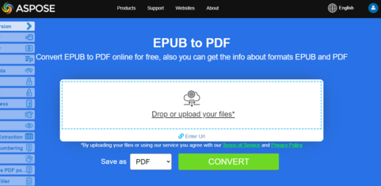
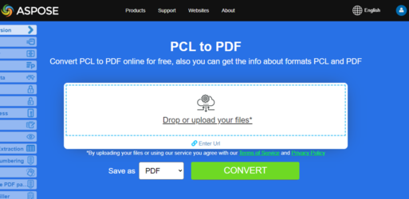

Este artigo explica como **converter vários outros tipos de formatos de arquivo para PDF usando Python**. Ele cobre os seguintes tópicos.

## Converter OFD para PDF

OFD significa Open Fixed-layout Document (também chamado de formato Open Fixed Document). É um padrão nacional chinês (GB/T 33190-2016) para documentos eletrônicos, introduzido como uma alternativa ao PDF.

Etapas para Converter OFD para PDF em Python:

1. Configurar opções de carregamento OFD usando OfdLoadOptions().
1. Carregar o documento OFD.
1. Salvar como PDF.

```python

    from os import path
    import aspose.pdf as ap

    path_infile = path.join(self.data_dir, infile)
    path_outfile = path.join(self.data_dir, "python", outfile)

    load_options = ap.OfdLoadOptions()
    document = ap.Document(path_infile, load_options)
    document.save(path_outfile)

    print(infile + " converted into " + outfile)
```

## Converter LaTeX/TeX para PDF

O formato de arquivo LaTeX é um formato de texto com marcação derivada da família de linguagens TeX e o LaTeX é um formato derivado do sistema TeX. LaTeX (ˈleɪtɛk/lay-tek ou lah-tek) é um sistema de preparação de documentos e uma linguagem de marcação de documentos. É amplamente utilizado para a comunicação e publicação de documentos científicos em diversos campos, incluindo matemática, física e ciência da computação. Também desempenha um papel crucial na preparação e publicação de livros e artigos que contêm material multilíngue complexo, como coreano, japonês, caracteres chineses e árabe, incluindo edições especiais.

LaTeX usa o programa de tipografia TeX para formatar sua saída, e é escrito na linguagem de macros TeX.

{}
**Tente converter LaTeX/TeX para PDF online**

Aspose.PDF for Python via .NET apresenta a você aplicação gratuita online ["LaTex to PDF"](https://products.aspose.app/pdf/conversion/tex-to-pdf), onde você pode testar a funcionalidade e a qualidade com que funciona.

[](https://products.aspose.app/pdf/conversion/tex-to-pdf)
{}

Etapas para Converter TEX para PDF em Python:

1. Configurar opções de carregamento LaTeX usando LatexLoadOptions().
1. Carregar o documento LaTeX.
1. Salvar como PDF.

```python

    from os import path
    import aspose.pdf as ap

    path_infile = path.join(self.data_dir, infile)
    path_outfile = path.join(self.data_dir, "python", outfile)

    load_options = ap.LatexLoadOptions()
    document = ap.Document(path_infile, load_options)
    document.save(path_outfile)

    print(infile + " converted into " + outfile)
```
## Converter OFD para PDF

OFD significa Open Fixed-layout Document (às vezes chamado de formato Open Fixed Document). É um padrão nacional chinês (GB/T 33190-2016) para documentos eletrônicos, introduzido como uma alternativa ao PDF.

Etapas para Converter OFD para PDF em Python:

1. Configurar opções de carregamento OFD usando OfdLoadOptions().
1. Carregar o documento OFD.
1. Salvar como PDF.

```python

    from os import path
    import aspose.pdf as ap

    path_infile = path.join(self.data_dir, infile)
    path_outfile = path.join(self.data_dir, "python", outfile)

    load_options = ap.OfdLoadOptions()
    document = ap.Document(path_infile, load_options)
    document.save(path_outfile)

    print(infile + " converted into " + outfile)
```

## Converter LaTeX/TeX para PDF

O formato de arquivo LaTeX é um formato de texto com marcação derivada da família de linguagens TeX e o LaTeX é um formato derivado do sistema TeX. LaTeX (ˈleɪtɛk/lay-tek ou lah-tek) é um sistema de preparação de documentos e uma linguagem de marcação de documentos. É amplamente usado para a comunicação e publicação de documentos científicos em muitos campos, incluindo matemática, física e ciência da computação. Também possui um papel de destaque na preparação e publicação de livros e artigos que contêm materiais multilíngues complexos, como sânscrito e árabe, incluindo edições críticas. LaTeX usa o programa de tipografia TeX para formatar sua saída, e é escrito na linguagem de macros TeX.

{}
**Tente converter LaTeX/TeX para PDF online**

Aspose.PDF for Python via .NET apresenta a você aplicação gratuita online ["LaTex to PDF"](https://products.aspose.app/pdf/conversion/tex-to-pdf), onde você pode testar a funcionalidade e a qualidade com que funciona.

[](https://products.aspose.app/pdf/conversion/tex-to-pdf)
{}

Etapas para Converter TEX para PDF em Python:

1. Configurar opções de carregamento LaTeX usando LatexLoadOptions().
1. Carregar o documento LaTeX.
1. Salvar como PDF.

```python

    from os import path
    import aspose.pdf as ap

    path_infile = path.join(self.data_dir, infile)
    path_outfile = path.join(self.data_dir, "python", outfile)

    load_options = ap.LatexLoadOptions()
    document = ap.Document(path_infile, load_options)
    document.save(path_outfile)

    print(infile + " converted into " + outfile)
```

## Converter EPUB para PDF

**Aspose.PDF for Python via .NET** permite que você converta arquivos EPUB para formato PDF.

EPUB (abreviação de electronic publication) é um padrão livre e aberto de e‑book do International Digital Publishing Forum (IDPF). Os arquivos têm a extensão .epub. EPUB foi projetado para conteúdo refluível, ou seja, um leitor EPUB pode otimizar o texto para um dispositivo de exibição específico.

<abbr title="electronic publication">EPUB</abbr> também suporta conteúdo de layout fixo. O formato destina‑se a ser um formato único que editores e casas de conversão podem usar internamente, bem como para distribuição e venda. Ele substitui o padrão Open eBook. A versão EPUB 3 também é endossada pelo Book Industry Study Group (BISG), uma associação líder da indústria de livros para práticas recomendadas padronizadas, pesquisa, informação e eventos, para empacotamento de conteúdo.

{}
**Tente converter EPUB para PDF online**

Aspose.PDF for Python via .NET apresenta a você um aplicativo online gratuito ["EPUB to PDF"](https://products.aspose.app/pdf/conversion/epub-to-pdf), onde você pode testar a funcionalidade e a qualidade com que ele funciona.

[](https://products.aspose.app/pdf/conversion/epub-to-pdf)
{}

Etapas para Converter EPUB para PDF em Python:

1. Carregue o Documento EPUB com EpubLoadOptions().
1. Converta EPUB para PDF.
1. Imprima a Confirmação.

O próximo trecho de código mostra como converter arquivos EPUB para formato PDF com Python.

```python

    from os import path
    import aspose.pdf as ap

    path_infile = path.join(self.data_dir, infile)
    path_outfile = path.join(self.data_dir, "python", outfile)

    load_options = ap.EpubLoadOptions()
    document = ap.Document(path_infile, load_options)

    document.save(path_outfile)
    print(infile + " converted into " + outfile)
```

## Converter Markdown para PDF

**Este recurso é suportado a partir da versão 19.6 ou superior.**

{}
**Tente converter Markdown para PDF online**

Aspose.PDF for Python via .NET apresenta a você um aplicativo online gratuito ["Markdown to PDF"](https://products.aspose.app/pdf/conversion/md-to-pdf), onde você pode testar a funcionalidade e a qualidade com que ele funciona.

[](https://products.aspose.app/pdf/conversion/md-to-pdf)
{}

Este trecho de código da Aspose.PDF for Python via .NET ajuda a converter arquivos Markdown em PDFs, permitindo melhor compartilhamento de documentos, preservação de formatação e compatibilidade de impressão.

O seguinte trecho de código mostra como usar esta funcionalidade com a biblioteca Aspose.PDF:

```python

    from os import path
    import aspose.pdf as ap

    path_infile = path.join(self.data_dir, infile)
    path_outfile = path.join(self.data_dir, "python", outfile)

    load_options = ap.MdLoadOptions()
    document = ap.Document(path_infile, load_options)
    document.save(path_outfile)
    print(infile + " converted into " + outfile)
```

## Converter PCL para PDF

<abbr title="Printer Command Language">PCL</abbr> (Printer Command Language) é uma linguagem de impressora Hewlett‑Packard desenvolvida para acessar recursos padrão de impressoras. Os níveis PCL de 1 a 5e/5c são linguagens baseadas em comandos que usam sequências de controle processadas e interpretadas na ordem em que são recebidas. Em nível de consumidor, fluxos de dados PCL são gerados por um driver de impressão. A saída PCL também pode ser facilmente gerada por aplicações personalizadas.

{}
**Tente converter PCL para PDF online**

Aspose.PDF for .NET apresenta a você um aplicativo online gratuito ["PCL to PDF"](https://products.aspose.app/pdf/conversion/pcl-to-pdf), onde você pode testar a funcionalidade e a qualidade com que ele funciona.

[](https://products.aspose.app/pdf/conversion/pcl-to-pdf)
{}

Para permitir a conversão de PCL para PDF, o Aspose.PDF possui a classe [`PclLoadOptions`](https://reference.aspose.com/pdf/net/aspose.pdf/pclloadoptions) que é usada para inicializar o objeto LoadOptions. Mais tarde, este objeto é passado como argumento durante a inicialização do objeto Document e ajuda o motor de renderização de PDF a determinar o formato de entrada do documento fonte.

O trecho de código a seguir mostra o processo de conversão de um arquivo PCL para formato PDF.

Etapas para Converter PCL para PDF em Python:

1. Carregue as opções para PCL usando PclLoadOptions().
1. Carregue o documento.
1. Salve como PDF.

```python

    from os import path
    import aspose.pdf as ap

    path_infile = path.join(self.data_dir, infile)
    path_outfile = path.join(self.data_dir, "python", outfile)

    load_options = ap.PclLoadOptions()
    load_options.supress_errors = True

    document = ap.Document(path_infile, load_options)
    document.save(path_outfile)

    print(infile + " converted into " + outfile)
```

## Converter Texto Pré-formatado para PDF

**Aspose.PDF for Python via .NET** suporta o recurso de conversão de texto simples e arquivos de texto pré-formatado para formato PDF.

Converter texto para PDF significa adicionar fragmentos de texto à página PDF. No caso de arquivos de texto, lidamos com 2 tipos de texto: pré-formatado (por exemplo, 25 linhas com 80 caracteres por linha) e texto não formatado (texto simples). Dependendo das nossas necessidades, podemos controlar essa adição nós mesmos ou confiar nos algoritmos da biblioteca.

{}
**Tente converter TEXTO para PDF online**

Aspose.PDF for Python via .NET apresenta a você um aplicativo online gratuito ["Text to PDF"](https://products.aspose.app/pdf/conversion/txt-to-pdf), onde você pode testar a funcionalidade e a qualidade com que ele funciona.

[](https://products.aspose.app/pdf/conversion/txt-to-pdf)
{}

Etapas para Converter TEXTO para PDF em Python:

1. Leia o arquivo de texto de entrada linha por linha.
1. Defina uma fonte monoespaçada (Courier New) para alinhamento de texto consistente.
1. Crie um novo Documento PDF e adicione a primeira página com margens e configurações de fonte personalizadas.
1. Itere pelas linhas do arquivo de texto. Para simular uma máquina de escrever, usamos a fonte 'monospace_font' tamanho 12.
1. Limite a criação de páginas a 4 páginas.
1. Salve o PDF final no caminho especificado.

```python

    from os import path
    import aspose.pdf as ap

    path_infile = path.join(self.data_dir, infile)
    path_outfile = path.join(self.data_dir, "python", outfile)

    with open(path_infile, "r") as file:
        lines = file.readlines()

    monospace_font = ap.text.FontRepository.find_font("Courier New")

    document = ap.Document()
    page = document.pages.add()

    page.page_info.margin.left = 20
    page.page_info.margin.right = 10
    page.page_info.default_text_state.font = monospace_font
    page.page_info.default_text_state.font_size = 12
    count = 1
    for line in lines:
        if line != "" and line[0] == "\x0c":
            page = document.pages.add()
            page.page_info.margin.left = 20
            page.page_info.margin.right = 10
            page.page_info.default_text_state.font = monospace_font
            page.page_info.default_text_state.font_size = 12
            count = count + 1
        else:
            text = ap.text.TextFragment(line)
            page.paragraphs.add(text)

        if count == 4:
            break

    document.save(path_outfile)

    print(infile + " converted into " + outfile)
```

## Converter PostScript para PDF

Este exemplo demonstra como converter um arquivo PostScript em um documento PDF usando Aspose.PDF para Python via .NET.

1. Crie uma instância de 'PsLoadOptions' para interpretar corretamente o arquivo PS.
1. Carregue o arquivo 'PostScript' em um objeto Document usando as opções de carregamento.
1. Salve o documento no formato PDF no caminho de saída desejado.

```python

    from os import path
    import aspose.pdf as ap

    path_infile = path.join(self.data_dir, infile)
    path_outfile = path.join(self.data_dir, "python", outfile)

    load_options = ap.PsLoadOptions()

    document = ap.Document(path_infile, load_options)
    document.save(path_outfile)

    print(infile + " converted into " + outfile)
```

## Converter XPS para PDF

**Aspose.PDF para Python via .NET** oferece suporte à conversão de arquivos <abbr title="XML Paper Specification">XPS</abbr> para formato PDF. Consulte este artigo para resolver suas tarefas.

O tipo de arquivo XPS está principalmente associado à Especificação de Papel XML da Microsoft Corporation. A Especificação de Papel XML (XPS), anteriormente chamada de Metro e que incorpora o conceito de marketing Next Generation Print Path (NGPP), é a iniciativa da Microsoft de integrar a criação e visualização de documentos em seu sistema operacional Windows.

O trecho de código a seguir mostra o processo de conversão de um arquivo XPS para o formato PDF com Python.

```python

    from os import path
    import aspose.pdf as ap

    path_infile = path.join(self.data_dir, infile)
    path_outfile = path.join(self.data_dir, "python", outfile)

    load_options = ap.XpsLoadOptions()
    document = ap.Document(path_infile, load_options)
    document.save(path_outfile)

    print(infile + " converted into " + outfile)
```

{}
**Tente converter o formato XPS para PDF online**

Aspose.PDF para Python via .NET apresenta a você uma aplicação online gratuita ["XPS para PDF"](https://products.aspose.app/pdf/conversion/xps-to-pdf/), onde você pode testar a funcionalidade e a qualidade do serviço.

[](https://products.aspose.app/pdf/conversion/xps-to-pdf/)
{}

## Converter XSL-FO para PDF

O trecho de código a seguir pode ser usado para converter um XSL-FO para o formato PDF com Aspose.PDF para Python via .NET:

```python

    from os import path
    import aspose.pdf as ap

    path_xsltfile = path.join(self.data_dir, xsltfile)
    path_xmlfile = path.join(self.data_dir, xmlfile)
    path_outfile = path.join(self.data_dir, "python", outfile)

    load_options = ap.XslFoLoadOptions(path_xsltfile)
    load_options.parsing_errors_handling_type = (
        ap.XslFoLoadOptions.ParsingErrorsHandlingTypes.ThrowExceptionImmediately
    )
    document = ap.Document(path_xmlfile, load_options)
    document.save(path_outfile)

    print(xmlfile + " converted into " + outfile)
```

## Converter XML com XSLT para PDF

Este exemplo demonstra como converter um arquivo XML em PDF, primeiro transformando-o em HTML usando um modelo XSLT e, em seguida, carregando o HTML no Aspose.PDF.

1. Crie uma instância de 'HtmlLoadOptions' para configurar a conversão de HTML para PDF.
1. Carregue o arquivo HTML transformado em um objeto Document do Aspose.PDF.
1. Salve o documento como PDF no caminho de saída especificado.
1. Remova o arquivo HTML temporário após a conversão bem-sucedida.

```python

    from os import path
    import aspose.pdf as ap

    def transform_xml_to_html(xml_file, xslt_file, html_file):
        from lxml import etree
        """
        Transform XML to HTML using XSLT and return as a stream
        """
        # Parse XML document
        xml_doc = etree.parse(xml_file)

        # Parse XSLT stylesheet
        xslt_doc = etree.parse(xslt_file)
        transform = etree.XSLT(xslt_doc)

        # Apply transformation
        result = transform(xml_doc)

        # Save result to HTML file
        with open(html_file, 'w', encoding='utf-8') as f:
            f.write(str(result))


    def convert_XML_to_PDF(template, infile, outfile):
        path_infile = path.join(data_dir, infile)
        path_outfile = path.join(data_dir, "python", outfile)
        path_template = path.join(data_dir, template)
        path_temp_file = path.join(data_dir, "temp.html")

        load_options = ap.HtmlLoadOptions()
        transform_xml_to_html(path_infile, path_template, path_temp_file)

        document = ap.Document(path_temp_file, load_options)
        document.save(path_outfile)

        if path.exists(path_temp_file):
            os.remove(path_temp_file)

        print(infile + " converted into " + outfile)
```

