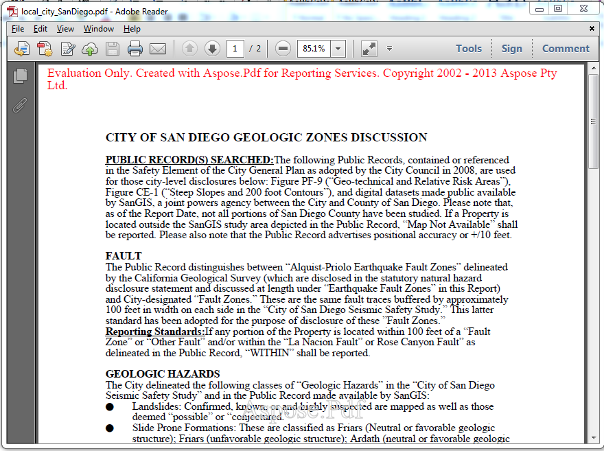

{}

Esta página indica a diferença entre a versão licenciada e a versão de avaliação do Aspose.PDF for Reporting Services

{}

Você pode baixar facilmente [Aspose.PDF for Reporting Services](https://downloads.aspose.com/pdf/reportingservices) para avaliação. O download de avaliação é o mesmo que o download adquirido. A versão de avaliação simplesmente se torna licenciada quando você coloca o arquivo de licença na pasta que contém Aspose.PDF.ReportingServices.dll ou algumas linhas de código para inicializar a licença ao usar o componente com o Report Viewer no modo local. A versão de avaliação do Aspose.PDF for Reporting Services (sem uma licença especificada) fornece toda a funcionalidade do produto, mas insere uma marca d'água de avaliação no topo do documento ao renderizar o arquivo .RDL para o formato PDF. Você pode visitar a página a seguir para mais instruções sobre [Como licenciar Aspose.PDF for Reporting Services](/pdf/pt/reportingservices/license-aspose-pdf-for-reporting-services/)

{}

Se você quiser testar o Aspose.PDF for Reporting Services sem as limitações da versão de avaliação, pode também solicitar uma Licença Temporária de 30 dias. Por favor, consulte [Como obter uma Licença Temporária?](<https://about.aspose.com/>)

{}

