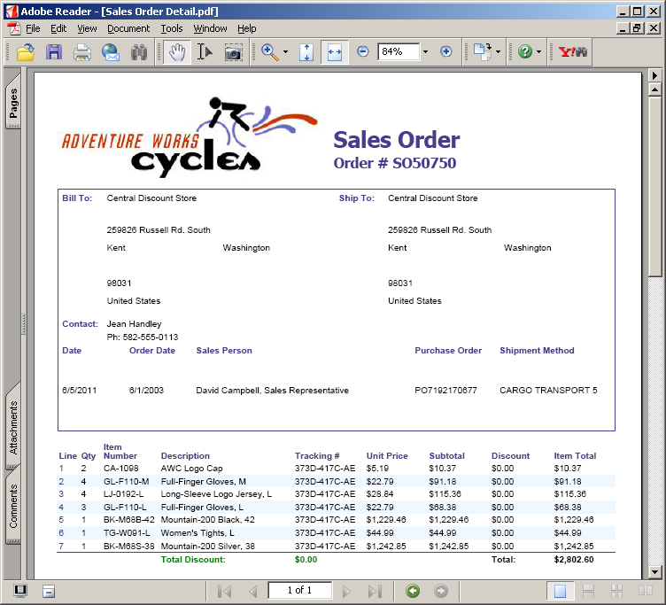

A versão de avaliação **Aspose.PDF for Reporting Services** fornece o mesmo conjunto de recursos presente na versão licenciada, exceto pela marca d'água de avaliação no PDF resultante ao usar a versão de avaliação. Visite nosso site e baixe a versão do produto e comece a explorar nosso produto com um conjunto completo de recursos em modo de avaliação.

Quando estiver satisfeito com sua avaliação, [compre uma licença](https://purchase.aspose.com/buy). Antes de comprar, certifique-se de compreender e concordar com os termos de assinatura da licença.

A licença estará disponível para download na página do pedido após o pagamento do pedido. A licença é um arquivo XML de texto não criptografado e assinado digitalmente. A licença contém informações como o nome do cliente, o produto adquirido e o tipo de licença. Não modifique o conteúdo do arquivo de licença, pois isso invalidará a licença.

## Licenciamento de um servidor

Baixe o arquivo de licença e copie-o para a pasta C:\Program Files\Microsoft SQL Server\<Instance>\Reporting Services\ReportServer\bin ou C:\Program Files\Microsoft SQL Server\SSRS\ReportServer\bin ou C:\Program Files\Microsoft Power BI Report Server\PBIRS\ReportServer\bin no servidor (a mesma pasta onde o Aspose.Pdf.ReportingServices.dll é colocado).

`<Instance>` é o nome do subdiretório que corresponde à instância do Microsoft SQL Server 2016 que você deseja licenciar.

O diretório de instância padrão do Microsoft SQL Server 2016 é MSRS13.MSSQLSERVER.
Para o Microsoft SQL Server 2017 e posterior, o caminho da instância padrão é C:\Program Files\Microsoft SQL Server\SSRS.
Para o Servidor de Relatórios do Power BI, o caminho da instância padrão é C:\Program Files\Microsoft Power BI Report Server\PBIRS.

**PDF gerado usando o relatório "Detalhamento de vendas por território"**

**PDF gerado usando o relatório "Detalhes do pedido de vendas"**

Se houver algum problema ao inicializar a licença, uma marca d’água de avaliação será exibida no documento PDF resultante, conforme especificado abaixo.

**Documento PDF gerado usando "Detalhamento de Vendas por Território" com marca d'água**

Observe que os nomes dos arquivos de licença suportados são Aspose.PDF.ReportingServices.lic, Aspose.Total.ReportingServices.lic e Aspose.Total.Product.Family.lic. Se o arquivo tiver outro nome, renomeie-o.

## Licença Temporária

{}

Você também pode solicitar uma licença temporária de 30 dias para testar o produto. Visite o link a seguir para obter mais informações sobre como obter licença temporária. [Obtenha uma licença temporária](https://purchase.aspose.com/temporary-license).

{}
