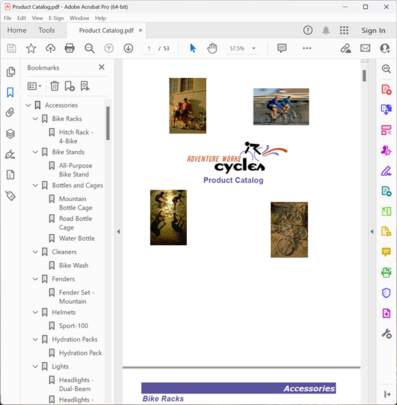

{}

Esta galeria demonstra relatórios PDF exportados pelo Aspose.Pdf for Reporting Services.

{}

A maioria dos relatórios mostrados aqui vem do banco de dados Adventure Works. Adventure Works é um banco de dados de exemplo para o Microsoft SQL Server, disponível para download da Microsoft [aqui](http://www.microsoft.com/downloads/details.aspx?familyid=E719ECF7-9F46-4312-AF89-6AD8702E4E6E&displaylang=en).

## Vendas da Empresa

## Resumo de Vendas do Empregado

## Catálogo de Produtos

## Vendas da Linha de Produto

## Detalhe do Pedido de Venda

