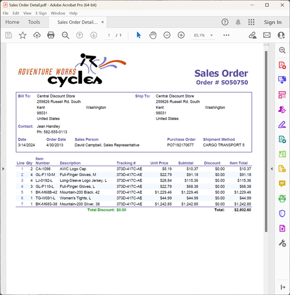

{}

Esta galeria demonstra relatórios em PDF exportados por Aspose.PDF para Reporting Services.

{}

A maioria dos relatórios mostrados aqui vem do banco de dados Adventure Works. Adventure Works é um banco de dados de exemplo para Microsoft SQL Server, disponível para download na Microsoft [aqui](http://www.microsoft.com/downloads/details.aspx?familyid=E719ECF7-9F46-4312-AF89-6AD8702E4E6E&displaylang=en).

## Vendas da empresa

## Resumo de vendas de funcionários

## Catálogo de Produtos

## Vendas de linha de produtos

## Detalhe do pedido de vendas

