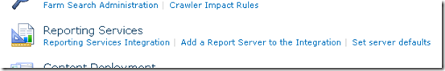

{}

Agora que o SharePoint está instalado e configurado no servidor RS e o RS está configurado através do Reporting Services Configuration Manager, podemos passar para a configuração no Central Admin. O RS 2008 R2 simplificou muito esse processo. Antes tínhamos um processo de 3 etapas que precisávamos executar para que isso funcionasse. Agora temos apenas uma etapa.

{}

{}

Queremos acessar o site Central Administrator e, em seguida, entrar em Configurações Gerais do Aplicativo. Mais para baixo, veremos Reporting Services.

**Image1**:- diálogo de configuração do SharePoint

Selecione "Reporting Services Integration" link. A tela a seguir será exibida.

**Image2**:- Especifique as credenciais de integração do Reporting Services

{}

## URL do Serviço Web:

**Forneceremos a URL do Report Server que encontramos no Reporting Services Configuration Manager.**

## Modo de Autenticação:

**Também selecionaremos um modo de autenticação. O link MSDN a seguir detalha o que são esses modos.
Visão geral de segurança para Reporting Services no modo SharePoint Integrated**

{}

**Em resumo, se o seu site usa Claims Authentication, você sempre usará Trusted Authentication independentemente da escolha aqui. Se você quiser passar credenciais do Windows, deverá escolher Windows Authentication. Para Trusted Authentication, passaremos o token SPUser e não dependeremos da credencial do Windows. Você também desejará usar Trusted Authentication se configurou seus sites Classic Mode para NTLM e o RS está configurado para NTLM. Kerberos seria necessário para usar Windows Authentication e passar isso para sua fonte de dados.**

{}

## Ativar recurso:

{}

**Isso lhe dá a opção de ativar o Reporting Services em todas as coleções de sites, ou você pode escolher em quais deseja ativá-lo. Isso realmente significa quais sites poderão usar o Reporting Services. Quando concluído, você deverá ver os seguintes resultados**

**Image3:**- Integração bem-sucedida do Reporting Services com o ambiente SharePoint
{}

{}

Voltando ao URL do ReportServer, devemos ver algo semelhante ao seguinte

**Image4:**- Reporting Services está conectado com sucesso ao ambiente SharePoint

**NOTE:** ***Se o seu site SharePoint estiver configurado para SSL, ele não aparecerá nesta lista. É um problema conhecido e não significa que haja um problema. Seus relatórios ainda devem funcionar.***
{}

{}

Agora que integrámos com sucesso ambos os produtos, estamos prontos para usar o Reporting Services no SharePoint 2010. Assim como na versão anterior, temos um recurso (ativado quando configuramos a Integração do Reporting Services) na "Site Collection Feature". Também a instalação adicionou 3 tipos de conteúdo ao nosso site. Na Imagem 7 podemos ver 2 desses tipos de conteúdo adicionados a uma biblioteca de documentos para criar um relatório personalizado usando o, como podemos ver na Image5 abaixo.

**Image5:**- Report Builder

O “Reporter Builder” é um controle ActiveX, portanto precisamos baixá-lo no servidor, como podemos ver na Imagem 6 abaixo.

**Image6:**- Baixe e instale o Report Builder
{}

{}

Depois que o processo de download for concluído, carregue o controle “Report Builder”. Agora estamos prontos para projetar nosso primeiro relatório, como mostrado na Image7 abaixo.

**Image7:**- Report Builder – Assistente de geração de novo relatório
{}

{}

Depois de criar nosso relatório, podemos salvá‑lo na biblioteca de documentos criada para armazenar os relatórios no nosso SharePoint 2010. O outro tipo de conteúdo deve ser usado para criar conexões compartilhadas como fonte de dados e salvá‑las em uma biblioteca de documentos no SharePoint. Podemos criar uma biblioteca de documentos, adicionar esse tipo de conteúdo e, depois, ter nossas conexões disponíveis para alterar a fonte de dados dos relatórios.

**Image8:**- Integração bem-sucedida do Aspose.PDF para Reporting Services com o MS SharePoint
{}

