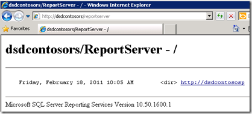

{}

Agora que o SharePoint está instalado e configurado no servidor RS e o RS está configurado através do Reporting Services Configuration Manager, podemos passar para a configuração dentro do Central Admin. O RS 2008 R2 realmente simplificou esse processo. Antes, tínhamos um processo de 3 etapas que era necessário executar para que isso funcionasse. Agora temos apenas uma etapa.

{}

{}

Queremos ir ao site do Administrador Central e depois às Configurações Gerais de Aplicação. Na parte inferior, veremos Reporting Services.

**Image1**:- diálogo de configuração do SharePoint

Selecione o link "Reporting Services Integration". A tela a seguir será exibida.

**Image2**:- Especifique as credenciais de integração do Reporting Services

{}

## URL do Serviço Web:

**Forneceremos a URL para o Report Server que encontramos no Reporting Services Configuration Manager.**

## Modo de Autenticação:

**Também selecionaremos um modo de autenticação. O link da MSDN a seguir detalha o que são esses modos.
Visão geral de segurança para Reporting Services em modo integrado do SharePoint**

{}

**Em resumo, se seu site estiver usando Autenticação de Claims, você sempre usará Autenticação Confiável independentemente do que escolher aqui. Se quiser passar credenciais do Windows, deverá escolher Autenticação do Windows. Para Autenticação Confiável, passaremos o token SPUser e não dependeremos da credencial do Windows. Você também deverá usar Autenticação Confiável se configurou seus sites em Modo Clássico para NTLM e o RS está configurado para NTLM. Kerberos seria necessário para usar Autenticação do Windows e repassá‑la para sua fonte de dados.**

{}

## Ativar recurso:

{}

**Isso dá a você a opção de ativar o Reporting Services em todas as coleções de sites, ou você pode escolher em quais deseja ativá-lo. Isso realmente significa quais sites poderão usar o Reporting Services. Quando terminar, você deverá ver os seguintes resultados**

**Image3:**- Integração bem‑sucedida do Reporting Services com o ambiente SharePoint
{}

{}

Voltando ao URL do ReportServer, devemos ver algo semelhante ao seguinte

**Image4:**- O Reporting Services está conectado com sucesso ao ambiente SharePoint

**NOTE:** ***Se o seu site SharePoint estiver configurado para SSL, ele não aparecerá nesta lista. É um problema conhecido e não significa que haja um problema. Seus relatórios ainda devem funcionar.***
{}

{}

Agora que integrámos com sucesso ambos os produtos, estamos prontos para usar Reporting Services no SharePoint 2010. Assim como na versão anterior, temos um recurso (ativado quando configuramos a Integração do Reporting Services) na “Site Collection Feature”. Também a instalação adicionou 3 tipos de conteúdo ao nosso site. Na Imagem 7 podemos ver 2 desses tipos de conteúdo adicionados a uma biblioteca de documentos para criar um relatório personalizado usando o, como podemos ver na Image5 abaixo.

**Image5:**- Report Builder

O “Reporter Builder” é um controle ActiveX, portanto precisamos baixá‑lo no servidor, como podemos ver na Imagem 6 abaixo.

**Image6:**- Baixe e instale o Report Builder
{}

{}

Depois que o processo de download for concluído, carregue o controle “Report Builder”. Agora estamos prontos para criar nosso primeiro relatório, como mostrado na Image7 abaixo.

**Image7:**- Report Builder – Assistente de criação de novo relatório
{}

{}

Após criar nosso relatório, podemos salvá‑lo na biblioteca de documentos criada para armazenar os relatórios no nosso SharePoint 2010. O outro tipo de conteúdo deve ser usado para criar conexões compartilhadas como fonte de dados e salvá‑las em uma biblioteca de documentos no SharePoint. Podemos criar uma biblioteca de documentos, adicionar esse tipo de conteúdo e, então, ter nossas conexões disponíveis para alterar a fonte de dados dos relatórios.

**Image8:**- Integração bem-sucedida do Aspose.PDF for Reporting Services com o MS SharePoint
{}

