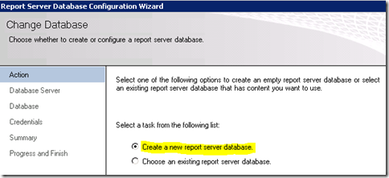
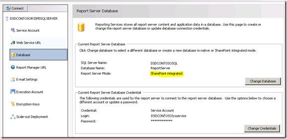

{}

Nossa primeira parada no Reporting Services Server é o Reporting Services Configuration Manager.

{}

## Conta de serviço:

**Certifique‑se de entender qual conta de serviço você está usando para o Reporting Services. Se encontrarmos problemas, eles podem estar relacionados à conta de serviço que você está usando. O padrão é Network Service. Quando vamos implantar novas compilações, sempre usamos contas de domínio, porque é aí que provavelmente encontraremos problemas. Para esta instância do servidor, usamos uma conta de domínio chamada RSService.**

**Image1:- Configurando conta de serviço**

## URL do Serviço Web:

{}

**Precisaremos configurar a URL do Serviço Web. Este é o diretório virtual (vdir) do ReportServer que hospeda os Serviços Web usados pelo Reporting Services, e com o qual o SharePoint se comunicará. A menos que você queira personalizar as propriedades do vdir (ou seja, SSL, portas, cabeçalhos de host, etc…), você deve simplesmente clicar em Aplicar aqui e estará pronto para usar.**

**Imagem2:- Configurando a URL do Serviço Web Uma vez que a URL do serviço Web tenha sido configurada, você deverá ser capaz de ver os seguintes resultados**

**Imagem3:- Configuração bem-sucedida da URL do serviço Web**
{}

## Banco de dados:

**Precisamos criar o Banco de Dados do Catálogo do Reporting Services. Ele pode ser colocado em qualquer mecanismo de banco de dados SQL 2008 ou SQL 2008 R2. O SQL11 também funcionaria bem, mas ainda está em BETA. Essa ação criará dois bancos de dados, ReportServer e ReportServerTempDB, por padrão.**

{}
**A outra etapa importante aqui é garantir que você escolha SharePoint Integrated para o tipo de banco de dados. Depois que essa escolha for feita, não poderá ser alterada.**

**Image4:- Criando banco de dados do servidor de relatórios**

**Image5:- Configurando o servidor de banco de dados e o tipo de autenticação**

**Image6:- Configurando o nome do banco de dados e o Modo**
{}

**Para as credenciais, é assim que o Report Server se comunicará com o SQL Server. Qualquer conta que você selecionar receberá certos direitos dentro do banco de dados Catalog, bem como em alguns dos bancos de dados do sistema via RSExecRole. MSDB é um desses bancos de dados para uso de Assinaturas, pois utilizamos o SQL Agent.**

**Image7:- Configurando as credenciais do banco de dados do Report Server**

{}

**Depois que as credenciais do banco de dados forem especificadas, devemos ser capazes de obter os resultados conforme especificado abaixo.**

**Image8:- Progresso da criação do banco de dados do Report Server**

**Image9:- Resumo da conclusão do banco de dados do Report Server**
{}

## URL do Gerenciador de Relatórios:

**Podemos ignorar o URL do Report Manager, pois ele não é usado quando estamos no modo SharePoint Integrated. O SharePoint é nossa interface frontal. O Report Manager não funciona.**

## Chaves de Criptografia:

{}
**Faça backup das suas chaves de criptografia e certifique-se de saber onde as guarda. Se você se deparar com uma situação em que precise migrar o Banco de Dados ou restaurá‑lo, precisará delas.**

**Image10:- Backup da chave de criptografia do Report Server**
{}

{}
**Parabéns! Configuramos com sucesso o Reporting Services usando o Configuration Manager. Se você navegar para a URL na aba Web Service URL, deverá mostrar algo semelhante ao seguinte.**

**Image11:- Acesso ao Report Server após a instalação**

**Motivo do erro: O SharePoint está instalado em nosso WFE e concluímos a configuração do Reporting Services. Neste exemplo, o Reporting Services e o SharePoint estão em máquinas diferentes. Se estivessem na mesma máquina, você não teria visto esse erro. Precisamos, tecnicamente, instalar o SharePoint na caixa RS. Isso significa que o IIS também será habilitado.**
{}

