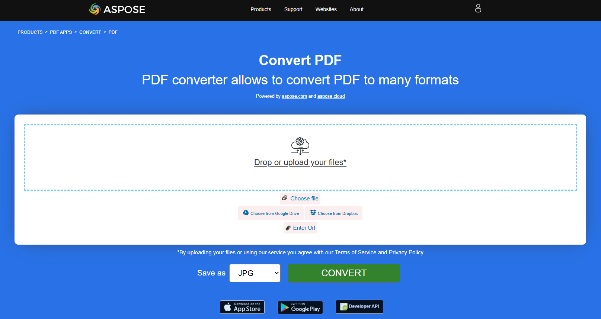

O PDF foi desenvolvido para fornecer um padrão para a apresentação de documentos e outros materiais de referência em um formato que é independente de software de aplicação, hardware e sistema operacional. O conteúdo dos arquivos PDF não se limita a texto; pode incluir hiperlinks, imagens, botões clicáveis e formulários, assinaturas eletrônicas, marcas d'água e muito mais. Portanto, muitas vezes é necessário converter arquivos PDF para algum outro formato a fim de editar ou alterar seu conteúdo.
**Nossa Aspose.PDF para Rust via C++** ferramenta permite que você converta seus documentos PDF de forma bem-sucedida, rápida e fácil para os formatos mais populares. Para uma lista completa de formatos suportados, veja a seção [Formatos de Arquivo Suportados pelo Aspose.PDF](https://docs.aspose.com/pdf/rust-cpp/supported-file-formats/).

**Aspose.PDF para Rust via C++** permite converter documentos PDF para vários formatos. Além disso, você pode verificar a qualidade da conversão do Aspose.PDF e visualizar os resultados online com o aplicativo conversor Aspose.PDF. Aprenda as seções de conversão de documentos com trechos de código.

## Como usar Rust para conversão

Os documentos Word são os mais versáteis e editáveis possíveis. Converter PDF para DOC manualmente é uma tarefa muito demorada. Neste artigo, você aprenderá como converter PDF para DOC e DOCX em Rust.

- [Converter PDF para DOC](/pdf/pt/rust-cpp/convert-pdf-to-doc/) - você pode converter seu documento PDF para formato Word com Rust.

Os formatos de número são necessários não apenas para tornar os dados na tabela mais fáceis de ler, mas também para tornar a tabela mais fácil de usar. É claro que, se você precisar converter esses dados de um documento PDF para o formato Excel, use o nosso Aspose.PDF for Rust.

- [Converter PDF para Microsoft XLSX](/pdf/pt/rust-cpp/convert-pdf-to-xlsx/) - esta seção descreve como converter documento PDF para XLSX e CSV.

O formato PowerPoint é usado para criar várias apresentações. Arquivos PPT contêm um grande número de slides ou páginas contendo diversas informações.

- [Converter PDF para Microsoft PowerPoint](/pdf/pt/rust-cpp/convert-pdf-to-powerpoint/) - aqui estamos falando sobre a conversão de PDF para PowerPoint acompanhando o processo de conversão

HyperText Markup Language é uma linguagem de descrição de documentos hypertext, uma linguagem padrão para criar páginas web. Com Aspose.PDF for Rust você pode converter documentos HTML facilmente e vice‑versa.

Existem muitos formatos de imagem que precisam ser convertidos para PDF para diferentes finalidades. Aspose.PDF for Rust permite os formatos de imagem mais populares.

- [Converter PDF para vários formatos de Imagem](/pdf/pt/rust-cpp/convert-pdf-to-images-format/) - converter páginas de PDF como imagens em JPEG, PNG, SVG e outros formatos

Esta seção inclui os seguintes formatos: EPUB, XPS, TeX, Texto e PDF em escala de cinza.

- [Converter arquivo PDF para outros formatos](/pdf/pt/rust-cpp/convert-pdf-to-other-files/) - este tópico descreve o método de conversão de documento PDF para vários formatos

## Experimente converter arquivos PDF online

{}
**Experimente converter arquivos PDF online**

Você pode experimentar a funcionalidade de conversão usando nossos Aspose PDF APPS:

{}