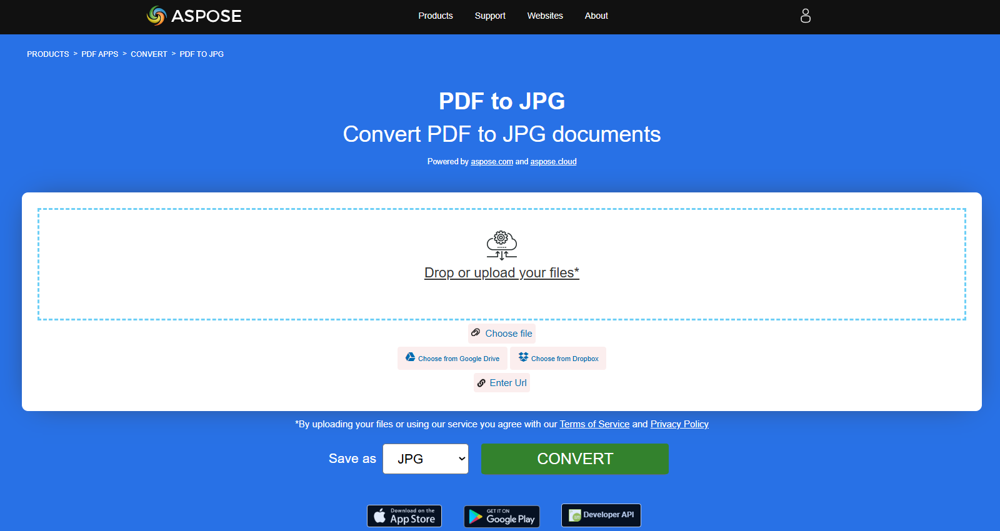
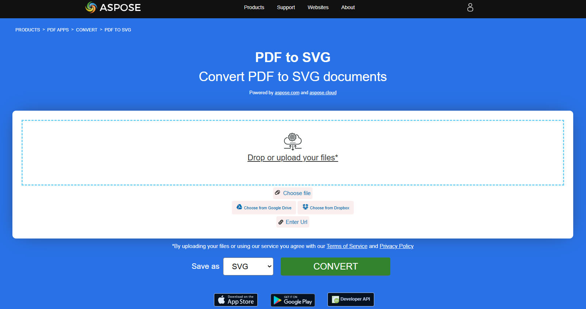

## Converter PDF para Imagem

Neste artigo, mostraremos as opções para converter PDF para formatos de imagem.

Documentos digitalizados anteriormente são frequentemente salvos no formato de arquivo PDF. No entanto, você precisa editá‑lo em um editor gráfico ou enviá‑lo posteriormente em formato de imagem? Temos uma ferramenta universal para você converter PDF em imagens usando **Aspose.PDF for Rust via C++**.
A tarefa mais comum ocorre quando você precisa salvar um documento PDF inteiro ou algumas páginas específicas de um documento como um conjunto de imagens. **Aspose.PDF for Rust via C++** permite converter PDF para formatos JPG e PNG para simplificar as etapas necessárias para obter suas imagens de um arquivo PDF específico.

**Aspose.PDF for Rust via C++** suporta várias conversões de PDF para formatos de imagem. Por favor, verifique a seção [Formatos de Arquivo Suportados pelo Aspose.PDF](https://docs.aspose.com/pdf/rust-cpp/supported-file-formats/).

### Converter PDF para JPEG

O trecho de código Rust fornecido demonstra como converter a primeira página de um documento PDF em uma imagem JPEG usando a biblioteca Aspose.PDF:

1. Abra um documento PDF.
1. Converter uma Página para JPEG usando [page_to_jpg](https://reference.aspose.com/pdf/rust-cpp/convert/page_to_jpg/) função.

```rs

  use asposepdf::Document;

  fn main() -> Result<(), Box<dyn std::error::Error>> {
      // Open a PDF-document with filename
      let pdf = Document::open("sample.pdf")?;

      // Convert and save the specified page as Jpg-image
      pdf.page_to_jpg(1, 100, "sample_page1.jpg")?;

      Ok(())
  }
```

{}
**Experimente converter PDF para JPEG online**

Aspose.PDF for Rust apresenta a você um aplicativo online gratuito ["PDF para JPEG"](https://products.aspose.app/pdf/conversion/pdf-to-jpg), onde você pode tentar investigar a funcionalidade e a qualidade com que funciona.

[](https://products.aspose.app/pdf/conversion/pdf-to-jpg)
{}

### Converter PDF para TIFF

O trecho de código Rust fornecido demonstra como converter a primeira página de um documento PDF em uma imagem TIFF usando a biblioteca Aspose.PDF:

1. Abra um documento PDF.
1. Converter um Page para TIFF usando [page_to_tiff](https://reference.aspose.com/pdf/rust-cpp/convert/page_to_tiff/) função.

```rs

  use asposepdf::Document;

  fn main() -> Result<(), Box<dyn std::error::Error>> {
      // Open a PDF-document with filename
      let pdf = Document::open("sample.pdf")?;

      // Convert and save the specified page as Tiff-image
      pdf.page_to_tiff(1, 100, "sample_page1.tiff")?;

      Ok(())
  }
```

{}
**Tente converter PDF para TIFF online**

Aspose.PDF for Rust apresenta a você um aplicativo online gratuito ["PDF para TIFF"](https://products.aspose.app/pdf/conversion/pdf-to-tiff), onde você pode tentar investigar a funcionalidade e a qualidade com que funciona.

[](https://products.aspose.app/pdf/conversion/pdf-to-tiff)
{}

### Converter PDF para PNG

O trecho de código Rust fornecido demonstra como converter a primeira página de um documento PDF em uma imagem PNG usando a biblioteca Aspose.PDF:

1. Abra um documento PDF.
1. Converter uma Page para PNG usando [pagina_para_png](https://reference.aspose.com/pdf/rust-cpp/convert/page_to_png/) função.

```rs

  use asposepdf::Document;

  fn main() -> Result<(), Box<dyn std::error::Error>> {
      // Open a PDF-document with filename
      let pdf = Document::open("sample.pdf")?;

      // Convert and save the specified page as Png-image
      pdf.page_to_png(1, 100, "sample_page1.png")?;

      Ok(())
  }
```

{}
**Tente converter PDF para PNG online**

Como exemplo de como nossos aplicativos gratuitos funcionam, verifique o próximo recurso.

Aspose.PDF for Rust apresenta a você um aplicativo online gratuito ["PDF para PNG"](https://products.aspose.app/pdf/conversion/pdf-to-png), onde você pode tentar investigar a funcionalidade e a qualidade com que funciona.

[](https://products.aspose.app/pdf/conversion/pdf-to-png)
{}

**Gráficos Vetoriais Escaláveis (SVG)** é uma família de especificações de um formato de arquivo baseado em XML para gráficos vetoriais bidimensionais, tanto estáticos quanto dinâmicos (interativos ou animados). A especificação SVG é um padrão aberto que está em desenvolvimento pelo World Wide Web Consortium (W3C) desde 1999.

### Converter PDF para SVG

O trecho de código Rust fornecido demonstra como converter a primeira página de um documento PDF em uma imagem SVG usando a biblioteca Aspose.PDF:

1. Abra um documento PDF.
1. Converter uma Página para SVG usando [page_to_svg](https://reference.aspose.com/pdf/rust-cpp/convert/page_to_svg/) função.

```rs

  use asposepdf::Document;

  fn main() -> Result<(), Box<dyn std::error::Error>> {
      // Open a PDF-document with filename
      let pdf = Document::open("sample.pdf")?;

      // Convert and save the specified page as Svg-image
      pdf.page_to_svg(1, "sample_page1.svg")?;

      Ok(())
  }
```

{}
**Tente converter PDF para SVG online**

Aspose.PDF for Rust apresenta a você um aplicativo online gratuito ["PDF para SVG"](https://products.aspose.app/pdf/conversion/pdf-to-svg), onde você pode tentar investigar a funcionalidade e a qualidade com que funciona.

[](https://products.aspose.app/pdf/conversion/pdf-to-svg)
{}

### Converter PDF para arquivo ZIP de SVG

O exemplo a seguir converte um documento PDF em um arquivo SVG, onde cada página é salva como um arquivo SVG separado dentro de um contêiner ZIP.

1. Abra o documento PDF de origem.
1. Salve o documento como um arquivo ZIP contendo arquivos SVG.

```rs

  use asposepdf::Document;

  fn main() -> Result<(), Box<dyn std::error::Error>> {
      // Open a PDF-document with filename
      let pdf = Document::open("sample.pdf")?;

      // Convert and save the previously opened PDF-document as SVG-archive
      pdf.save_svg_zip("sample_svg.zip")?;

      Ok(())
  }
```

### Converter PDF para DICOM

O trecho de código Rust fornecido demonstra como converter a primeira página de um documento PDF em uma imagem DICOM usando a biblioteca Aspose.PDF:

1. Abra um documento PDF.
1. Converter uma Página para DICOM usando [pagina_para_dicom](https://reference.aspose.com/pdf/rust-cpp/convert/page_to_dicom/) função.

```rs

  use asposepdf::Document;

  fn main() -> Result<(), Box<dyn std::error::Error>> {
      // Open a PDF-document with filename
      let pdf = Document::open("sample.pdf")?;

      // Convert and save the specified page as DICOM-image
      pdf.page_to_dicom(1, 100, "sample_page1.dcm")?;

      Ok(())
  }
```

### Converter PDF para BMP

O trecho de código Rust fornecido demonstra como converter a primeira página de um documento PDF em uma imagem BMP usando a biblioteca Aspose.PDF:

1. Abra um documento PDF.
1. Converter uma Page para BMP usando [pagina_para_bmp](https://reference.aspose.com/pdf/rust-cpp/convert/page_to_bmp/) função.

```rs

  use asposepdf::Document;

  fn main() -> Result<(), Box<dyn std::error::Error>> {
      // Open a PDF-document with filename
      let pdf = Document::open("sample.pdf")?;

      // Convert and save the specified page as Bmp-image
      pdf.page_to_bmp(1, 100, "sample_page1.bmp")?;

      Ok(())
  }
```