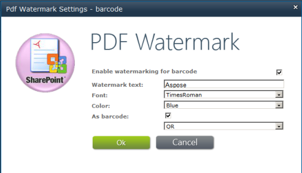

## **Adicionar código de barras a um arquivo PDF**

{}

Aspose.PDF for SharePoint permite adicionar um código de barras a um documento PDF. Os usuários podem adicionar um código de barras ao canto inferior esquerdo de cada página de um documento PDF adicionado à biblioteca. A imagem abaixo dá uma ideia de como pode ser um documento PDF com um código de barras adicionado.

**Código de barras no canto inferior esquerdo**

{}

{}

Para habilitar o recurso de código de barras para uma biblioteca específica, use o botão **Configurações de Marca d'água** na guia **Ferramentas de Marca d'água do Aspose PDF** em **Ferramentas da Biblioteca**, conforme mostrado abaixo.

**Configurações de marca d'água do PDF**

Depois de habilitar códigos de barras para a biblioteca específica, o Aspose.PDF for SharePoint adiciona um código de barras a todos os documentos PDF adicionados àquela biblioteca.

{}
