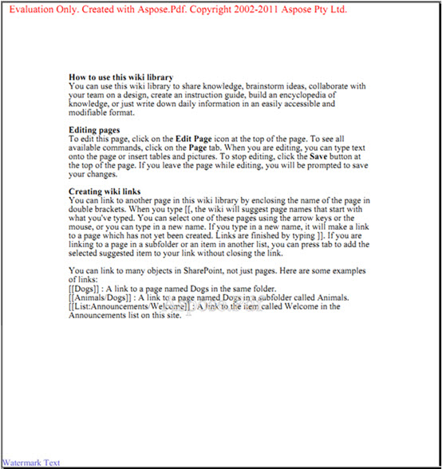
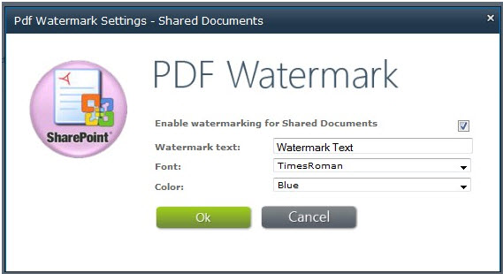

{}

Aspose.PDF for SharePoint permite que você adicione marca d'água a um documento PDF. O recurso adiciona uma marca d'água de texto no canto inferior esquerdo de cada página de um documento PDF adicionado à biblioteca.

## **Texto da marca d'água no canto inferior esquerdo**

{}

{}

Para habilitar o recurso de marca d'água em uma biblioteca específica:

1. Clique em **Watermark Settings** na aba **Aspose Tools** na caixa de diálogo **Library Tools**.

   **Ferramentas de biblioteca**

As configurações de marca d'água são específicas de lista, portanto você pode escolher configurações de marca d'água diferentes para bibliotecas diferentes. A captura de tela a seguir mostra a caixa de diálogo Watermark Settings para a biblioteca **Shared Documents**.

## **Configurações de marca d'água**

- Selecione **Enable watermarking for** para ativar o recurso de marca d'água para uma lista específica.
- **Texto da marca d'água** – o texto que aparecerá na página como marca d'água.
- **Font** – a fonte usada para a marca d'água.
- **Color** – a cor da marca d'água.

Depois de ativar a marca d'água para uma biblioteca específica, o Aspose.PDF adiciona marcas d'água a cada documento PDF adicionado a essa biblioteca.

{}
