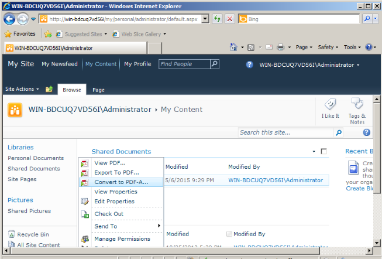
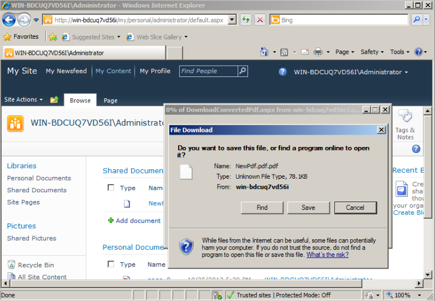

{}

Em [Aspose.PDF for SharePoint 2.0](https://releases.aspose.com/pdf/sharepoint/new-releases/aspose.pdf-for-sharepoint-2.0.0/) lançamento, adicionamos suporte para criar PDF compatível com PDFA.

Atualmente, o Aspose.PDF for SharePoint suporta apenas o padrão PDFA1b.

{}

## **Criando um Documento compatível com PDFA**

Converta o PDF da biblioteca de documentos do SharePoint para PDFA da seguinte forma:

1. Clique em **Convert to PDF** no menu ECB.

2. Faça o download e salve o arquivo PDF resultante.

