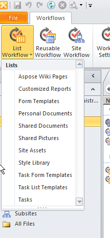
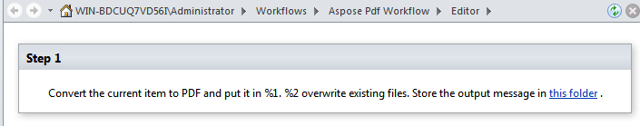

{}

O suporte a fluxos de trabalho é uma funcionalidade essencial do Microsoft Office SharePoint Server. Os fluxos de trabalho ajudam a automatizar o movimento de documentos de acordo com a lógica de negócios e a otimizar o custo e o tempo de organização de documentos. Este artigo demonstra como usar Aspose.PDF for SharePoint em um fluxo de trabalho que converte um documento em PDF.

{}

## Configurando um Fluxo de Trabalho

Este exemplo cria um workflow que converte qualquer novo item em uma biblioteca de documentos para o formato PDF e o armazena em outra biblioteca de documentos. O exemplo usa a biblioteca **Personal Documents** como biblioteca de origem e a subpasta **Pdf** na biblioteca **Shared Documents** como biblioteca de destino.

Aspose.PDF for SharePoint suporta a conversão de arquivos HTML, de texto e de imagem.

### Crie o Workflow usando o SharePoint Designer

1. Abra o **SharePoint Designer** e conecte-se ao site onde o workflow será implementado.
1. Selecione **Workflows** em **site objects** e então abra **List Workflow**.
1. Selecione a biblioteca **Personal Documents** para criar e anexar um novo workflow de lista à biblioteca de documentos.

   **Selecionando Documentos Pessoais no menu**

1. Crie e anexe o fluxo de trabalho de lista à biblioteca **Documentos Pessoais** digitando um nome e uma descrição para o fluxo de trabalho.
1. Clique em **OK** para concluir esta etapa.

   **Criando um fluxo de trabalho de lista**

Um editor de etapas de fluxo de trabalho aparece. Ele é usado para definir condições e ações para fluxos de trabalho. Agora adicione uma ação para converter um novo documento em PDF sem nenhuma condição, a partir de **Aspose Actions**.

1. Selecione a ação **Convert file to PDF via Aspose.PDF** do menu **Action**.

   **Selecionando uma ação**

1. Configure os parâmetros da ação:
   1. Defina o parâmetro **this folder** como a pasta de destino.
   1. Deixe os outros parâmetros de ação com os valores padrão ou defina-os usando a janela de propriedades da ação. O valor padrão para o parâmetro **Overwrite** é false.

      **O Editor de Workflow**

**Definindo a biblioteca de destino**

**Definindo as propriedades**

1. No menu **Workflow**, selecione **Configurações de Workflow**.
1. Selecione **iniciar workflow automaticamente quando um novo item for criado** e limpe outras opções de **Opções de Início**.

   **Configurando as opções de início**

O design do workflow está concluído.

1. Salve e publique o workflow para implementá-lo no site do SharePoint.

### Teste o Workflow

Para testar o workflow:

1. Abra o site do SharePoint e carregue um novo documento na biblioteca de documentos **Personal Documents**.
   Aspose.PDF for SharePoint suporta conversão de arquivos HTML, arquivos de texto e imagens (JPG, PNG, GIF, TIFF e BMP*) para PDF. O workflow está configurado para iniciar automaticamente quando um novo item é criado, portanto os arquivos são processados automaticamente.
1. Atualize o navegador.
   O status do fluxo de trabalho aparece na coluna de fluxo de trabalho, **Aspose.PDF Workflow** neste caso.

   **Adicionando um documento à biblioteca de origem**

1. Abra a biblioteca de documentos de destino para visualizar o documento convertido. **Shared Documents/Pdf** é o caminho neste exemplo.

   **A biblioteca de destino**

