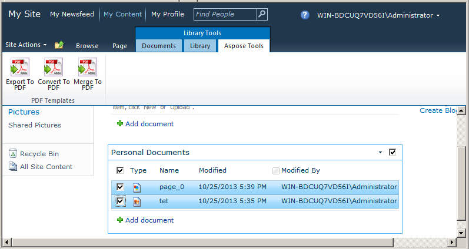

{}

Aspose.PDF for SharePoint oferece suporte à criação de PDFs seguros. Instalar o Aspose.PDF for SharePoint adiciona uma opção **Configurações de PDF Seguro** em Configurações do Site. Aqui, você pode definir a senha de usuário, a senha do proprietário e qualquer valor da lista de algoritmos para criptografar o PDF de saída. A lista de algoritmos oferece diferentes combinações de algoritmos de criptografia e tamanhos de chave. Passe o valor de sua escolha.

Este artigo demonstra como usar o Aspose.PDF for SharePoint para gerar um PDF criptografado.

{}

## **Criando um PDF Seguro**

Para demonstrar o recurso, primeiro configuramos a opção **PDF Secure Setting** para a senha do proprietário e do usuário e o algoritmo de criptografia. O exemplo então mescla dois documentos de uma biblioteca de documentos.

### **Configurando Opções de PDF Secure Setting**

Abra a opção **PDF Secure Settings** em Configurações do Site e defina o algoritmo, a senha do proprietário e a senha do usuário.

Especifique senhas diferentes para o usuário e o proprietário ao criptografar o arquivo PDF.

- A senha do usuário, se definida, é o que você precisa fornecer para abrir um PDF. O Acrobat Reader solicita que o usuário insira a senha do usuário. Se estiver errada, o documento não abre.
- A senha do proprietário, se definida, controla permissões como impressão, edição, extração, comentários, etc. O Acrobat Reader impede esses recursos com base nas configurações de permissão. O Acrobat requer essa senha se você quiser definir/alterar permissões.

### **Mesclar Documentos**

Mescle dois documentos usando a opção **Convert to PDF**. Este recurso mescla vários arquivos não PDF (HTML, texto ou imagem) em um arquivo PDF.

1. Abra uma biblioteca de documentos e selecione os documentos desejados na lista.

1. Use a opção **Merge to PDF** nas Ferramentas da Biblioteca para salvar o arquivo de saída. Você será solicitado a salvar o arquivo de saída no disco.

### **Saída**

O arquivo de saída está criptografado.

