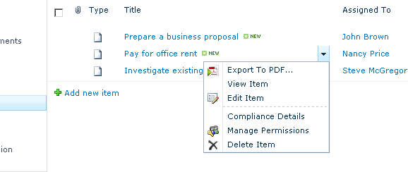

{}

Aspose.PDF for SharePoint permite converter vários documentos, ou um de cada vez. Este artigo mostra como exportar um item de uma lista.

{}

Para exportar um item específico de uma lista: selecione **Export to Pdf** no Edit Control Block (ECB) do item.

## **Selecionando Export to Pdf no ECB do item**

## **Exportar para PDF**

