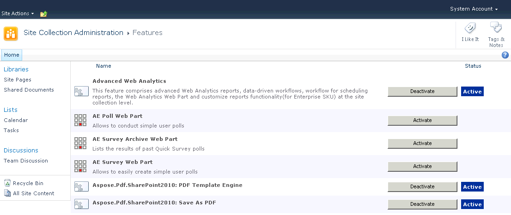

{}

Durante a instalação, o Aspose.PDF for SharePoint é ativado para todas as coleções de sites selecionadas. Após a instalação, você pode usar o menu Site Actions no site raiz de uma coleção de sites para ativar e desativar o Aspose.PDF for SharePoint.

{}

## Ativando o Aspose.PDF for SharePoint em uma coleção de sites 

**
