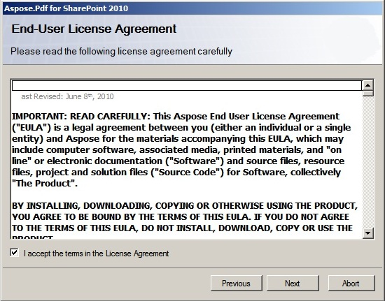
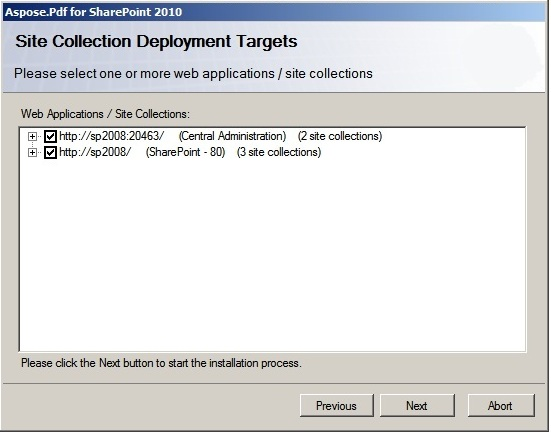
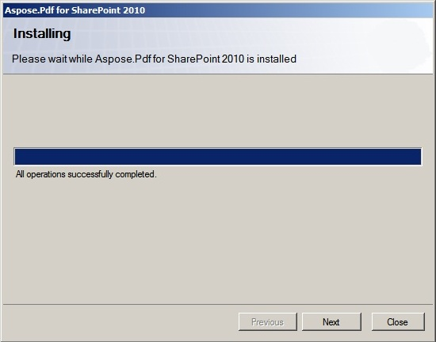
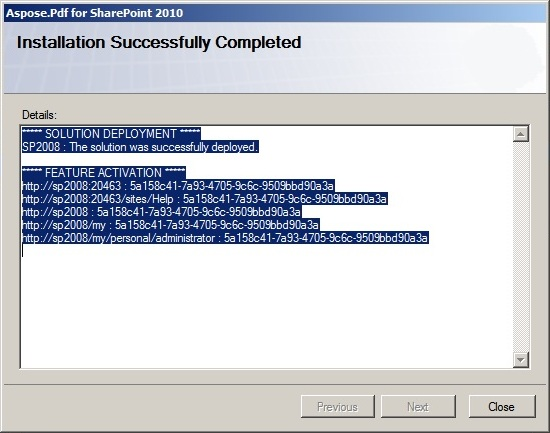

{}

Aspose.PDF para SharePoint pode ser baixado como o arquivo Aspose.PDF.SharePoint.zip.

{}

**Este arquivo contém:**

- Aspose.PDF.SharePoint.wsp
  Arquivo de solução SharePoint. Aspose.PDF para SharePoint é empacotado como uma solução SharePoint para facilitar a implantação/retração e a ativação/desativação de recursos em toda a fazenda de servidores.
- Aspose_LicenseAgreement.rtf

**Contrato de licença de usuário final:**

- Aspose.PDF for SharePoint.pdf

**Documentação do usuário:**

- Aspose.PDF for SharePoint Documentation.chm

**Documentação do usuário com referência da API pública:**

- setup.exe

**Programa de instalação:**

- setup.exe.config

**Arquivo de configuração de instalação:**

O programa de instalação verifica as seguintes condições antes de prosseguir:

- O SharePoint 2010 está instalado.
- O usuário tem permissão para instalar soluções do SharePoint.
- O banco de dados do SharePoint está online.
- O serviço SharePoint Administration está iniciado.
- O serviço SharePoint Timer está iniciado. O serviço SharePoint Administration e o serviço Timer são necessários porque algumas ações de configuração dependem de um job de timer para se propagar a todos os servidores na fazenda de servidores.

**Para instalar Aspose.PDF para SharePoint:**

- Descompacte o zip Aspose.PDF.SharePoint na unidade local.
- Execute o setup.exe e siga as instruções na tela.

**O programa de instalação executa as seguintes ações:**

- Verifique os pré-requisitos de instalação. A instalação não continuará se alguma verificação falhar.

- Exiba o Contrato de Licença de Usuário Final. O usuário deve aceitar o contrato para prosseguir.

- Exiba a caixa de diálogo de seleção de destino de implantação. O usuário seleciona aplicativos web e coleções de sites onde o recurso deverá ser ativado. Veja a figura abaixo.

- Implante o recurso na farm de servidores.

- Ative o recurso para as coleções de sites selecionadas e configure seus aplicativos web principais.
- Exiba uma lista de aplicativos web e coleções de sites onde o recurso foi implantado e ativado.

