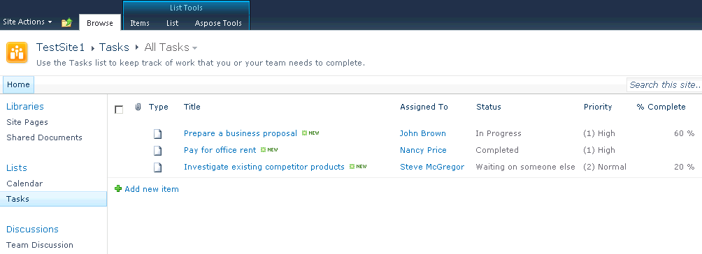

{}

### **Bem-vindo à Documentação do Aspose.PDF for SharePoint!**
Aspose.PDF for SharePoint é uma solução que permite que os usuários exportem listas, itens de lista e páginas Wiki do SharePoint para o formato de arquivo PDF.

{}

{}
Aspose.PDF for SharePoint foi projetado para ser usado com Microsoft SharePoint Server 2010. Não há requisitos de sistema adicionais além do Microsoft SharePoint Server 2010.

Esta documentação descreve o Aspose.PDF for SharePoint [recursos](/pdf/pt/sharepoint/features/), [instalação](/pdf/pt/sharepoint/install-aspose-pdf-for-sharepoint/), [limitações de avaliação](/pdf/pt/sharepoint/evaluate-aspose-pdf/), [licenciamento](/pdf/pt/sharepoint/license-aspose-pdf-for-sharepoint/), casos de uso comuns e configurações.

{}

**A aba Aspose Tools na faixa de opções Listas e Bibliotecas indica que o Aspose.PDF for SharePoint está instalado**

