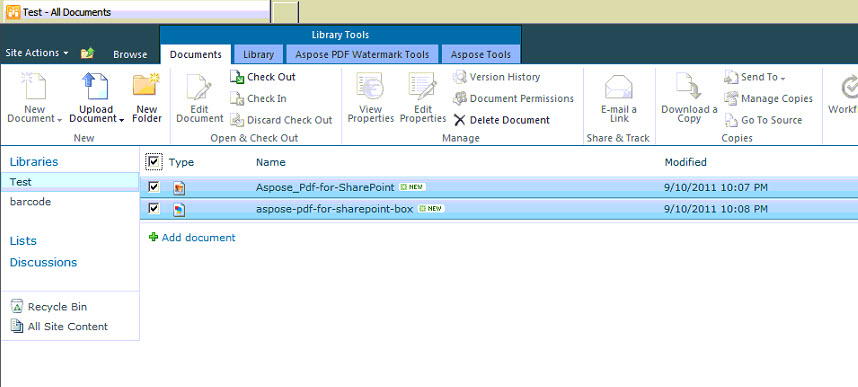
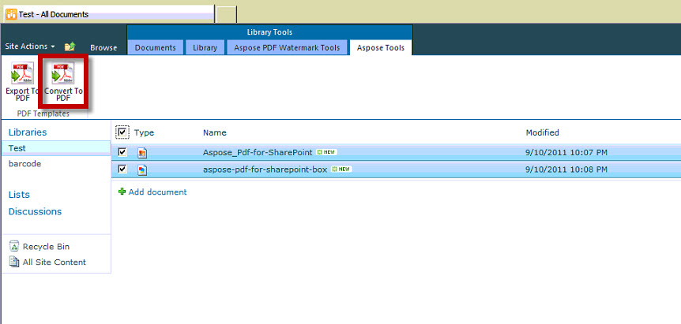
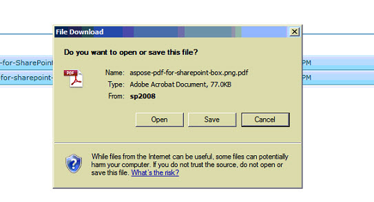

{}

Este artigo mostra como converter vários arquivos selecionados em arquivos PDF com uma única operação de conversão usando Aspose.PDF for SharePoint.

{}

## Converter Vários Arquivos Selecionados para PDF

{}

Para converter vários arquivos selecionados, execute as etapas a seguir:

1. Selecione os arquivos a serem convertidos

2. Clique na guia Aspose Tools em Library Tools

3. Clique em Convert to PDF para converter todos os arquivos selecionados em arquivos PDF resultantes.

4. Um prompt será exibido para baixar os arquivos convertidos.

{}
