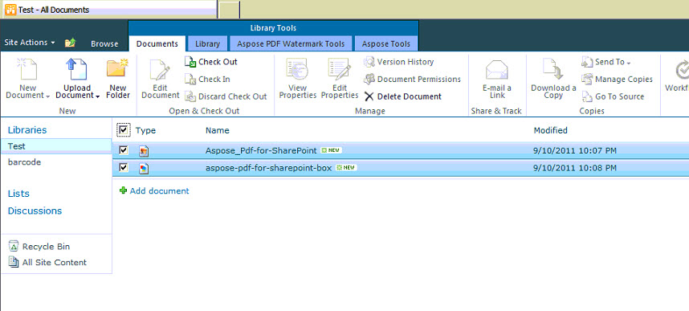
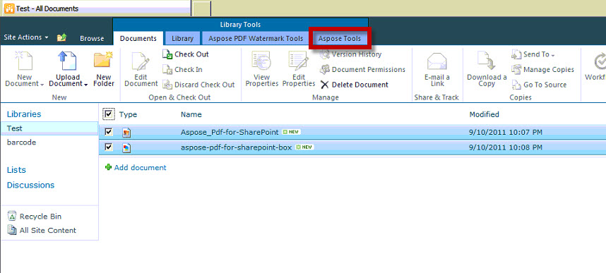

---
title: Converta vários arquivos selecionados em arquivos PDF com uma única solicitação de conversão
linktitle: Converta vários arquivos selecionados em arquivos PDF com uma única solicitação de conversão
type: docs
weight: 50
url: /pt/sharepoint/convert-multiple-selected-files-to-pdf-files-with-single-conversion-request/
lastmod: "2020-12-16"
description: A Biblioteca PDF SharePoint permite converter vários arquivos selecionados em arquivos PDF com uma única operação de conversão.
---

{}

Este artigo mostra como converter vários arquivos selecionados em arquivos PDF com uma única operação de conversão usando Aspose.PDF para SharePoint.

{}

## Converta vários arquivos selecionados em PDF

{}

Para converter vários arquivos selecionados, execute as seguintes etapas:

1. Selecione os arquivos a serem convertidos

2. Clique na guia Aspose Tools em Ferramentas da Biblioteca

3. Clique em Converter em PDF para converter todos os arquivos selecionados em arquivos PDF resultantes.

4. Será mostrado um prompt para baixar os arquivos convertidos.

{}

