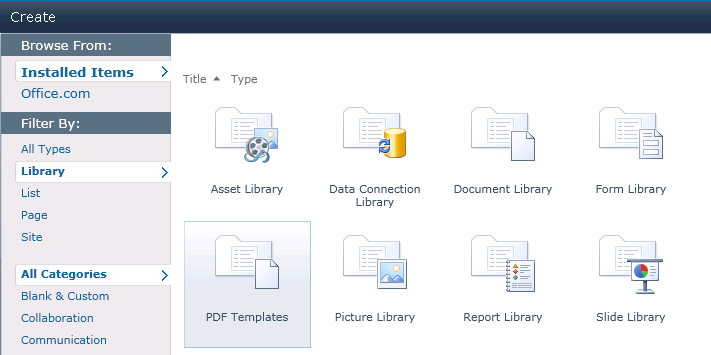
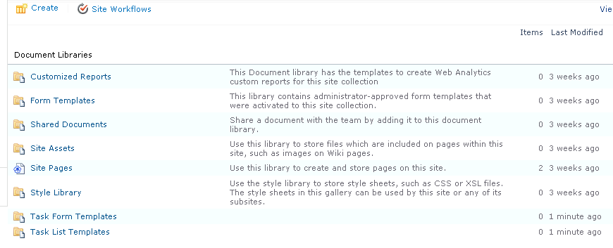
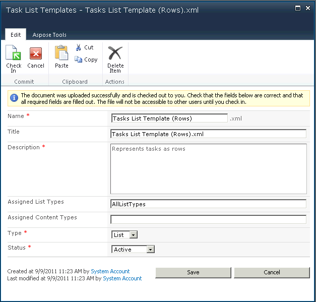
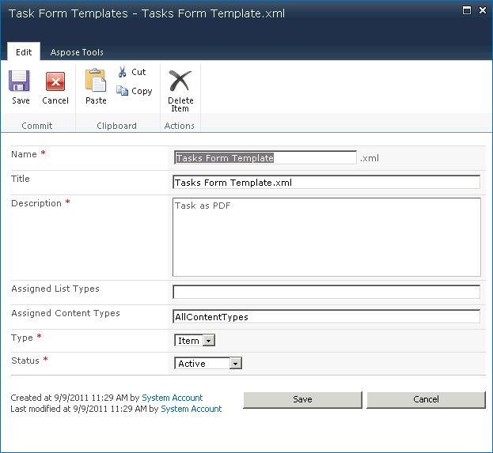
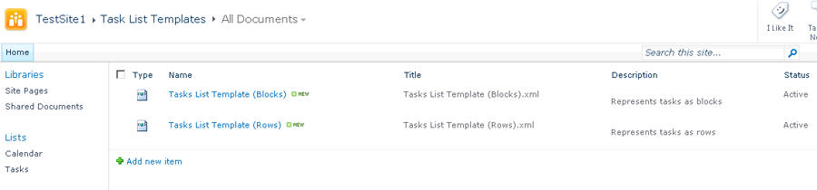

{}

Este artigo mostra como criar e exportar modelos usando o Aspose.PDF for SharePoint.

A partir do Aspose.PDF for SharePoint 1.9.2, o suporte a modelos PDF também abrange subsites do SharePoint.

{}

## **Criando e Exportando Modelos**
{}

Para usar o recurso de exportação do Aspose.PDF for SharePoint, primeiro crie uma lista que use “Modelos PDF”.

Criando uma lista que usa modelos PDF:

Dois modelos de documento, Modelos de Formulário de Tarefa e Modelos de Lista de Tarefa, são criados:

O formulário do modelo permite que você insira as seguintes informações:

- **Name**: o nome do arquivo do modelo.
- **Title**: o título do modelo. (Por padrão, o mesmo que o nome do arquivo.)
- **Description**: uma descrição do modelo. Uma boa descrição torna o modelo mais fácil de usar.
- **Tipos de Lista Atribuídos**: IDs de lista separados por vírgula (relacionados ao modelo. Este campo também pode conter o valor **AllListTypes**. Este campo só se aplica quando o campo **Type** está definido como **List**).
- **Tipos de Conteúdo Atribuídos**: IDs de tipo de conteúdo separados por vírgula (relacionados ao modelo. Este campo pode ser definido como **AllListTypes**. Este campo só se aplica quando o campo **Type** está definido como **Item**).
- **Type**: modelo de lista ou modelo de item.
- **Status**: as opções são ativo, inativo (invisível para todos) e depuração (visível apenas para administradores).

**Formulário de Modelos de Lista de Tarefas:**

**Formulário de Modelos de Formulário de Tarefas:**

Quando eles forem salvos, os novos modelos aparecem na lista de modelos, prontos para uso:

**Dois modelos de lista de tarefas:**

**Um modelo de formulários de tarefa:**

#### **Desenvolvendo Modelos**
Um modelo é um arquivo XML baseado em Aspose XML PDF. Para criar um modelo para uma lista, insira marcadores especiais relacionados ao nome interno do campo do tipo de conteúdo de destino do SharePoint no arquivo XML PDF.
##### **Marcadores**
- **SPListItemsCount** – substituído pela contagem de itens da lista.
- **SPListTitle** – substituído pelo título da lista.
- **SPTableIterator** – colocado na primeira célula da tabela e marca a tabela para iteração completa.
- **SPRowIterator** – colocado na primeira célula da tabela e marca a tabela para iteração de linhas.
- **SPField** – substituído pelo valor do campo do item.

Para referência, por favor baixe [arquivos XML de modelo](attachments/8421394/8618082.zip).
#### **Exportar para PDF**
Quando um modelo está completamente configurado, você está pronto para exportar listas ou itens para arquivos PDF.

**Exportando uma lista para PDF usando um modelo de lista de tarefas:**

{}
