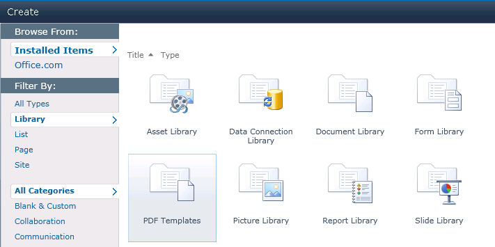
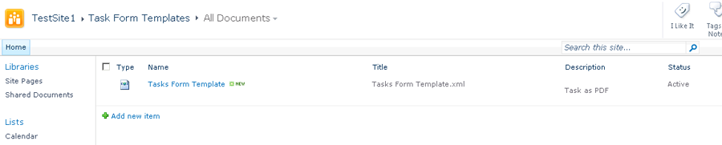

---
title: Criação e exportação de modelo
linktitle: Criação e exportação de modelo
type: docs
weight: 10
url: /pt/sharepoint/creating-and-exporting-template/
lastmod: "2020-12-16"
description: Você pode criar e exportar modelos para PDF no SharePoint usando a API PDF SharePoint.
---

{}

Este artigo mostra como criar e exportar modelos usando Aspose.PDF para SharePoint.

No Aspose.PDF para SharePoint 1.9.2, o suporte a modelos PDF também abrange subsites do SharePoint.

{}

## Criação e exportação de modelos

{}

Para usar o recurso de exportação Aspose.PDF para SharePoint, primeiro crie uma lista que use “Modelos PDF”.

Criando uma lista que usa modelos PDF:

Dois modelos de documentos, modelos de formulário de tarefas e modelos de lista de tarefas são criados:

O formulário modelo permite inserir as seguintes informações:

- **Nome**: o nome do arquivo do modelo.
- **Título**: o título do modelo. (Por padrão, é igual ao nome do arquivo.)
- **Descrição**: uma descrição do modelo. Uma boa descrição torna o modelo mais fácil de usar.
- **Tipos de lista atribuídos**: IDs de lista separados por vírgula (relacionados ao modelo. Este campo também pode conter o valor
- **TodosTiposdeLista**. Este campo só é aplicável quando o campo **Tipo** está definido como **Lista**).
- **Tipos de conteúdo atribuídos**: IDs de tipo de conteúdo separados por vírgulas relacionados ao modelo. Este campo pode conter ser definido como **AllListTypes**. Este campo só é aplicável quando o campo **Tipo** está definido como **Item**.
- **Tipo**: modelo de lista ou modelo de item.
- **Status**: as opções são ativa, inativa (invisível para todos) e depuração (visível apenas para administradores).

O formulário Modelos de lista de tarefas:

O formulário Modelos de formulário de tarefa:

Depois de salvos, os novos modelos aparecem na lista de modelos, prontos para serem usados:

Dois modelos de lista de tarefas:*

Um modelo de formulário de tarefa:

### Desenvolvimento de modelos

Um modelo é um arquivo XML baseado em Aspose XML PDF. Para criar um modelo para uma lista, coloque marcadores especiais relacionados ao nome interno do campo do tipo de conteúdo de destino do SharePoint no arquivo PDF XML.

### Marcadores

- **SPListItemsCount** – substituído pela contagem de itens da lista.
- **SPListTitle** – substituído pelo título da lista.
- **SPTableIterator** – colocado na primeira célula da tabela e marca a tabela para iteração completa.
- **SPRowIterator** – colocado na primeira célula da tabela e marca a tabela para iteração de linha.
- **SPField** – substituído pelo valor do campo do item.

Para referência, faça o download [arquivos XML de modelo](attachments/8421394/8618082.zip).

### Exportar para PDF

Quando um modelo estiver completamente configurado, você estará pronto para exportar listas ou itens para arquivos PDF.

Exportando uma lista para PDF usando um modelo de lista de tarefas:

{}

