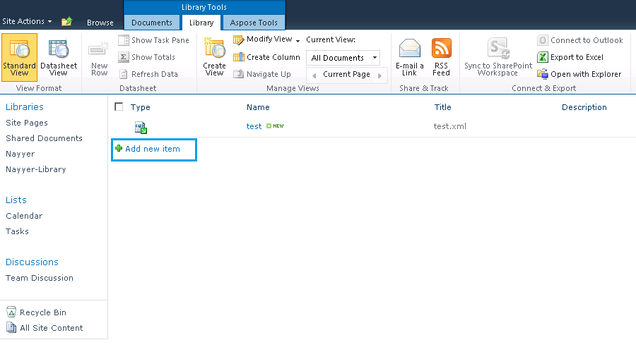
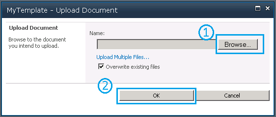
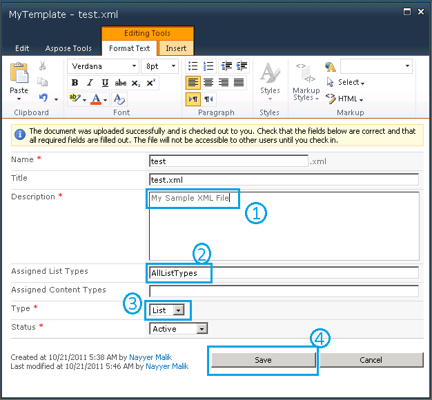

{}

Aspose.PDF for SharePoint é construído sobre o nosso premiado componente Aspose.PDF for .NET. Aspose.PDF for .NET oferece recursos notáveis, desde a criação de documentos PDF do zero até a manipulação de arquivos PDF existentes. Entre esses recursos, a conversão de XML para PDF é um dos recursos destacados suportados por este produto. Portanto, acreditamos que o Aspose.PDF for SharePoint também será capaz de converter arquivos XML para o formato PDF.

{}

## **Criando um Arquivo XML e Convertendo‑o para PDF**

{}

Passo a passo, este artigo orienta você pelo processo de criar um arquivo XML e convertê‑lo para PDF:

1. [Crie um arquivo XML](/pdf/pt/sharepoint/how-to-create-and-convert-an-xml-file-to-pdf/#step-1-create-xml-file).
2. [Criar um modelo PDF](/pdf/pt/sharepoint/how-to-create-and-convert-an-xml-file-to-pdf/#step-2-create-pdf-template).
3. [Carregar o modelo XML](/pdf/pt/sharepoint/how-to-create-and-convert-an-xml-file-to-pdf/#step-3-load-xml-template).
4. [Especifique o caminho para o caminho de origem](/pdf/pt/sharepoint/how-to-create-and-convert-an-xml-file-to-pdf/#step-4-specify-source-file-path).
5. [Especifique as propriedades do arquivo](/pdf/pt/sharepoint/how-to-create-and-convert-an-xml-file-to-pdf/#step-5-specify-file-properties).
6. [Exportar o arquivo para PDF](/pdf/pt/sharepoint/how-to-create-and-convert-an-xml-file-to-pdf/#step-6-export-to-pdf).
7. [Salvar o arquivo PDF](/pdf/pt/sharepoint/how-to-create-and-convert-an-xml-file-to-pdf/#step-7-save-pdf-document).
#### **Passo 1: Criar arquivo XML**
Primeiro, crie um arquivo XML com base no Modelo de Objeto de Documento do Aspose.PDF for .NET.

De acordo com o Aspose.PDF for .NET DOM, um documento PDF contém uma coleção de objetos Section, e uma Section contém um ou mais elementos Paragraph. Text é um objeto de nível Paragraph e pode conter um ou mais segmentos. A seguir, uma string de texto de exemplo é adicionada a um objeto Segment e adicionada a um objeto Text. Finalmente, o elemento Text é adicionado à coleção de parágrafos do objeto Section.

**XML**



<?xml version="1.0" encoding="utf-8" ?>

  <Pdf xmlns="Aspose.PDF">

   <Section>

    <Text>

            <Segment>Olá Mundo</Segment>

    </Text>

   </Section>

  </Pdf>


#### **Passo 2: Criar Modelo de PDF**
Antes de continuar, certifique-se de que o servidor SharePoint Foundation 2010 está devidamente instalado e configurado no sistema onde a conversão ocorrerá.

1. Faça login no site do SharePoint.
1. Selecione **Site Action** e **All Items**.
1. Selecione a opção **Create** e selecione **PDF Template** da lista.
1. Insira um nome de modelo.
1. Clique em **Create**.

#### **Etapa 3: Carregar Modelo XML**
Depois que o modelo for criado, carregue [o arquivo XML](/pdf/pt/sharepoint/how-to-create-and-convert-an-xml-file-to-pdf/):

1. Na página de modelo PDF, selecione **Add new item**.

#### **Etapa 4: Especificar o Caminho do Arquivo de Origem**
Na caixa de diálogo de upload de documento:

1. Clique em **Browse** e localize o arquivo XML no seu sistema. Você pode marcar a caixa de seleção para sobrescrever a opção de arquivo existente.
1. Pressione o botão **OK**.

#### **Etapa 5: Especificar Propriedades do Arquivo**
Quando o arquivo for carregado, adicione informações nos campos obrigatórios (marcados com um asterisco vermelho: *).

Para este exemplo, uma descrição de amostra foi adicionada e os seguintes campos foram preenchidos:

1. Uma breve descrição do documento.
1. Insira **AllListTypes** no campo **Assigned List Types**.
1. Selecione **List** no menu **Type**.
   Certifique‑se de que o status permaneça **Active**.
1. Clique **Salvar** para salvar as propriedades.

#### **Etapa 6: Exportar para PDF**
Quando o arquivo XML foi adicionado ao modelo PDF:
Ou:

1. Clique com o botão direito no arquivo test.xml.
1. Selecione **Exportar para PDF** no menu.

Ou:

1. Selecione **Aspose Tools** da **Library Tools**.
1. Clique em **Export**.

#### **Etapa 7: Salvar documento PDF**
1. Na caixa de diálogo Exportar para PDF, selecione **Template storage** (o local onde o arquivo fonte está armazenado).
1. Selecione o arquivo a ser exportado no menu **Template name**.
1. Clique **Export to PDF** para salvar o documento PDF final.

#### **Abra o PDF**
O documento PDF foi salvo e pode ser aberto. Na imagem abaixo, observe a frase "Hello World" que estava na tag {segment] no XML. Observe também que o Produtor de PDF é Aspose.PDF for SharePoint.

{}
