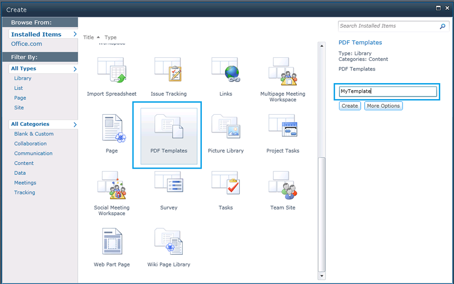
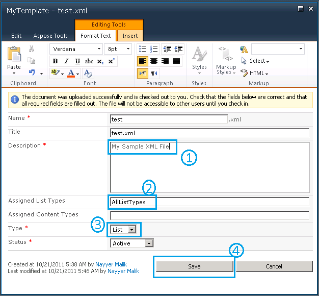

---
title: Como criar e converter um arquivo XML em PDF
linktitle: Como criar e converter um arquivo XML em PDF
type: docs
weight: 30
url: /pt/sharepoint/how-to-create-and-convert-an-xml-file-to-pdf/
lastmod: "2020-12-16"
description: A API PDF SharePoint é capaz de criar e converter arquivos XML em formato PDF.
---

{}

Aspose.PDF for SharePoint foi desenvolvido com base em nosso premiado componente Aspose.PDF for .NET. Aspose.PDF for .NET oferece recursos notáveis, desde a criação de documentos PDF do zero até a manipulação de arquivos PDF existentes. Dentre esses recursos, a conversão de XML para PDF é um dos grandes recursos suportados por este produto. Portanto, acreditamos que o Aspose.PDF for SharePoint também será capaz de converter arquivos XML para o formato PDF.

{}

## Criando um arquivo XML e convertendo-o em PDF

{}

Passo a passo, este artigo orienta você no processo de criação de um arquivo XML e conversão em PDF:

1. [Crie um arquivo XML](/pdf/pt/sharepoint/how-to-create-and-convert-an-xml-file-to-pdf/#step-1-create-xml-file).
2. [Create a PDF template](/pdf/pt/sharepoint/how-to-create-and-convert-an-xml-file-to-pdf/#step-2-create-pdf-template).
3. [Carregue o modelo XML](/pdf/pt/sharepoint/how-to-create-and-convert-an-xml-file-to-pdf/#step-3-load-xml-template).
4. [Especifique o caminho para o caminho de origem](/pdf/pt/sharepoint/how-to-create-and-convert-an-xml-file-to-pdf/#step-4-specify-source-file-path).
5. [Especifique as propriedades do arquivo](/pdf/pt/sharepoint/how-to-create-and-convert-an-xml-file-to-pdf/#step-5-specify-file-properties).
6. [Exporte o arquivo para PDF](/pdf/pt/sharepoint/how-to-create-and-convert-an-xml-file-to-pdf/#step-6-export-to-pdf).
7. [Salve o arquivo PDF](/pdf/pt/sharepoint/how-to-create-and-convert-an-xml-file-to-pdf/#step-7-save-pdf-document)

### Etapa 1: criar arquivo XML

First create an XML file based on the Aspose.PDF for .NET Document Object Model.

De acordo com Aspose.PDF para .NET DOM, um documento PDF contém uma coleção de objetos Section e uma Section contém um ou mais elementos Paragraph. Texto é um objeto no nível de parágrafo e pode conter um ou mais segmentos. Abaixo, uma sequência de texto de exemplo é adicionada a um objeto Segment e adicionada a um objeto Text. Finalmente, o elemento Text é adicionado à coleção de parágrafos do objeto Section.

```xml

<?xml version="1.0" encoding="utf-8" ?>

  <Pdf xmlns="Aspose.PDF">

   <Section>

    <Text>

            <Segment>Hello World</Segment>

    </Text>

   </Section>

  </Pdf>

```

### Passo 2: Criar modelo PDF

Antes de continuar, certifique-se de que o servidor SharePoint Foundation 2010 esteja instalado e configurado corretamente no sistema onde a conversão ocorrerá.

1. Faça login no site do SharePoint.
1. Selecione **Ação do site** e **Todos os itens**.
1. Selecione a opção **Criar** e selecione **Modelo de PDF** na lista.
1. Insira um nome de modelo.
1. Clique em **Criar**.



### Etapa 3: carregar modelo XML

Depois que o modelo for criado, carregue [o arquivo XML](/pdf/pt/sharepoint/how-to-create-and-convert-an-xml-file-to-pdf/)

1. On the PDF template page, select **Add new item**.


### Etapa 4: especificar o caminho do arquivo de origem

Na caixa de diálogo de upload de documento:

1. Clique em **Procurar** e localize o arquivo XML em seu sistema. Você pode ativar a caixa de seleção para substituir a opção de arquivo existente.
1. Pressione o botão **OK**.


### Etapa 5: especifique as propriedades do arquivo

Quando o arquivo for carregado, adicione informações nos campos obrigatórios (marcados com um asterisco vermelho: *).

Para este exemplo, uma descrição de amostra foi adicionada e os seguintes campos preenchidos:

1. Uma breve descrição do documento.
1. Insira **AllListTypes** no campo **Tipos de lista atribuídos**.
1. Selecione **Lista** no menu **Tipo**.
   Certifique-se de que o status permaneça **Ativo**.
1. Clique em **Salvar** para salvar as propriedades.



### Passo 6: Exportar para PDF

Quando o arquivo XML for adicionado ao modelo PDF:
Qualquer:

1. Clique com o botão direito no arquivo test.xml.
1. Selecione **Exportar para PDF** no menu.

Ou:

1. Selecione **Ferramentas Aspose** em **Ferramentas da Biblioteca**.
1. Clique em **Exportar**.


### Passo 7: Salvar documento PDF

1. Na caixa de diálogo Exportar para PDF, selecione **Armazenamento de modelos** (o local onde o arquivo de origem está armazenado).
1. Selecione o arquivo a ser exportado no menu **Nome do modelo**.
1. Clique em **Exportar para PDF** para salvar o documento PDF final.


## Abra o PDF

O documento PDF foi salvo e pode ser aberto. Na imagem abaixo, observe a frase “Hello World” que estava na tag segment no XML. Observe também que o PDF Producer é Aspose.PDF para SharePoint.


{}

