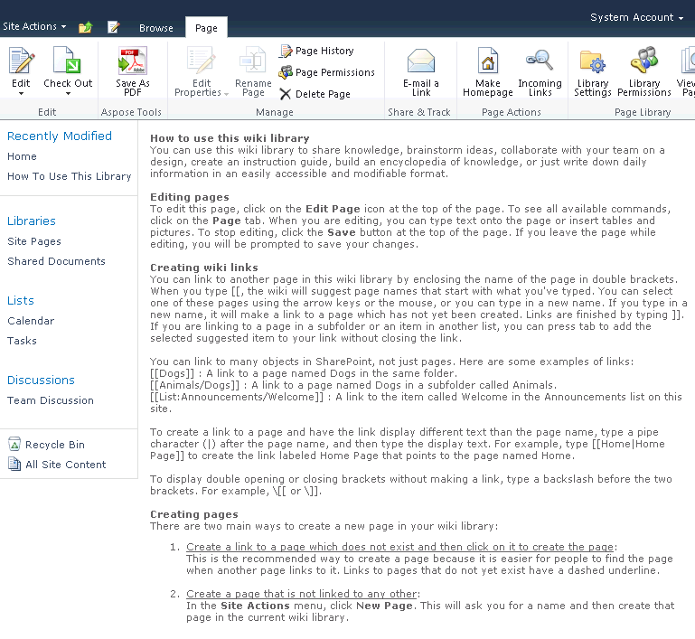
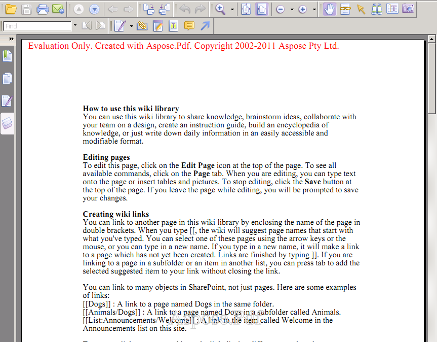

{}

## Exportação de PDF da Wiki do SharePoint

Este artigo mostra como exportar páginas Wiki do SharePoint para PDF usando Aspose.PDF for SharePoint.

{}
## **Salvando páginas Wiki**

{}

Para salvar uma página Wiki como PDF, clique em **Salvar como PDF** na aba **Página**. As capturas de tela abaixo mostram uma seção de texto como aparece em uma página Wiki e exportada para PDF.

**Uma página Wiki prestes a ser exportada para arquivo PDF.** (Observe o botão **Salvar como PDF** na guia **Página**.)

**Um PDF mostrando a página Wiki exportada.**

{}

