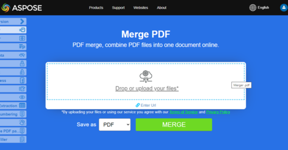

## Merge or combine multiple PDF into single PDF in Python via C++

By leveraging Python and a C++ library by Aspose, you can efficiently merge multiple PDF files into a single PDF with ease. 

To concatenate two PDF files:

1. Open first document
1. Then add pages of second document to the first
1. Save concatenated output file with [document_save](https://reference.aspose.com/pdf/python-cpp/core/document_save/) function

The following code snippet shows how to concatenate PDF files.

```python

    import AsposePDFPythonWrappers as apw
    import AsposePDFPython as apCore
    import os
    import os.path

    dataDir = os.path.join(os.getcwd(), "samples")
    input_file= os.path.join(dataDir , "sample0.pdf")
    output_file = os.path.join(dataDir , "results", "concatenated-files.pdf")

    # Open first document
    document1 = apw.Document(inputFile)
    document2 = apw.Document(inputFile)

    # Add pages of second document to the first
    document1.pages.add(document2.pages)

    # Save concatenated output file
    document1.save(output_file)
```

## Live Example

[Aspose.PDF Merger](https://products.aspose.app/pdf/merger) is an online free web application that allows you to investigate how presentation merging functionality works.

[](https://products.aspose.app/pdf/merger)

