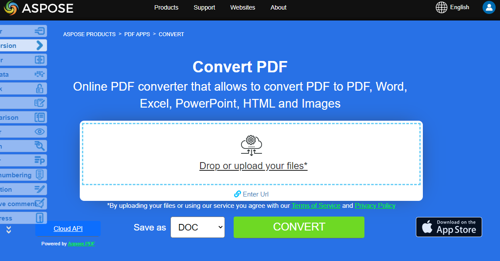

Do you want to convert PDF to other formats using Python? **Aspose.PDF for Python** is the best solution for converting PDF documents. Recall that Python is an object-oriented programming language that is used to develop software prototypes for web applications and data processing. Let's now learn how you can convert PDF to text using Python.

PDF files can contain not only text but also images, clickable buttons, hyperlinks, embedded fonts, signatures, stamps, etc. Users who are converting a PDF file to some other format are interested in doing so in order to be able to edit the PDF content.

**Our Aspose.PDF for Python via Java** library allows you to successfully, quickly and easily convert your PDF documents to the most popular formats and vice versa.

## How to use Aspose.PDF for conversion

The next section describes the most popular options for converting PDF documents.
After learning the code examples, you will understand that the Aspose.PDF for Python via Java library provides fairly universal solutions that will help you solve the tasks of converting documents.
Aspose.PDF supports the largest number of popular document formats, both for loading and saving.

Draw your attention that the current section describes only popular conversions.

Aspose.PDF for Python via .NET allows converting PDF documents to various formats and also converting from other formats to PDF. Also, you can check the quality of Aspose.PDF conversion and view the results online with Aspose.PDF converter app. Learn the sections of converting documents with code snippets.

Word documents are the most versatile and editable possible. Converting PDF to Word manually is a very time-consuming task. In this article, you will learn how to convert PDF to Word programmatically in Python.

- [Convert PDF to Microsoft Word](/pdf/python-java/convert-pdf-to-word/) - you can convert your PDF document to Word format with Python

Number formats are needed not only to make the data in the table easier to read, but also to make the table easier to use. Of course, if you need to convert such data from a PDF document to Excel format use our Aspose.PDF library.

- [Convert PDF to Microsoft Excel](/pdf/python-java/convert-pdf-to-excel/) - this section describes how to convert PDF document to XLSX, ODS, CSV and SpreadSheetML

The PowerPoint format is used to create various presentations. PPT files contain a large number of slides or pages containing various information.

- [Convert PDF to Microsoft PowerPoint](/pdf/python-java/convert-pdf-to-powerpoint/) - here we are talking about converting PDF to PowerPoint by tracking the conversion process

HyperText Markup Language is a hypertext document description language, a standard language for creating web pages. With Aspose.PDF for Python you can easily convert HTML documents and vice versa.

- [Convert HTML format to PDF file](/pdf/python-java/convert-html-to-pdf/) - article about different aspects of HTML-to-PDF conversion
- [Convert PDF file to HTML format](/pdf/python-java/convert-pdf-to-html/) - convert your PDF documents to HTML files as separate pages or as a simgle page

There are many image formats that need to be converted to PDF for different purposes. Aspose.PDF allows the most popular images formats and vice versa.

- [Convert PDF to various Images formats](/pdf/python-java/convert-pdf-to-images-format/) - convert PDF pages as images in JPEG, PNG and other formats

This section includes such formats as: EPUB, Markdown, PCL, XPS, LATex/TeX, Text, and PostScript.

- [Convert PDF file to other formats](/pdf/python-java/convert-pdf-to-other-files/) - this topic describes way for conversion PDF document to various formats

PDF/A is a version of PDF designed for the long-term archiving of electronic documents.
If honestly, externally, it is very difficult to determine if it is PDF or PDF/A. To check this file, validators are used. Check the following articles for a quality converting PDF to PDF/A and vice versa.

- [Convert PDF to PDF/A formats](/pdf/python-java/convert-pdf-to-pdfa/) - Python library by Aspose.PDF has an easy way for converting PDF to PDF/A

## Try to convert PDF files online

{}

You can try the conversion functionality by using our Aspose PDF APPS:

{}
