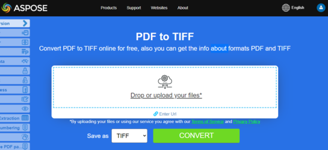

## Overview

This article explains how to convert PDF to different image formats using Python. It covers the following topics.

_Image Format_: **TIFF**
- [Python PDF to TIFF](#python-pdf-to-tiff)
- [Python Convert PDF to TIFF](#python-pdf-to-tiff)
- [Python Convert Single or Particular Pages of PDF to TIFF](#python-pdf-to-tiff-pages)


_Image Format_: **BMP**
- [Python PDF to BMP](#python-pdf-to-bmp)
- [Python Convert PDF to BMP](#python-pdf-to-bmp)
- [Python PDF to BMP Converter](#python-pdf-to-bmp)

_Image Format_: **EMF**
- [Python PDF to EMF](#python-pdf-to-emf)
- [Python Convert PDF to EMF](#python-pdf-to-emf)
- [Python PDF to EMF Converter](#python-pdf-to-emf)


_Image Format_: **JPG**
- [Python PDF to JPG](#python-pdf-to-jpg)
- [Python Convert PDF to JPG](#python-pdf-to-jpg)
- [Python PDF to JPG Converter](#python-pdf-to-jpg)


_Image Format_: **PNG**
- [Python PDF to PNG](#python-pdf-to-png)
- [Python Convert PDF to PNG](#python-pdf-to-png)
- [Python PDF to PNG Converter](#python-pdf-to-png)


_Image Format_: **GIF**
- [Python PDF to GIF](#python-pdf-to-gif)
- [Python Convert PDF to GIF](#python-pdf-to-gif)
- [Python PDF to GIF Converter](#python-pdf-to-gif)

_Image Format_: **SVG**
- [Python PDF to SVG](#python-pdf-to-svg)
- [Python Convert PDF to SVG](#python-pdf-to-svg)
- [Python PDF to SVG Converter](#python-pdf-to-svg)

## Python Convert PDF to Image

**Aspose.PDF for Python** uses several approaches to convert PDF to image. Generally speaking, we use two approaches: conversion using the Device approach and conversion using SaveOption. This section will show you how to convert PDF documents to image formats such as BMP, JPEG, GIF, PNG, EMF, TIFF, and SVG formats using one of those approaches.

There are several classes in the library that allow you to use a virtual device to transform images. DocumentDevice is oriented for conversion whole document, but ImageDevice - for a particular page.

## Convert PDF using DocumentDevice class

**Aspose.PDF for Python** makes a possible to convert PDF Pages to TIFF images.

The [TiffDevice](https://reference.aspose.com/pdf/python-net/aspose.pdf.devices/tiffdevice/) (based on DocumentDevice) class allows you to convert PDF pages to TIFF images. This class provides a method named [process](https://reference.aspose.com/pdf/python-net/aspose.pdf.devices/tiffdevice/#methods) which allows you to convert all the pages in a PDF file to a single TIFF image.

{}
**Try to convert PDF to TIFF online**

Aspose.PDF for Python via .NET presents you online free application ["PDF to TIFF"](https://products.aspose.app/pdf/conversion/pdf-to-tiff), where you may try to investigate the functionality and quality it works.

[](https://products.aspose.app/pdf/conversion/pdf-to-tiff)
{}

### Convert PDF Pages to One TIFF Image

Aspose.PDF for Python explain how to convert all pages in a PDF file to a single TIFF image:

<a name="csharp-pdf-to-tiff"><strong>Steps: Convert PDF to TIFF in Python</strong></a>

1. Create an object of the [Document](https://reference.aspose.com/pdf/python-net/aspose.pdf/document/) class.
2. Create [TiffSettings](https://reference.aspose.com/pdf/python-net/aspose.pdf.devices/tiffsettings/) and [TiffDevice](https://reference.aspose.com/pdf/python-net/aspose.pdf.devices/tiffdevice/) objects
3. Call the [process](https://reference.aspose.com/pdf/python-net/aspose.pdf.devices/tiffdevice/#methods) method to convert the PDF document to TIFF.
4. To set the output file's properties, use the [TiffSettings](https://reference.aspose.com/pdf/python-net/aspose.pdf.devices/tiffsettings/) class.

The following code snippet shows how to convert all the PDF pages to a single TIFF image.

```python

    import aspose.pdf as ap

    input_pdf = DIR_INPUT + "sample.pdf"
    output_pdf = DIR_OUTPUT + "convert_pdf_to_tiff.tiff"
    # Open PDF document
    document = ap.Document(input_pdf)

    # Create Resolution object
    resolution = ap.devices.Resolution(300)

    # Create TiffSettings object
    tiffSettings = ap.devices.TiffSettings()
    tiffSettings.compression = ap.devices.CompressionType.LZW
    tiffSettings.depth = ap.devices.ColorDepth.DEFAULT
    tiffSettings.skip_blank_pages = False

    # Create TIFF device
    tiffDevice = ap.devices.TiffDevice(resolution, tiffSettings)

    # Convert a particular page and save the image to stream
    tiffDevice.process(document, output_pdf)
```

## Convert PDF using ImageDevice class

`ImageDevice` is the ancestor for `BmpDevice`, `JpegDevice`, `GifDevice`, `PngDevice` and `EmfDevice`.

- The [BmpDevice](https://reference.aspose.com/pdf/python-net/aspose.pdf.devices/bmpdevice/) class allows you to convert PDF pages to <abbr title="Bitmap Image File">BMP</abbr> images.
- The [EmfDevice](https://reference.aspose.com/pdf/python-net/aspose.pdf.devices/emfdevice/) class allows you to convert PDF pages to <abbr title="Enhanced Meta File">EMF</abbr> images.
- The [JpegDevice](https://reference.aspose.com/pdf/python-net/aspose.pdf.devices/jpegdevice/) class allows you to convert PDF pages to JPEG images.
- The [PngDevice](https://reference.aspose.com/pdf/python-net/aspose.pdf.devices/pngdevice/) class allows you to convert PDF pages to <abbr title="Portable Network Graphics">PNG</abbr> images.
- The [GifDevice](https://reference.aspose.com/pdf/python-net/aspose.pdf.devices/gifdevice/) class allows you to convert PDF pages to <abbr title="Graphics Interchange Format">GIF</abbr> images.

Let's take a look at how to convert a PDF page to an image.

[BmpDevice](https://reference.aspose.com/pdf/python-net/aspose.pdf.devices/bmpdevice/) class provides a method named [process](https://reference.aspose.com/pdf/python-net/aspose.pdf.devices/bmpdevice/#methods) which allows you to convert a particular page of the PDF file to BMP image format. The other classes have the same method. So, if we need to convert a PDF page to an image, we just instantiate the required class.

<a name="csharp-pdf-to-bmp"></a>
<a name="csharp-pdf-to-emf"></a>
<a name="csharp-pdf-to-jpg"></a>
<a name="csharp-pdf-to-png"></a>
<a name="csharp-pdf-to-gif"></a>
    
The following steps and code snippet in Python shows this possibility
 
 - [Convert PDF to BMP in Python](#python-pdf-to-image)
 - [Convert PDF to EMF in Python](#python-pdf-to-image)
 - [Convert PDF to JPG in Python](#python-pdf-to-image)
 - [Convert PDF to PNG in Python](#python-pdf-to-image)
 - [Convert PDF to GIF in Python](#python-pdf-to-image)

<a name="csharp-pdf-to-image"><strong>Steps: PDF to Image (BMP, EMF, JPG, PNG, GIF) in Python</strong></a>

1. Load the PDF file using [Document](https://reference.aspose.com/pdf/python-net/aspose.pdf/document/) class.
2. Create an instance of subclass of [ImageDevice](https://reference.aspose.com/pdf/python-net/aspose.pdf.devices/imagedevice/) i.e.
   * [BmpDevice](https://reference.aspose.com/pdf/python-net/aspose.pdf.devices/bmpdevice/) (to convert PDF to BMP)
   * [EmfDevice](https://reference.aspose.com/pdf/python-net/aspose.pdf.devices/emfdevice/) (to convert PDF to Emf)
   * [JpegDevice](https://reference.aspose.com/pdf/python-net/aspose.pdf.devices/jpegdevice/) (to convert PDF to JPG)
   * [PngDevice](https://reference.aspose.com/pdf/python-net/aspose.pdf.devices/pngdevice/) (to convert PDF to PNG)
   * [GifDevice](https://reference.aspose.com/pdf/python-net/aspose.pdf.devices/gifdevice/) (to convert PDF to GIF)
3. Call the [ImageDevice.Process()](https://reference.aspose.com/pdf/python-net/aspose.pdf.devices/imagedevice/#methods) method to perform PDF to Image conversion.

### Convert PDF to BMP

```python

    import aspose.pdf as ap

    input_pdf = DIR_INPUT + "many_pages.pdf"
    output_pdf = DIR_OUTPUT + "convert_pdf_to_bmp"
    # Open PDF document
    document = ap.Document(input_pdf)

    # Create Resolution object
    resolution = ap.devices.Resolution(300)
    device = ap.devices.BmpDevice(resolution)

    for i in range(0, len(document.pages)):
        # Create file for save
        imageStream = io.FileIO(
            output_pdf + "_page_" + str(i + 1) + "_out.bmp", 'x'
        )
        # Convert a particular page and save the image to stream
        device.process(document.pages[i + 1], imageStream)
        imageStream.close()
```

### Convert PDF to EMF

```python

    import aspose.pdf as ap

    input_pdf = DIR_INPUT + "sample.pdf"
    output_pdf = DIR_OUTPUT + "convert_pdf_to_emf"
    # Open PDF document
    document = ap.Document(input_pdf)

    # Create Resolution object
    resolution = ap.devices.Resolution(300)
    device = ap.devices.EmfDevice(resolution)

    for i in range(0, len(document.pages)):
        # Create file for save
        imageStream = io.FileIO(
            output_pdf + "_page_" + str(i + 1) + "_out.emf", 'x'
        )
        # Convert a particular page and save the image to stream
        device.process(document.pages[i + 1], imageStream)
        imageStream.close()
```  

### Convert PDF to JPEG

```python

    import aspose.pdf as ap

    input_pdf = DIR_INPUT + "many_pages.pdf"
    output_pdf = DIR_OUTPUT + "convert_pdf_to_jpeg"
    # Open PDF document
    document = ap.Document(input_pdf)

    # Create Resolution object
    resolution = ap.devices.Resolution(300)
    device = ap.devices.JpegDevice(resolution)

    for i in range(0, len(document.pages)):
        # Create file for save
        imageStream = io.FileIO(
            output_pdf + "_page_" + str(i + 1) + "_out.jpeg", "x"
        )
        # Convert a particular page and save the image to stream
        device.process(document.pages[i + 1], imageStream)
        imageStream.close()  
``` 

### Convert PDF to PNG

```python

    import aspose.pdf as ap

    input_pdf = DIR_INPUT + "sample.pdf"
    output_pdf = DIR_OUTPUT + "convert_pdf_to_png"
    # Open PDF document
    document = ap.Document(input_pdf)

    # Create Resolution object
    resolution = ap.devices.Resolution(300)
    device = ap.devices.PngDevice(resolution)

    for i in range(0, len(document.pages)):
        # Create file for save
        imageStream = io.FileIO(
            output_pdf + "_page_" + str(i + 1) + "_out.png", 'x'
        )
        # Convert a particular page and save the image to stream
        device.process(document.pages[i + 1], imageStream)
        imageStream.close()
``` 

### Convert PDF to GIF

```python

    import aspose.pdf as ap

    input_pdf = DIR_INPUT + "many_pages.pdf"
    output_pdf = DIR_OUTPUT + "convert_pdf_to_gif"
    # Open PDF document
    document = ap.Document(input_pdf)

    # Create Resolution object
    resolution = ap.devices.Resolution(300)

    device = ap.devices.GifDevice(resolution)

    for i in range(0, len(document.pages)):
        # Create file for save
        imageStream = io.FileIO(
            output_pdf + "_page_" + str(i + 1) + "_out.gif", 'x'
        )
        # Convert a particular page and save the image to stream
        device.process(document.pages[i + 1], imageStream)
        # Close stream
        imageStream.close()  
``` 

{}
**Try to convert PDF to PNG online**

As an example of how our free applications work please check the next feature.

Aspose.PDF for Python presents you online free application ["PDF to PNG"](https://products.aspose.app/pdf/conversion/pdf-to-png), where you may try to investigate the functionality and quality it works.

[](https://products.aspose.app/pdf/conversion/pdf-to-png)
{}

## Convert PDF using SaveOptions class

This part of article shows you how to convert PDF to <abbr title="Scalable Vector Graphics">SVG</abbr> using Python and SaveOptions class.

{}
**Try to convert PDF to SVG online**

Aspose.PDF for Python via .NET presents you online free application ["PDF to SVG"](https://products.aspose.app/pdf/conversion/pdf-to-svg), where you may try to investigate the functionality and quality it works.

[](https://products.aspose.app/pdf/conversion/pdf-to-svg)
{}

**Scalable Vector Graphics (SVG)** is a family of specifications of an XML-based file format for two-dimensional vector graphics, both static and dynamic (interactive or animated). The SVG specification is an open standard that has been under development by the World Wide Web Consortium (W3C) since 1999.

SVG images and their behaviors are defined in XML text files. This means that they can be searched, indexed, scripted and if required, compressed. As XML files, SVG images can be created and edited with any text editor, but it is often more convenient to create them with drawing programs such as Inkscape.

Aspose.PDF for Python supports the feature to convert SVG image to PDF format and also offers the capability to convert PDF files to SVG format. To accomplish this requirement, the [SvgSaveOptions](https://reference.aspose.com/pdf/python-net/aspose.pdf/svgsaveoptions/) class has been introduced into the Aspose.PDF namespace. Instantiate an object of SvgSaveOptions and pass it as a second argument to the [Document.Save()](https://reference.aspose.com/pdf/python-net/aspose.pdf/document/#methods) method.

The following code snippet shows the steps for converting a PDF file to SVG format with Python.

<a name="csharp-pdf-to-svg"><strong>Steps: Convert PDF to SVG in Python</strong></a>

1. Create an object of the [Document](https://reference.aspose.com/pdf/python-net/aspose.pdf/document/) class.
2. Create [SvgSaveOptions](https://reference.aspose.com/pdf/python-net/aspose.pdf/svgsaveoptions/) object with needed settings.
3. Call the [Document.Save()](https://reference.aspose.com/pdf/python-net/aspose.pdf/document/#methods) method and pass it [SvgSaveOptions](https://reference.aspose.com/pdf/python-net/aspose.pdf/svgsaveoptions/) object convert the PDF document to SVG.

### Convert PDF to SVG

```python

    import aspose.pdf as ap

    input_pdf = DIR_INPUT + "sample.pdf"
    output_pdf = DIR_OUTPUT + "convert_pdf_to_svg.svg"
    # Open PDF document
    document = ap.Document(input_pdf)

    # Instantiate an object of SvgSaveOptions
    saveOptions = ap.SvgSaveOptions()

    # Do not compress SVG image to Zip archive
    saveOptions.compress_output_to_zip_archive = False
    saveOptions.treat_target_file_name_as_directory = True

    # Save the output in SVG files
    document.save(output_pdf, saveOptions)
```
