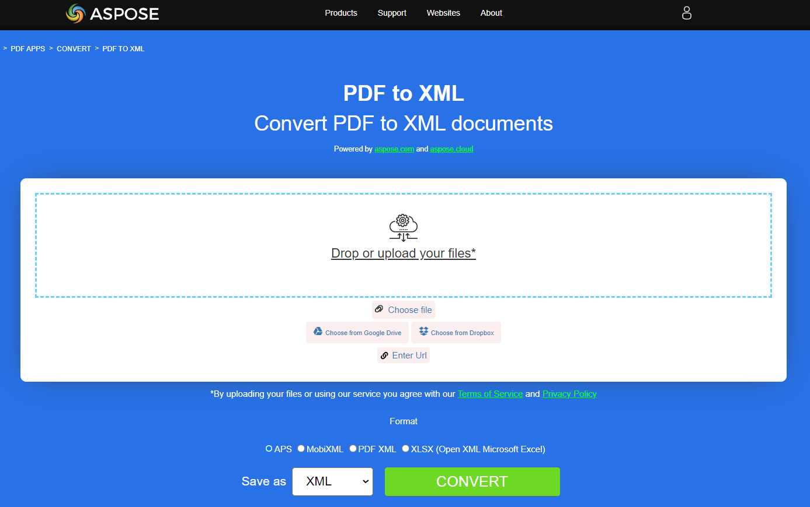

## Convert PDF to EPUB

{}
**Try to convert PDF to EPUB online**

Aspose.PDF for Python presents you online free application ["PDF to EPUB"](https://products.aspose.app/pdf/conversion/pdf-to-epub), where you may try to investigate the functionality and quality it works.

[](https://products.aspose.app/pdf/conversion/pdf-to-epub)
{}

**<abbr title="Electronic Publication">EPUB</abbr>** is a free and open e-book standard from the International Digital Publishing Forum (IDPF). Files have the extension .epub.
EPUB is designed for reflowable content, meaning that an EPUB reader can optimize text for a particular display device. EPUB also supports fixed-layout content. The format is intended as a single format that publishers and conversion houses can use in-house, as well as for distribution and sale. It supersedes the Open eBook standard.

Aspose.PDF for Python also supports the feature to convert PDF documents to EPUB format. Aspose.PDF for Python has a class named 'EpubSaveOptions' which can be used as the second argument to [save()](https://reference.aspose.com/pdf/python-net/aspose.pdf/document/#methods) method, to generate an EPUB file.
Please try using the following code snippet to accomplish this requirement with Python.

```python

    import aspose.pdf as ap

    input_pdf = DIR_INPUT + "sample.pdf"
    output_pdf = DIR_OUTPUT + "convert_pdf_to_epub.epub"
    # Open PDF document
    document = ap.Document(input_pdf)

    # Instantiate Epub Save options
    save_options = ap.EpubSaveOptions()

    # Specify the layout for contents
    save_options.content_recognition_mode = ap.EpubSaveOptions.RecognitionMode.FLOW

    # Save the ePUB document
    document.save(output_pdf, save_options)
```

## Convert PDF to LaTeX/TeX

**Aspose.PDF for Python via .NET** support converting PDF to LaTeX/TeX.
The LaTeX file format is a text file format with the special markup and used in TeX-based document preparation system for high-quality typesetting.

{}
**Try to convert PDF to LaTeX/TeX online**

Aspose.PDF for Python presents you online free application ["PDF to LaTeX"](https://products.aspose.app/pdf/conversion/pdf-to-tex), where you may try to investigate the functionality and quality it works.

[](https://products.aspose.app/pdf/conversion/pdf-to-tex)
{}

To convert PDF files to TeX, Aspose.PDF has the class [LaTeXSaveOptions](https://reference.aspose.com/pdf/python-net/aspose.pdf/latexsaveoptions/) which provides the property OutDirectoryPath for saving temporary images during the conversion process.

The following code snippet shows the process of converting PDF files into the TEX format with Python.

```python

    import aspose.pdf as ap

    input_pdf = DIR_INPUT + "sample.pdf"
    output_pdf = DIR_OUTPUT + "convert_pdf_to_tex.tex"
    # Open PDF document
    document = ap.Document(input_pdf)
    # Instantiate an object of LaTeXSaveOptions
    saveOptions = ap.LaTeXSaveOptions()
    document.save(output_pdf, saveOptions)
```

## Convert PDF to Text

**Aspose.PDF for Python** support converting whole PDF document and single page to a Text file.

### Convert PDF document to Text file

You can convert PDF document to TXT file using 'TextDevice' class.

The following code snippet explains how to extract the texts from the all pages.

```python

    import aspose.pdf as ap

    input_pdf = DIR_INPUT + "sample.pdf"
    output_pdf =  DIR_OUTPUT + "convert_pdf_to_txt.txt"
    # Open PDF document
    document = ap.Document(input_pdf)

    # Create Text device
    textDevice = ap.devices.TextDevice()

    # Convert a particular page and save
    textDevice.process(document.pages[1], output_pdf)
```

{}
**Try to convert Convert PDF to Text online**

Aspose.PDF for Python presents you online free application ["PDF to Text"](https://products.aspose.app/pdf/conversion/pdf-to-txt), where you may try to investigate the functionality and quality it works.

[](https://products.aspose.app/pdf/conversion/pdf-to-txt)
{}

## Convert PDF to XPS

**Aspose.PDF for Python** gives a possibility to convert PDF files to <abbr title="XML Paper Specification">XPS</abbr> format. Let try to use the presented code snippet for converting PDF files to XPS format with Python.

{}
**Try to convert PDF to XPS online**

Aspose.PDF for Python presents you online free application ["PDF to XPS"](https://products.aspose.app/pdf/conversion/pdf-to-xps), where you may try to investigate the functionality and quality it works.

[](https://products.aspose.app/pdf/conversion/pdf-to-xps)
{}

The XPS file type is primarily associated with the XML Paper Specification by Microsoft Corporation. The XML Paper Specification (XPS), formerly codenamed Metro and subsuming the Next Generation Print Path (NGPP) marketing concept, is Microsoft's initiative to integrate document creation and viewing into the Windows operating system.

To convert PDF files to XPS, Aspose.PDF has the class [XpsSaveOptions](https://reference.aspose.com/pdf/python-net/aspose.pdf/xpssaveoptions/) that is used as the second argument to the [save()](https://reference.aspose.com/pdf/python-net/aspose.pdf/document/#methods) method to generate the XPS file.

The following code snippet shows the process of converting PDF file into XPS format.

```python

    import aspose.pdf as ap

    input_pdf = DIR_INPUT + "sample.pdf"
    output_pdf = DIR_OUTPUT + "convert_pdf_to_xps.xps"
    # Open PDF document
    document = ap.Document(input_pdf)

    # Instantiate XPS Save options
    save_options = ap.XpsSaveOptions()

    # Save the XPS document
    document.save(output_pdf, save_options)
```
## Convert PDF to XML

{}
**Try to convert PDF to XML online**

Aspose.PDF for Python presents you online free application ["PDF to XML"](https://products.aspose.app/pdf/conversion/pdf-to-xml), where you may try to investigate the functionality and quality it works.

[](https://products.aspose.app/pdf/conversion/pdf-to-xml)
{}

<abbr title="Extensible Markup Language">XML</abbr> is a markup language and file format for storing, transmitting, and reconstructing arbitrary data.

Aspose.PDF for Python also supports the feature to convert PDF documents to XML format. Aspose.PDF for Python has a class named 'XmlSaveOptions' which can be used as the second argument to [save()](https://reference.aspose.com/pdf/python-net/aspose.pdf/document/#methods) method, to generate an XML file.
Please try using the following code snippet to accomplish this requirement with Python.

```python

    import aspose.pdf as ap

    def convert_pdf_to_xml(self, infile, outfile):
        path_infile = self.dataDir + infile
        path_outfile = self.dataDir + outfile

        # Open PDF document

        document = ap.Document(path_infile)

        # Instantiate XML Save options
        save_options = ap.XmlSaveOptions()

        # Save the XML document
        document.save(path_outfile, save_options)
        print(infile + " converted into " + outfile)
```