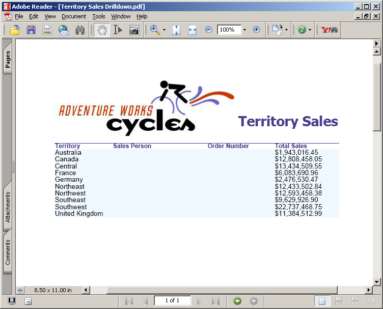
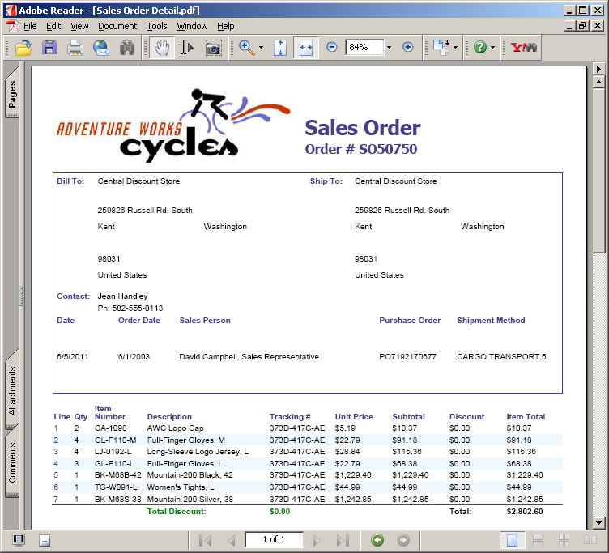
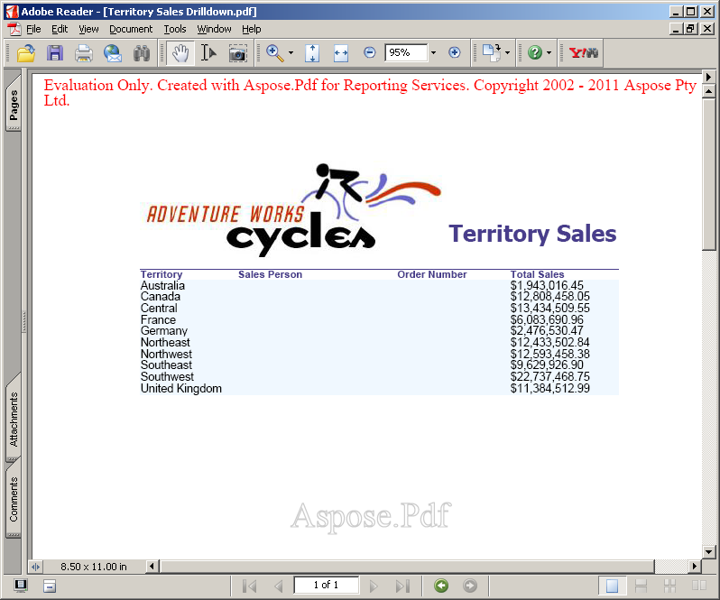

**Aspose.Pdf for Reporting Services** evaluation version provide the same set of features as present in Licensed version, except for the evaluation watermark in resultant PDF when using evaluation version. Please visit our website and download the product version and start exploring our product with complete set of features in an evaluation mode.

When you are happy with your evaluation, [buy a license](https://purchase.aspose.com/buy). Before purchasing, make sure you understand and agree to the license subscription terms.

The license will be available for download from the order page after the order is paid. The license is a clear text, digitally signed XML file. The license contains information such as the client's name, the purchased product and the type of the license. Do not modify the content of the license file as it will invalidate the license.

## Licensing a Server

Download the license file and copy it to the C:\Program Files\Microsoft SQL Server\```<Instance>``\Reporting Services\ReportServer\bin, or C:\Program Files\Microsoft SQL Server\SSRS\ReportServer\bin, or C:\Program Files\Microsoft Power BI Report Server\PBIRS\ReportServer\bin folder on the server (the same folder where the Aspose.Pdf.ReportingServices.dll is placed).

```<Instance>``` is the subdirectory name that corresponds to the Microsoft SQL Server 2016 instance you want to license.

The default instance directory for Microsoft SQL Server 2016 is MSRS13.MSSQLSERVER.
For the Microsoft SQL Server 2017 and later the default instance path is C:\Program Files\Microsoft SQL Server\SSRS.
For the Power BI Report Server the default instance path is C:\Program Files\Microsoft Power BI Report Server\PBIRS.

**PDF generated using “Territory sales drilldown” report**




**PDF generated using “Sales Order details” report**



If there is a problem while initializing the license, an evaluation watermark is displayed in the resultant PDF document as specified below.

**PDF document generated using “Territory Sales Drilldown” with watermark**



Please note that that supported license file names are Aspose.PDF.ReportingServices.lic, Aspose.Total.ReportingServices.lic and Aspose.Total.Product.Family.lic. If the file has any other name, please rename it.


## Temporary License

{}

You may also request a 30 days temporary license to test the product. Please visit the following link for more information on how to get Temporary license. [Get a Temporary License](https://purchase.aspose.com/temporary-license).

{}
