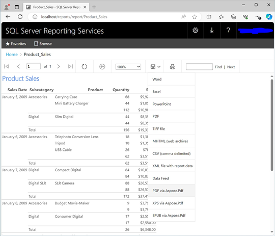

{}

## Welcome to Aspose.PDF for Reporting Services!

Microsoft SQL Server Reporting Services fulfills a need that many organizations are faced with - the need to build business intelligence and reporting solutions. Until now, developers were required to embed reports into their applications, or organizations were required to purchase expensive and sometimes problematic third-party reporting solutions. Now, Microsoft SQL Server Reporting Services offer a complete solution for distributing reports across the enterprise; enabling businesses to make decisions better and faster.

**Aspose.Pdf for Reporting Services** is another unique solution from Aspose, that makes possible generating PDF reports in Microsoft SQL Server 2016/2017/2019/2022 Reporting Services and Power BI Report Server. All RDL report features, including tables, matrices, charts and images are converted with the highest degree of precision to PDF.

Microsoft SQL Server Reporting Services have built-in abilities to export reports as PDF documents, but it lacks to provide necessary technical support for end user. Aspose.Pdf strives to provide a supreme and efficient technical support.

Aspose.Pdf for Reporting Services creates documents on the server without utilizing Adobe.Pdf SDK. Aspose.Pdf for Reporting Services internally uses Aspose.Pdf for .NET – the world-class component for server-side document processing and conversions.

## Aspose.PDF for Reporting Services makes it possible to export any report in PDF format

