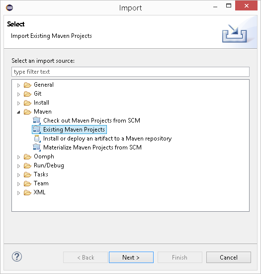

## Скачать с GitHub

Все примеры Aspose.PDF для Android через Java размещены на [Github](https://github.com/aspose-pdf/Aspose.PDF-for-Java). Вы можете либо клонировать репозиторий с помощью вашего любимого клиента Github, либо скачать ZIP‑файл из [здесь](https://github.com/aspose-pdf/Aspose.PDF-for-Java/archive/master.zip).

Извлеките содержимое ZIP‑файла в любую папку на вашем компьютере. Все примеры находятся в папке **Examples** folder.

Проект использует систему сборки Maven. Любая современная IDE может легко открыть или импортировать проект и его зависимости. Ниже мы покажем, как использовать популярные IDE для сборки и запуска примеров.

### IntelliJ IDEA

Щелкните меню **File** и выберите **Open**. Перейдите к папке проекта и выберите файл **pom.xml**.

Он откроет проект и автоматически загрузит зависимости. На вкладке Project просмотрите примеры в папке **src/main/java**. Чтобы запустить пример, просто щелкните правой кнопкой мыши файл и выберите "Run ..", пример будет выполнен, а вывод будет показан во встроенном окне консольного вывода.

### Eclipse

Щелкните меню **File** и выберите **Import**. Выберите **Maven** - Existing Maven Projects.

Перейдите к папке, которую вы склонировали или загрузили с GitHub, и выберите файл **pom.xml**.

Он откроет проект и автоматически загрузит зависимости. На вкладке Package Explorer просмотрите примеры в папке **src/main/java**. Чтобы запустить пример, просто щелкните правой кнопкой мыши файл и выберите **Run As** — **Java Application**, пример будет выполнен, а вывод будет показан во встроенном окне консольного вывода.

### NetBeans

Щёлкните на меню **File** и выберите **Open Project**. Перейдите к папке, которую вы клонировали или скачали с GitHub. Иконка папки **Examples** покажет, что это Maven‑проект. Выберите Examples и откройте её.

Это откроет проект и автоматически загрузит зависимости. На вкладке Projects просмотрите примеры в **source packages**. Чтобы запустить пример, просто щёлкните правой кнопкой мыши по файлу и выберите **Run File**, пример будет выполнен, а вывод появится во встроенном окне консольного вывода.

### Внести свой вклад

Если вы хотите добавить или улучшить пример, мы призываем вас внести свой вклад в проект. Все примеры и демонстрационные проекты в этом репозитории являются открытым исходным кодом и могут свободно использоваться в ваших приложениях.

Для вклада вы можете форкнуть репозиторий, отредактировать исходный код и создать pull request. Мы рассмотрим изменения и включим их в репозиторий, если они окажутся полезными.

