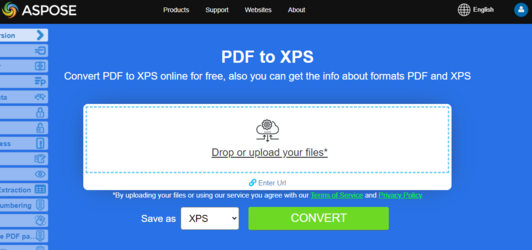

## Конвертировать PDF в EPUB

**<abbr title="Electronic Publication">EPUB</abbr>** — это свободный и открытый стандарт электронных книг от Международного форума цифровой публикации (IDPF). Файлы имеют расширение .epub.
EPUB разработан для контента с переобтеканием, что означает, что читалка EPUB может оптимизировать текст под конкретное устройство отображения. EPUB также поддерживает контент фиксированного макета. Формат предназначен как единый формат, который издатели и компании, занимающиеся конвертацией, могут использовать внутри компании, а также для распространения и продажи. Он заменяет стандарт Open eBook.

Предоставленный фрагмент кода на Go демонстрирует, как конвертировать документ PDF в EPUB с использованием библиотеки Aspose.PDF:

1. Откройте PDF‑документ.
1. Преобразуйте PDF‑файл в EPUB, используя функцию [SaveEpub]().
1. Закройте PDF‑документ и освободите все выделенные ресурсы.

```go

    package main

    import "github.com/aspose-pdf/aspose-pdf-go-cpp"
    import "log"

    func main() {
      // Open(filename string) opens a PDF-document with filename
      pdf, err := asposepdf.Open("sample.pdf")
      if err != nil {
        log.Fatal(err)
      }
      // SaveEpub(filename string) saves previously opened PDF-document as Epub-document with filename
      err = pdf.SaveEpub("sample.epub")
      if err != nil {
        log.Fatal(err)
      }
      // Close() releases allocated resources for PDF-document
      defer pdf.Close()
    }
```

{}
**Попробуйте конвертировать PDF в EPUB онлайн**

Aspose.PDF for Go представляет вам онлайн бесплатное приложение ["PDF в EPUB"](https://products.aspose.app/pdf/conversion/pdf-to-epub), где вы можете попытаться исследовать функциональность и качество, как оно работает.

[](https://products.aspose.app/pdf/conversion/pdf-to-epub)
{}

## Преобразовать PDF в TeX

**Aspose.PDF for Go** поддерживает конвертирование PDF в TeX.
Формат файла LaTeX — это текстовый формат с особой разметкой, используемый в системе подготовки документов на основе TeX для высококачественной вёрстки.

Предоставленный фрагмент кода на Go демонстрирует, как преобразовать документ PDF в TeX с использованием библиотеки Aspose.PDF:

1. Откройте PDF‑документ.
1. Преобразуйте PDF-файл в TeX с помощью функции [SaveTeX](https://reference.aspose.com/pdf/go-cpp/convert/savetex/).
1. Закройте PDF‑документ и освободите все выделенные ресурсы.

```go

    package main

    import "github.com/aspose-pdf/aspose-pdf-go-cpp"
    import "log"

    func main() {
      // Open(filename string) opens a PDF-document with filename
      pdf, err := asposepdf.Open("sample.pdf")
      if err != nil {
        log.Fatal(err)
      }
      // SaveTeX(filename string) saves previously opened PDF-document as TeX-document with filename
      err = pdf.SaveTeX("sample.tex")
      if err != nil {
        log.Fatal(err)
      }
      // Close() releases allocated resources for PDF-document
      defer pdf.Close()
    }
```

{}
**Попробуйте конвертировать PDF в LaTeX/TeX онлайн**

Aspose.PDF for Go представляет вам онлайн бесплатное приложение ["PDF в LaTeX"](https://products.aspose.app/pdf/conversion/pdf-to-tex), где вы можете попытаться исследовать функциональность и качество, как оно работает.

[](https://products.aspose.app/pdf/conversion/pdf-to-tex)
{}

## Конвертировать PDF в TXT

Предоставленный фрагмент кода на Go демонстрирует, как преобразовать документ PDF в TXT с помощью библиотеки Aspose.PDF:

1. Откройте PDF‑документ.
1. Преобразуйте PDF‑файл в TXT с помощью функции [SaveTxt](https://reference.aspose.com/pdf/go-cpp/convert/savetxt/).
1. Закройте PDF‑документ и освободите все выделенные ресурсы.

```go

    package main

    import "github.com/aspose-pdf/aspose-pdf-go-cpp"
    import "log"

    func main() {
      // Open(filename string) opens a PDF-document with filename
      pdf, err := asposepdf.Open("sample.pdf")
      if err != nil {
        log.Fatal(err)
      }
      // SaveTxt(filename string) saves previously opened PDF-document as Txt-document with filename
      err = pdf.SaveTxt("sample.txt")
      if err != nil {
        log.Fatal(err)
      }
      // Close() releases allocated resources for PDF-document
      defer pdf.Close()
    }
```

{}
**Попробуйте преобразовать PDF в текст онлайн**

Aspose.PDF for Go представляет вам онлайн бесплатное приложение ["PDF в текст"](https://products.aspose.app/pdf/conversion/pdf-to-txt), где вы можете попытаться исследовать функциональность и качество, как оно работает.

[](https://products.aspose.app/pdf/conversion/pdf-to-txt)
{}

## Конвертировать PDF в XPS

Тип файла XPS в первую очередь связан с XML Paper Specification компании Microsoft Corporation. XML Paper Specification (XPS), ранее назывался «Metro» и включал в себя маркетинговую концепцию Next Generation Print Path (NGPP), является инициативой Microsoft по интеграции создания и просмотра документов в операционную систему Windows.

**Aspose.PDF for Go** предоставляет возможность конвертировать PDF‑файлы в <abbr title="XML Paper Specification">XPS</abbr> формат. Давайте попробуем использовать представленный фрагмент кода для конвертации PDF‑файлов в формат XPS с Go.

Предоставленный фрагмент кода на Go демонстрирует, как преобразовать документ PDF в XPS с помощью библиотеки Aspose.PDF:

1. Откройте PDF‑документ.
1. Преобразуйте файл PDF в XPS с помощью функции [SaveXps](https://reference.aspose.com/pdf/go-cpp/convert/savexps/).
1. Закройте PDF‑документ и освободите все выделенные ресурсы.

```go

    package main

    import "github.com/aspose-pdf/aspose-pdf-go-cpp"
    import "log"

    func main() {
      // Open(filename string) opens a PDF-document with filename
      pdf, err := asposepdf.Open("sample.pdf")
      if err != nil {
        log.Fatal(err)
      }
      // SaveXps(filename string) saves previously opened PDF-document as Xps-document with filename
      err = pdf.SaveXps("sample.xps")
      if err != nil {
        log.Fatal(err)
      }
      // Close() releases allocated resources for PDF-document
      defer pdf.Close()
    }
```

{}
**Попробуйте конвертировать PDF в XPS онлайн**

Aspose.PDF for Go представляет вам онлайн бесплатное приложение ["PDF в XPS"](https://products.aspose.app/pdf/conversion/pdf-to-xps), где вы можете попытаться исследовать функциональность и качество, как оно работает.

[](https://products.aspose.app/pdf/conversion/pdf-to-xps)
{}

## Преобразовать PDF в PDF в оттенках серого

Предоставленный фрагмент кода на Go демонстрирует, как преобразовать первую страницу PDF‑документа в градацию серого, используя библиотеку Aspose.PDF:

1. Откройте PDF‑документ.
1. Преобразуйте страницу PDF в PDF в градациях серого с помощью функции [PageGrayscale](https://reference.aspose.com/pdf/go-cpp/organize/pagegrayscale/).
1. Закройте PDF‑документ и освободите все выделенные ресурсы.

Этот пример преобразует конкретную страницу вашего PDF в градацию серого:

```go

    package main

    import "github.com/aspose-pdf/aspose-pdf-go-cpp"
    import "log"

    func main() {
      // Open(filename string) opens a PDF-document with filename
      pdf, err := asposepdf.Open("sample.pdf")
      if err != nil {
        log.Fatal(err)
      }
      // PageGrayscale(num int32) converts page to black and white
      err = pdf.PageGrayscale(1)
      if err != nil {
        log.Fatal(err)
      }
      // SaveAs(filename string) saves previously opened PDF-document with new filename
      err = pdf.SaveAs("sample_page1_Grayscale.pdf")
      if err != nil {
        log.Fatal(err)
      }
      // Close() releases allocated resources for PDF-document
      defer pdf.Close()
    }
```

Этот пример преобразует весь PDF‑документ в градации серого:

```go

    package main

    import "github.com/aspose-pdf/aspose-pdf-go-cpp"
    import "log"

    func main() {
      // Open(filename string) opens a PDF-document with filename
      pdf, err := asposepdf.Open("sample.pdf")
      if err != nil {
        log.Fatal(err)
      }
      // Grayscale() converts PDF-document to black and white
      err = pdf.Grayscale()
      if err != nil {
        log.Fatal(err)
      }
      // SaveAs(filename string) saves previously opened PDF-document with new filename
      err = pdf.SaveAs("sample_Grayscale.pdf")
      if err != nil {
        log.Fatal(err)
      }
      // Close() releases allocated resources for PDF-document
      defer pdf.Close()
    }
```
