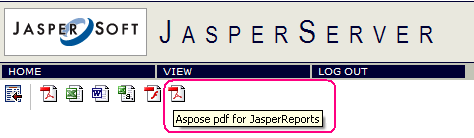

{}

Интеграция Aspose.PDF for JasperReports с JasperServer описана ниже.

{}

В следующих шагах <InstallDir> обозначает каталог установки JasperServer.

{}

1. Добавьте следующие новые свойства экспортера в

**<InstallDir>\apache-tomcat\webapps\jasperserver\WEB-INF\flows\viewReportBeans.xml** файл.

{}

```xml
 <bean id="AsposePdfExporter" class="com.Aspose.PDF.jr3_7_0.jasperreports.AsposeServerPdfExporter" parent="baseReportExporter">
   <property name="exportParameters" ref="AsposeExportParameters"/>
   <property name="setResponseContentLength" value="true"/>
</bean>

<bean id="AsposePdfExporterConfiguration" class="com.jaspersoft.jasperserver.war.action.ExporterConfigurationBean">
   <property name="descriptionKey" value="Pdf - PDF via Aspose.PDF for JasperReports"/>
   <property name="iconSrc" value="/images/pdf.gif"/>
   <property name="parameterDialogName" value="dlg"/>
   <property name="exportParameters" ref="AsposeExportParameters"/>
   <property name="currentExporter" ref="AsposePdfExporter"/>
</bean>

```

{}

2. Найдите элемент <util:map id=”exporterConfigMap> в

**<InstallDir>\apache-tomcat\webapps\jasperserver\WEB-INF\flows\viewReportBeans.xml** и добавьте следующие строки:

{}

```xml
 <util:map id="exporterConfigMap">

   <entry key="pdf" value-ref="pdfExporterConfiguration"/>
   <entry key="xls" value-ref="xlsExporterConfiguration"/>
   <entry key="rtf" value-ref="rtfExporterConfiguration"/>
   <entry key="csv" value-ref="csvExporterConfiguration"/>
   <entry key="swf" value-ref="swfExporterConfiguration"/>

<!-- START of ADDED LINES -->
   <entry key="Aspose_pdf" value-ref="AsposePdfExporterConfiguration"/>
<!-- END of NEW LINES -->

</util:map>

```
{}

3. Скопируйте все изображения GIF из папки \lib **Aspose-pdf-jasperreports.zip** в <InstallDir>\apache-tomcat\webapps\jasperserver\images\.
4. Скопируйте **Aspose-pdf-jasperreports.jar** из папки \lib в **Aspose.PDF.JasperReports.zip** в <InstallDir>\apache-tomcat\webapps\jasperserver\WEB-INF\lib\.
5. Добавьте следующие строки в файл **<InstallDir>\apache-tomcat\webapps\jasperserver\WEB-INF\applicationContext.xml** файл.

   Этот компонент может содержать различные параметры конфигурации, предназначенные для настройки экспорта. Например, вы можете использовать функцию сопоставления шрифтов JasperReports или указать расположение файла лицензии Aspose.Cells для JasperReports.
  
{}

```xml
<bean id="AsposeExportParameters" class="com.Aspose.PDF.jr3_7_0.jasperreports.JrPdfExportParametersBean">
<property name="localizedFontMap" ref="localePdfFontMap"/>

<!-- Uncomment to apply a license. Check the license path.
<property name="licenseFile" value="C:/jasperserver-3.0/apache-tomcat/webapps/
jasperserver/WEB-INF/Aspose.PDF.JasperReports.lic"/>
-->
</bean>

```

{}

6. Запустите JasperServer и откройте любой отчет для просмотра. Если предыдущие шаги были выполнены правильно, в списке доступных форматов вы увидите значок экспорта через Aspose.PDF for JasperReports.

   **Интегрирован Aspose.PDF for JasperReports**



{}
