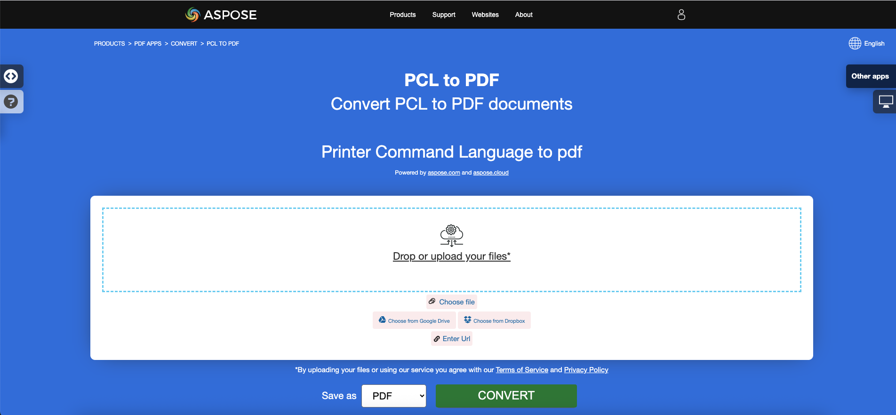
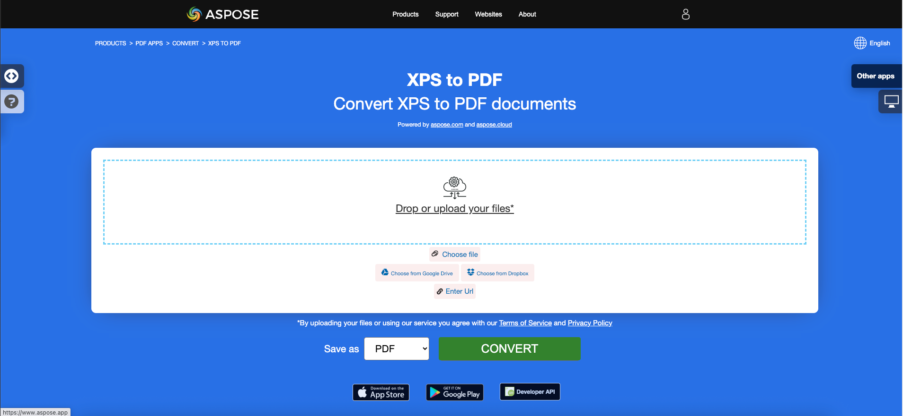

<script type="application/ld+json">
{
    "@context": "https://schema.org",
    "@type": "TechArticle",
    "headline": "Convert other file formats to PDF in .NET",
    "alternativeHeadline": "Convert Multiple File Formats to PDF in C#",
    "abstract": "Aspose.PDF for .NET представляет универсальную функцию, позволяющую пользователям без проблем конвертировать ряд форматов файлов, включая EPUB, Markdown, PCL, XPS, PS, XML и LaTeX, в высококачественные PDF-документы. Эта функциональность улучшает управление документами, обеспечивая совместимость и доступность на различных платформах, сохраняя при этом целостность оригинального контента.",
    "author": {
        "@type": "Person",
        "name": "Anastasiia Holub",
        "givenName": "Anastasiia",
        "familyName": "Holub",
        "url": "https://www.linkedin.com/in/anastasiia-holub-750430225/"
    },
    "genre": "pdf document generation",
    "wordcount": "4393",
    "proficiencyLevel": "Beginner",
    "publisher": {
        "@type": "Organization",
        "name": "Aspose.PDF for .NET",
        "url": "https://products.aspose.com/pdf",
        "logo": "https://www.aspose.cloud/templates/aspose/img/products/pdf/aspose_pdf-for-net.svg",
        "alternateName": "Aspose",
        "sameAs": [
            "https://facebook.com/aspose.pdf/",
            "https://twitter.com/asposepdf",
            "https://www.youtube.com/channel/UCmV9sEg_QWYPi6BJJs7ELOg/featured",
            "https://www.linkedin.com/company/aspose",
            "https://stackoverflow.com/questions/tagged/aspose",
            "https://aspose.quora.com/",
            "https://aspose.github.io/"
        ],
        "contactPoint": [
            {
                "@type": "ContactPoint",
                "telephone": "+1 903 306 1676",
                "contactType": "sales",
                "areaServed": "US",
                "availableLanguage": "en"
            },
            {
                "@type": "ContactPoint",
                "telephone": "+44 141 628 8900",
                "contactType": "sales",
                "areaServed": "GB",
                "availableLanguage": "en"
            },
            {
                "@type": "ContactPoint",
                "telephone": "+61 2 8006 6987",
                "contactType": "sales",
                "areaServed": "AU",
                "availableLanguage": "en"
            }
        ]
    },
    "url": "/net/convert-other-files-to-pdf/",
    "mainEntityOfPage": {
        "@type": "WebPage",
        "@id": "/net/convert-other-files-to-pdf/"
    },
    "dateModified": "2025-04-04",
    "description": "Aspose.PDF может выполнять не только простые и легкие задачи, но и справляться с более сложными целями. Проверьте следующий раздел для опытных пользователей и разработчиков."
}
</script>

## Обзор

Эта статья объясняет, как **конвертировать различные другие типы форматов файлов в PDF с использованием C#**. Она охватывает следующие темы.

Следующий фрагмент кода также работает с библиотекой [Aspose.PDF.Drawing](/pdf/ru/net/drawing/).

- [Конвертация EPUB в PDF](#csharp-convert-epub-to-pdf)
- [Конвертация Markdown в PDF](#csharp-convert-markdown-to-pdf)
- [Конвертация PCL в PDF](#csharp-convert-pcl-to-pdf)
- [Конвертация текста в PDF](#csharp-convert-text-to-pdf)
- [Конвертация предварительно отформатированного текста в PDF](#csharp-convert-pre-formatted-text-to-pdf)
- [Конвертация XPS в PDF](#csharp-convert-xps-to-pdf)
- [Конвертация PostScript в PDF](#csharp-convert-ps-to-pdf)
- [Конвертация XML в PDF](#csharp-convert-xml-to-pdf)
- [Конвертация XLS-FO в PDF](#csharp-convert-xlsfo-to-pdf)
- [Конвертация LaTeX/TeX в PDF](#csharp-convert-latex-to-pdf)
- [Конвертация OFD в PDF](#csharp-convert-ofd-to-pdf)

## Конвертация EPUB в PDF

**Aspose.PDF for .NET** позволяет вам просто конвертировать файлы EPUB в формат PDF.

<abbr title="электронная публикация">EPUB</abbr> (сокращение от электронная публикация) — это бесплатный и открытый стандарт электронных книг от Международного форума цифрового издательства (IDPF). Файлы имеют расширение .epub. EPUB предназначен для контента, который может изменять свой размер, что означает, что EPUB-читалка может оптимизировать текст для конкретного устройства отображения.

EPUB также поддерживает контент с фиксированной компоновкой. Формат предназначен как единый формат, который издатели и конверсионные компании могут использовать внутри компании, а также для распространения и продажи. Он заменяет стандарт Open eBook. Версия EPUB 3 также поддерживается Группой по исследованию книжной индустрии (BISG), ведущей ассоциацией книжной торговли для стандартизированных лучших практик, исследований, информации и мероприятий по упаковке контента.

{}
**Попробуйте конвертировать EPUB в PDF онлайн**

Aspose.PDF for .NET предлагает вам онлайн бесплатное приложение ["EPUB в PDF"](https://products.aspose.app/pdf/conversion/epub-to-pdf), где вы можете попробовать исследовать функциональность и качество его работы.

[](https://products.aspose.app/pdf/conversion/epub-to-pdf)
{}

<a name="csharp-convert-epub-to-pdf" id="csharp-convert-epub-to-pdf"><strong>Конвертация EPUB в PDF</strong></a>

1. Создайте экземпляр класса [EpubLoadOptions](https://reference.aspose.com/pdf/ru/net/aspose.pdf/epubloadoptions).
2. Создайте экземпляр класса [Document](https://reference.aspose.com/pdf/ru/net/aspose.pdf/document) с указанием имени исходного файла и параметров.
3. Сохраните документ с желаемым именем файла.

Следующий фрагмент кода показывает, как конвертировать файлы EPUB в формат PDF с помощью C#.

```csharp
// For complete examples and data files, visit https://github.com/aspose-pdf/Aspose.PDF-for-.NET
private static void ConvertEPUBtoPDF()
{
    // The path to the documents directory
    var dataDir = RunExamples.GetDataDir_AsposePdf_DocumentConversion();
    // Convert options
    var options = new Aspose.Pdf.EpubLoadOptions();

    // Open PDF document
    using (var document = new Aspose.Pdf.Document(dataDir + "EPUBToPDF.epub", options))
    {
        // Save PDF document
        document.Save(dataDir + "ConvertEPUBtoPDF_out.pdf");
    }
}
```

Вы также можете установить размер страницы для конвертации. Чтобы определить новый размер страницы, создайте объект `SizeF` и передайте его в конструктор [EpubLoadOptions](https://reference.aspose.com/pdf/ru/net/aspose.pdf/epubloadoptions/constructors/main).

```csharp
// For complete examples and data files, visit https://github.com/aspose-pdf/Aspose.PDF-for-.NET
private static void ConvertEPUBtoPDFAdv()
{
    // The path to the documents directory
    var dataDir = RunExamples.GetDataDir_AsposePdf_DocumentConversion();
    // Convert options
    var options = new Aspose.Pdf.EpubLoadOptions(new SizeF(1190, 1684));

    // Open PDF document
    using (var document = new Aspose.Pdf.Document(dataDir + "EPUBToPDF.epub", options))
    {
        // Save PDF document
        document.Save(dataDir + "ConvertEPUBtoPDFAdv_out.pdf");
    }
}
```

## Конвертация Markdown в PDF

**Эта функция поддерживается версией 19.6 или выше.**

{}
**Попробуйте конвертировать Markdown в PDF онлайн**

Aspose.PDF for .NET предлагает вам онлайн бесплатное приложение ["Markdown в PDF"](https://products.aspose.app/pdf/conversion/md-to-pdf), где вы можете попробовать исследовать функциональность и качество его работы.

[](https://products.aspose.app/pdf/conversion/md-to-pdf)
{}

Aspose.PDF for .NET предоставляет функциональность для создания PDF-документа на основе входного файла данных [Markdown](https://daringfireball.net/projects/markdown/syntax). Чтобы конвертировать Markdown в PDF, вам нужно инициализировать [Document](https://reference.aspose.com/pdf/ru/net/aspose.pdf/document) с использованием [MdLoadOptions](https://reference.aspose.com/pdf/ru/net/aspose.pdf/mdloadoptions).

Следующий фрагмент кода показывает, как использовать эту функциональность с библиотекой Aspose.PDF:

<a name="csharp-convert-markdown-to-pdf" id="csharp-convert-markdown-to-pdf"><strong><em>Конвертация Markdown в PDF</strong></a>

1. Создайте экземпляр класса [MdLoadOptions ](https://reference.aspose.com/pdf/ru/net/aspose.pdf/mdloadoptions/) .
2. Создайте экземпляр класса [Document](https://reference.aspose.com/pdf/ru/net/aspose.pdf/document) с указанием имени исходного файла и параметров.
3. Сохраните документ с желаемым именем файла.

```csharp
// For complete examples and data files, visit https://github.com/aspose-pdf/Aspose.PDF-for-.NET
private static void ConvertMarkdownToPDF()
{
    // The path to the documents directory
    var dataDir = RunExamples.GetDataDir_AsposePdf_DocumentConversion();
    // Convert options
    var options = new Aspose.Pdf.MdLoadOptions();

    // Open PDF document
    using (var document = new Aspose.Pdf.Document(dataDir + "sample.md", options))
    {
        // Save PDF document
        document.Save(dataDir + "ConvertMarkdownToPDF_out.pdf");
    }
}
```

## Конвертация PCL в PDF

<abbr title="Язык команд принтера">PCL</abbr> (Язык команд принтера) — это язык принтера Hewlett-Packard, разработанный для доступа к стандартным функциям принтера. Уровни PCL от 1 до 5e/5c — это языки на основе команд, использующие управляющие последовательности, которые обрабатываются и интерпретируются в порядке их получения. На потребительском уровне потоки данных PCL генерируются драйвером печати. Вывод PCL также может быть легко сгенерирован пользовательскими приложениями.

{}
**Попробуйте конвертировать PCL в PDF онлайн**

Aspose.PDF для .NET предлагает вам онлайн бесплатное приложение ["PCL в PDF"](https://products.aspose.app/pdf/conversion/pcl-to-pdf), где вы можете попробовать исследовать функциональность и качество его работы.

[](https://products.aspose.app/pdf/conversion/pcl-to-pdf)
{}

**В настоящее время поддерживаются только PCL5 и более ранние версии**

<table>
    <thead>
        <tr>
            <th>
                Наборы команд
            </th>
            <th>
                Поддержка
            </th>
            <th>
                Исключения
            </th>
            <th>
                Описание
            </th>
        </tr>
    </thead>
    <tbody>
        <tr>
            <td>
                Команды управления заданиями
            </td>
            <td>
                +
            </td>
            <td>
                Режим двусторонней печати
            </td>
            <td>
                Управление процессом печати: количество копий, выходной лоток, простая/двусторонняя печать, отступы слева и сверху и т.д.
            </td>
        </tr>
        <tr>
            <td>
                Команды управления страницами
            </td>
            <td>
                +
            </td>
            <td>
                Команда пропуска перфорации
            </td>
            <td>
                Укажите размер страницы, поля, ориентацию страницы, расстояния между строками и символами и т.д.
            </td>
        </tr>
        <tr>
            <td>
                Команды позиционирования курсора
            </td>
            <td>
                +
            </td>
            <td>
                &nbsp;
            </td>
            <td>
                Укажите положение курсора и, следовательно, начало текста, растровых или векторных изображений и деталей.
            </td>
        </tr>
        <tr>
            <td>
                Команды выбора шрифта
            </td>
            <td>
                +
            </td>
            <td>
                <ol>
                    <li>Команда прозрачной печати данных.</li>
                    <li>Встроенные мягкие шрифты. В текущей версии вместо создания мягкого шрифта наша библиотека выбирает подходящий шрифт из существующих "жестких" шрифтов TrueType, установленных на целевой машине. <br/>
                        Подходящесть определяется соотношением ширины и высоты.<br/>
                        Эта функция работает только для растровых и шрифтов TrueType и не гарантирует, что текст, напечатанный с помощью мягкого шрифта, будет соответствовать тексту в исходном файле.<br/>
                        Поскольку коды символов в мягком шрифте могут не совпадать с кодами по умолчанию.
                    </li>
                    <li>Пользовательские наборы символов.</li>
                </ol>
            </td>
            <td>
                Позволяет загружать мягкие (встроенные) шрифты из файла PCL и управлять ими в памяти.
            </td>
        </tr>
        <tr>
            <td>
                Команды растровой графики
            </td>
            <td>
                +
            </td>
            <td>
                Только черно-белые
            </td>
            <td>
                Позволяет загружать растровые изображения из файла PCL в память, указывать параметры растрового изображения. <br
                    > такие как ширина, высота, тип сжатия, разрешение и т.д.
            </td>
        </tr>
        <tr>
            <td>
                Цветные команды
            </td>
            <td>
                +
            </td>
            <td>
                &nbsp;
            </td>
            <td>
                Позволяет окрашивать все печатные объекты.
            </td>
        </tr>
        <tr>
            <td>
                Команды модели печати
            </td>
            <td>
                +
            </td>
            <td>
                &nbsp;
            </td>
            <td>
                Позволяет заполнять текст, растровые изображения и прямоугольные области заранее определенными и <br>
                пользовательскими шаблонами, указывать режим прозрачности для шаблонов и
                исходного растрового изображения. <br> Предварительно определенные шаблоны - это штриховка, перекрестная штриховка
                и затенение.
            </td>
        </tr>
        <tr>
            <td>
                Команды заполнения прямоугольной области
            </td>
            <td>
                +
            </td>
            <td>
                &nbsp;
            </td>
            <td>
                Позволяет создавать и заполнять прямоугольные области шаблонами.
            </td>
        </tr>
        <tr>
            <td>
                Команды векторной графики HP-GL/2
            </td>
            <td>
                +
            </td>
            <td>
                Команды векторной графики с экранированием (SV), команды режима прозрачности (TR), команды прозрачных данных (TD), RO
                (Повернуть систему координат), команды масштабируемых или растровых шрифтов (SB), команды наклона символов (SL) и
                дополнительные пробелы (ES) не реализованы, а команды DV (Определить переменный текстовый путь) реализованы в
                бета-версии.
            </td>
            <td>
                Позволяет загружать векторные изображения HP-GL/2 из файла PCL в память. Векторное изображение имеет начало в нижнем
                левом углу печатной области, может быть масштабировано, перемещено, повернуто и обрезано. <br>
                Векторное изображение может содержать текст, такие как метки, и геометрические фигуры, такие
                как прямоугольник, круг, эллипс, линия, дуга, кривая Безье и сложные фигуры, составленные из простых
                фигур. <br> Закрытые фигуры, включая буквы меток, могут быть заполнены
                сплошной заливкой или векторным шаблоном. <br> Шаблон может быть
                штриховкой, перекрестной штриховкой, затенением, растровым пользовательским, PCL-штриховкой или перекрестной штриховкой и PCL
                пользовательским. Шаблоны PCL являются растровыми. Метки могут быть индивидуально повернуты, масштабированы и направлены в
                четырех направлениях: вверх, вниз, влево и вправо. Левые и правые направления включают&nbsp;расположение букв одно за другим.
                Вверх и вниз включают расположение букв одно под другой.
            </td>
        </tr>
        <tr>
            <td>
                Макросы
            </td>
            <td>
                ―
            </td>
            <td>
                &nbsp;
            </td>
            <td>
                Позволяет загружать последовательность команд PCL в память и использовать эту последовательность много раз, например,
                для печати заголовка страницы или установки одного форматирования для набора страниц.
            </td>
        </tr>
        <tr>
            <td>
                Текст Unicode
            </td>
            <td>
                ―
            </td>
            <td>
                &nbsp;
            </td>
            <td>
                Позволяет печатать не ASCII символы. Не реализовано из-за отсутствия образцов файлов с <br
                    > текстом Unicode
            </td>
        </tr>
        <tr>
            <td>
                PCL6 (PCL-XL)
            </td>
            <td>
                &nbsp;
            </td>
            <td>
                Реализовано только в бета-версии из-за отсутствия тестовых файлов. Встроенные шрифты также не
                поддерживаются.<br> Расширение JetReady не поддерживается, потому что невозможно получить спецификацию JetReady.
            </td>
            <td>
                Двоичный формат файла.
            </td>
        </tr>
    </tbody>
</table>

### Конвертация файла PCL в формат PDF

Чтобы разрешить конвертацию из PCL в PDF, Aspose.PDF имеет класс [`PclLoadOptions`](https://reference.aspose.com/pdf/ru/net/aspose.pdf/pclloadoptions), который используется для инициализации объекта LoadOptions. Позже этот объект передается в качестве аргумента при инициализации объекта Document, и он помогает движку рендеринга PDF определить входной формат исходного документа.

Следующий фрагмент кода показывает процесс конвертации файла PCL в формат PDF.

<a name="csharp-convert-pcl-to-pdf" id="csharp-convert-pcl-to-pdf"><strong>Конвертация PCL в PDF</strong></a>

1. Создайте экземпляр класса [PclLoadOptions](https://reference.aspose.com/pdf/ru/net/aspose.pdf/pclloadoptions/) .
2. Создайте экземпляр класса [Document](https://reference.aspose.com/pdf/ru/net/aspose.pdf/document/) с указанием имени исходного файла и параметров.
3. Сохраните документ с желаемым именем файла.

```csharp
// For complete examples and data files, visit https://github.com/aspose-pdf/Aspose.PDF-for-.NET
private static void ConvertPCLtoPDF()
{
    // The path to the documents directory
    var dataDir = RunExamples.GetDataDir_AsposePdf_DocumentConversion();
    // Convert options
    var options = new Aspose.Pdf.PclLoadOptions();

    // Open PDF document
    using (var document = new Aspose.Pdf.Document(dataDir + "ConvertPCLtoPDF.pcl", options))
    {
        // Save PDF document
        document.Save(dataDir + "ConvertPCLtoPDF_out.pdf");
    }
}
```

Вы также можете отслеживать обнаружение ошибок во время процесса конвертации. Для этого вам нужно настроить объект PclLoadOptions: установить или снять флажок SupressErrors.

```csharp
// For complete examples and data files, visit https://github.com/aspose-pdf/Aspose.PDF-for-.NET
private static void ConvertPCLtoPDFAdvanced()
{
    // The path to the documents directory
    var dataDir = RunExamples.GetDataDir_AsposePdf_DocumentConversion();
    // Convert options
    var options = new Aspose.Pdf.PclLoadOptions { SupressErrors = true };

    // Open PDF document
    using (var document = new Aspose.Pdf.Document(dataDir + "ConvertPCLtoPDFAdvanced.pcl", options))
    {
        if (options.Exceptions != null)
        {
            foreach (var ex in options.Exceptions)
            {
                Console.WriteLine(ex.Message);
            }
        }
        // Save PDF document
        document.Save(dataDir + "ConvertPCLtoPDFAdvanced_out.pdf");
    }
}
```

### Известные проблемы

1. Начало текстовых строк и изображений может немного отличаться от таковых в исходном файле PCL, если направление печати не равно 0°. То же самое относится к векторным изображениям, если система координат векторного графика повернута (предшествует команда RO).
2. Начало меток в векторных изображениях может отличаться от таковых в исходном файле PCL, если на метки влияет последовательность команд: Начало метки (LO), Определить переменный текстовый путь (DV), Абсолютное направление (DI) или Относительное направление (DR).
3. Текст может быть неправильно прочитан, если он должен быть отрендерен с помощью растрового или TrueType мягкого (встроенного) шрифта, потому что в настоящее время эти шрифты поддерживаются только частично (см. исключения в "Таблице поддерживаемых функций"). В этой ситуации текст может быть правильно прочитан только в том случае, если коды символов в мягком шрифте соответствуют кодам по умолчанию. Стиль прочитанного текста также может отличаться от стиля в исходном файле PCL, потому что не обязательно устанавливать стиль в заголовке мягкого шрифта.
4. Если разобранный файл PCL содержит шрифты Intellifont или Universal, будет выброшено исключение, потому что шрифты Intellifont и Universal вообще не поддерживаются.
5. Если разобранный файл PCL содержит команды макросов, результат разбора будет сильно отличаться от исходного файла, потому что команды макросов не поддерживаются.

## Конвертация текста в PDF

**Aspose.PDF for .NET** поддерживает функцию конвертации обычного текста и предварительно отформатированного текстового файла в формат PDF.

Конвертация текста в PDF означает добавление текстовых фрагментов на страницу PDF. Что касается текстовых файлов, мы имеем дело с 2 типами текста: предварительно отформатированным (например, 25 строк по 80 символов в строке) и неформатированным текстом (обычный текст). В зависимости от наших потребностей мы можем контролировать это добавление самостоятельно или доверить его алгоритмам библиотеки.

{}
**Попробуйте конвертировать TEXT в PDF онлайн**

Aspose.PDF for .NET предлагает вам онлайн бесплатное приложение ["Текст в PDF"](https://products.aspose.app/pdf/conversion/txt-to-pdf), где вы можете попробовать исследовать функциональность и качество его работы.

[](https://products.aspose.app/pdf/conversion/txt-to-pdf)
{}

### Конвертация обычного текстового файла в PDF

В случае обычного текстового файла мы можем использовать следующую технику:

<a name="csharp-convert-text-to-pdf" id="csharp-convert-text-to-pdf"><strong>Конвертация текста в PDF</strong></a>

1. Используйте _TextReader_ для чтения всего текста.
2. Создайте объект [Document](https://reference.aspose.com/pdf/ru/net/aspose.pdf/document/) и добавьте новую страницу в коллекцию Pages.
3. Создайте новый объект [TextFragment](https://reference.aspose.com/pdf/ru/net/aspose.pdf.text/textfragment/) и передайте объект _TextReader_ в его конструктор.
4. Добавьте объект _TextFragment_ как абзац в коллекцию _Paragraphs_. Если объем текста больше, чем страница, алгоритм библиотеки автоматически добавляет дополнительные страницы.
5. Используйте метод **Save** класса [Document](https://reference.aspose.com/pdf/ru/net/aspose.pdf/document/).

```csharp
// For complete examples and data files, visit https://github.com/aspose-pdf/Aspose.PDF-for-.NET
private static void ConvertPlainTextFileToPDF()
{
    // The path to the documents directory
    var dataDir = RunExamples.GetDataDir_AsposePdf_DocumentConversion();

    // Read the source text file
    using (var streamReader = new StreamReader(dataDir + "TextToPDFInput.txt"))
    {
        // // Create PDF document
        using (var document = new Aspose.Pdf.Document())
        {
            // Add page
            var page = document.Pages.Add();
            // Create an instance of TextFragment and pass the text from reader object to its constructor as argument
            var text = new Aspose.Pdf.Text.TextFragment(streamReader.ReadToEnd());
            // Add a new text paragraph in paragraphs collection and pass the TextFragment object
            page.Paragraphs.Add(text);
            // Save PDF document
            document.Save(dataDir + "TextToPDF_out.pdf");
        }
    }
}
```

### Конвертация предварительно отформатированного текстового файла в PDF

Конвертация предварительно отформатированного текста аналогична обычному тексту, но вам нужно выполнить некоторые дополнительные действия, такие как установка полей, типа и размера шрифта. Очевидно, что шрифт должен быть моноширинным (например, Courier New).

Следуйте этим шагам, чтобы конвертировать предварительно отформатированный текст в PDF с помощью C#:

<a name="csharp-convert-pre-formatted-text-to-pdf" id="csharp-convert-pre-formatted-text-to-pdf"><strong>Конвертация предварительно отформатированного TXT в PDF</strong></a>

1. Прочитайте весь текст как массив строк.
2. Создайте объект [Document](https://reference.aspose.com/pdf/ru/net/aspose.pdf/document/) и добавьте новую страницу в коллекцию [Pages](https://reference.aspose.com/pdf/ru/net/aspose.pdf/document/pages/).
3. Запустите цикл по массиву строк и добавьте каждую строку как абзац в коллекцию [Paragraphs](https://reference.aspose.com/pdf/ru/net/aspose.pdf/paragraphs/).

В этом случае алгоритм библиотеки также добавляет дополнительные страницы, но мы можем контролировать этот процесс самостоятельно. Следующий пример показывает, как конвертировать предварительно отформатированный текстовый файл в PDF-документ с размером страницы A4.

```csharp
// For complete examples and data files, visit https://github.com/aspose-pdf/Aspose.PDF-for-.NET
private static void ConvertPreFormattedTextToPdf()
{
    // The path to the documents directory
    var dataDir = RunExamples.GetDataDir_AsposePdf_DocumentConversion();
    // Read the text file as array of string
    var lines = File.ReadAllLines(dataDir + "ConvertPreFormattedTextToPdf.txt");

    // Create PDF document
    using (var document = new Aspose.Pdf.Document())
    {
        // Add page
        var page = document.Pages.Add();
        // Set left and right margins for better presentation
        page.PageInfo.Margin.Left = 20;
        page.PageInfo.Margin.Right = 10;
        page.PageInfo.DefaultTextState.Font = Aspose.Pdf.Text.FontRepository.FindFont("Courier New");
        page.PageInfo.DefaultTextState.FontSize = 12;

        foreach (var line in lines)
        {
            // check if line contains "form feed" character
            // see https://en.wikipedia.org/wiki/Page_break
            if (line.StartsWith("\x0c"))
            {
                page = document.Pages.Add();
                page.PageInfo.Margin.Left = 20;
                page.PageInfo.Margin.Right = 10;
                page.PageInfo.DefaultTextState.Font = Aspose.Pdf.Text.FontRepository.FindFont("Courier New");
                page.PageInfo.DefaultTextState.FontSize = 12;
            }
            else
            {
                // Create an instance of TextFragment and pass the line to its constructor as argument
                var text = new Aspose.Pdf.Text.TextFragment(line);
                // Add a new text paragraph in paragraphs collection and pass the TextFragment object
                page.Paragraphs.Add(text);
            }
        }
        // Save PDF document
        document.Save(dataDir + "PreFormattedTextToPDF_out.pdf");
    }
}
```

## Конвертация XPS в PDF

**Aspose.PDF for .NET** поддерживает функцию конвертации <abbr title="XML Paper Specification">XPS</abbr> файлов в формат PDF. Ознакомьтесь с этой статьей, чтобы решить ваши задачи.

Тип файла XPS в первую очередь ассоциируется с XML Paper Specification от Microsoft Corporation. XML Paper Specification (XPS), ранее имевший кодовое название Metro и охватывающий концепцию маркетинга Next Generation Print Path (NGPP), является инициативой Microsoft по интеграции создания и просмотра документов в свою операционную систему Windows.

{}

Формат файла в основном представляет собой сжатый XML-файл, который в основном используется для распространения и хранения. Его очень трудно редактировать, и в основном он реализован Microsoft.

{}

Чтобы конвертировать XPS в PDF с помощью Aspose.PDF for .NET, мы представили класс [XpsLoadOption](https://reference.aspose.com/pdf/ru/net/aspose.pdf/xpsloadoptions), который используется для инициализации объекта [LoadOptions](https://reference.aspose.com/pdf/ru/net/aspose.pdf/loadoptions). Позже этот объект передается в качестве аргумента при инициализации объекта Document, и он помогает движку рендеринга PDF определить входной формат исходного документа.

{}

В обеих версиях XP и Windows 7 вы должны найти предустановленный принтер XPS, если посмотрите в Панели управления, а затем в Принтерах. Чтобы создать эти файлы, вы можете использовать этот принтер в качестве устройства вывода. В Windows 7 вы должны просто дважды щелкнуть файл, чтобы открыть его в просмотрщике XPS. Вы также можете скачать просмотрщик XPS с сайта Microsoft.

{}

Следующий фрагмент кода показывает процесс конвертации файла XPS в формат PDF с помощью C#.

<a name="csharp-convert-xps-to-pdf" id="csharp-convert-xps-to-pdf"><strong>Конвертация XPS в PDF</strong></a>

1. Создайте экземпляр класса [XpsLoadOptions](https://reference.aspose.com/pdf/ru/net/aspose.pdf/xpsloadoptions/) .
2. Создайте экземпляр класса [Document](https://reference.aspose.com/pdf/ru/net/aspose.pdf/document/) с указанием имени исходного файла и параметров.
3. Сохраните документ в формате PDF с желаемым именем файла.

```csharp
// For complete examples and data files, visit https://github.com/aspose-pdf/Aspose.PDF-for-.NET
private static void ConvertXPSToPDF()
{
    // The path to the documents directory
    var dataDir = RunExamples.GetDataDir_AsposePdf_DocumentConversion();
    // Instantiate Options object
    var options = new Aspose.Pdf.XpsLoadOptions();

    // Open PDF document
    using (var document = new Aspose.Pdf.Document(dataDir + "XPSToPDF.xps", options))
    {
        // Save PDF document
        document.Save(dataDir + "ConvertXPSToPDF_out.pdf");
    }
}
```

{}
**Попробуйте конвертировать формат XPS в PDF онлайн**

Aspose.PDF for .NET предлагает вам онлайн бесплатное приложение ["XPS в PDF"](https://products.aspose.app/pdf/conversion/xps-to-pdf/), где вы можете попробовать исследовать функциональность и качество его работы.

[](https://products.aspose.app/pdf/conversion/xps-to-pdf/)
{}

## Конвертация PostScript в PDF

<a name="csharp-convert-ps-to-pdf" id="csharp-convert-ps-to-pdf"><strong>Конвертация PostScript в PDF</strong></a>

**Aspose.PDF for .NET** поддерживает функции конвертации файлов PostScript в формат PDF. Одна из функций Aspose.PDF заключается в том, что вы можете установить набор папок шрифтов, которые будут использоваться во время конвертации.

Чтобы конвертировать файл PostScript в формат PDF, Aspose.PDF for .NET предлагает класс [PsLoadOptions](https://reference.aspose.com/pdf/ru/net/aspose.pdf/psloadoptions), который используется для инициализации объекта LoadOptions. Позже этот объект может быть передан в качестве аргумента конструктору объекта Document, что поможет движку рендеринга PDF определить формат исходного документа.

Следующий фрагмент кода можно использовать для конвертации файла PostScript в формат PDF с помощью Aspose.PDF for .NET:

```csharp
// For complete examples and data files, visit https://github.com/aspose-pdf/Aspose.PDF-for-.NET
private static void ConvertPostScriptToPDF()
{
    // The path to the documents directory
    var dataDir = RunExamples.GetDataDir_AsposePdf_DocumentConversion();
    // Convert options
    var options = new PsLoadOptions();

    // Open PDF document
    using (var document = new Aspose.Pdf.Document(dataDir + "ConvertPostscriptInput.ps", options))
    {
        // Save PDF document
        document.Save(dataDir + "PSToPDF_out.pdf");
    }
}
```

Кроме того, вы можете установить набор папок шрифтов, которые будут использоваться во время конвертации:

```csharp
// For complete examples and data files, visit https://github.com/aspose-pdf/Aspose.PDF-for-.NET
private static void ConvertPostscriptToPDFAdvanced()
{
    // The path to the documents directory
    var dataDir = RunExamples.GetDataDir_AsposePdf_DocumentConversion();
    // Convert options with custom font folders
    var options = new Aspose.Pdf.PsLoadOptions
    {
        FontsFolders = new[] { dataDir + @"\fonts1", dataDir + @"\fonts2" }
    };

    // Open PDF document
    using (var document = new Aspose.Pdf.Document(dataDir + "ConvertPostscriptInput.ps", options))
    {
        // Save PDF document
        document.Save(dataDir + "ConvertPostscriptToPDFAdvanced_out.pdf");
    }
}
```

## Конвертация XML в PDF

<a name="csharp-convert-xml-to-pdf" id="csharp-convert-xml-to-pdf"><strong>Конвертация XML в PDF</strong></a>

Формат XML используется для хранения структурированных данных. Существует несколько способов конвертации <abbr title="Расширяемый язык разметки">XML</abbr> в PDF в Aspose.PDF:

1. Преобразуйте любые данные XML в HTML с помощью XSLT и конвертируйте HTML в PDF, как описано ниже.
2. Сгенерируйте XML-документ с использованием схемы XSD Aspose.PDF.
3. Используйте XML-документ на основе стандарта XSL-FO.

{}
**Попробуйте конвертировать XML в PDF онлайн**

Aspose.PDF for .NET предлагает вам онлайн бесплатное приложение ["XML в PDF"](https://products.aspose.app/pdf/conversion/xml-to-pdf), где вы можете попробовать исследовать функциональность и качество его работы.

[](https://products.aspose.app/pdf/conversion/xml-to-pdf)
{}

## Конвертация XSL-FO в PDF

<a name="csharp-convert-xslfo-to-pdf" id="csharp-convert-xslfo-to-pdf"><strong>Конвертация XSL-FO в PDF</strong></a>

Конвертация файлов XSL-FO в PDF может быть реализована с использованием традиционной техники Aspose.PDF - создайте объект [Document](https://reference.aspose.com/page/net/aspose.page/document) с [XslFoLoadOptions](https://reference.aspose.com/pdf/ru/net/aspose.pdf/xslfoloadoptions). Но иногда вы можете столкнуться с неправильной структурой файла. В этом случае конвертер XSL-FO позволяет установить стратегию обработки ошибок. Вы можете выбрать `ThrowExceptionImmediately`, `TryIgnore` или `InvokeCustomHandler`.

```csharp
// For complete examples and data files, visit https://github.com/aspose-pdf/Aspose.PDF-for-.NET
private static void Convert_XSLFO_to_PDF()
{
    // The path to the documents directory
    var dataDir = RunExamples.GetDataDir_AsposePdf_DocumentConversion();
    // Convert options
    var options = new Aspose.Pdf.XslFoLoadOptions(dataDir + "XSLFOToPdfInput.xslt");
    // Set error handling strategy
    options.ParsingErrorsHandlingType = Aspose.Pdf.XslFoLoadOptions.ParsingErrorsHandlingTypes.ThrowExceptionImmediately;

    // Open PDF document
    using (var document = new Aspose.Pdf.Document(dataDir + "XSLFOToPdfInput.xml", options))
    {
        // Save PDF document
        document.Save(dataDir + "XSLFOToPdf_out.pdf");
    }
}
```

## Конвертация LaTeX/TeX в PDF

<a name="csharp-convert-latex-to-pdf" id="csharp-convert-latext-to-pdf"><strong>Конвертация LaTeX/TeX в PDF</strong></a>

Формат файла LaTeX — это текстовый формат файла с разметкой в производной от TeX языковой семье, и LaTeX является производным форматом системы TeX. LaTeX (ˈleɪtɛk/лей-тек или ля-тек) — это система подготовки документов и язык разметки документов. Он широко используется для общения и публикации научных документов в различных областях, включая математику, физику и информатику. Он также играет важную роль в подготовке и публикации книг и статей, содержащих сложные многоязычные материалы, такие как санскрит и арабский, включая критические издания. LaTeX использует программу верстки TeX для форматирования своего вывода и сам написан на языке макросов TeX.

{}
**Попробуйте конвертировать LaTeX/TeX в PDF онлайн**

Aspose.PDF for .NET предлагает вам онлайн бесплатное приложение ["LaTex в PDF"](https://products.aspose.app/pdf/conversion/tex-to-pdf), где вы можете попробовать исследовать функциональность и качество его работы.

[](https://products.aspose.app/pdf/conversion/tex-to-pdf)
{}

Aspose.PDF for .NET поддерживает функцию конвертации файлов TeX в формат PDF, и для выполнения этого требования в пространстве имен Aspose.Pdf есть класс [LatexLoadOptions](https://reference.aspose.com/pdf/ru/net/aspose.pdf/latexloadoptions), который предоставляет возможности для загрузки файлов LaTex и рендеринга вывода в формате PDF с использованием класса [Document](https://reference.aspose.com/pdf/ru/net/aspose.pdf/document).
Следующий фрагмент кода показывает процесс конвертации файла LaTex в формат PDF с помощью C#.

```csharp
// For complete examples and data files, visit https://github.com/aspose-pdf/Aspose.PDF-for-.NET
private static void ConvertTeXtoPDF()
{
    // The path to the documents directory
    var dataDir = RunExamples.GetDataDir_AsposePdf_DocumentConversion();
    // Convert options
    var options = new Aspose.Pdf.TeXLoadOptions();
    // Open PDF document
    using (var document = new Aspose.Pdf.Document(dataDir + "samplefile.tex", options))
    {
        // Save PDF document
        document.Save(dataDir + "TeXToPDF_out.pdf");
    }
}
```

## Конвертация OFD в PDF

<a name="csharp-convert-ofd-to-pdf" id="csharp-convert-ofd-to-pdf"><strong>Конвертация OFD в PDF</strong></a>

Формат OFD относится к "Открытому документу с фиксированной компоновкой", установленному как национальный стандарт Китая для хранения электронных файлов, используемым в качестве альтернативы популярному формату PDF. Он поддерживает документы с фиксированной компоновкой, обеспечивая единообразное отображение на различных платформах. Файлы OFD используются для различных целей, включая цифровые документы и бизнес-приложения.

Aspose.PDF for .NET поддерживает функцию конвертации файлов OFD в формат PDF, и для выполнения этого требования в пространстве имен Aspose.Pdf есть класс [OfdLoadOptions](https://reference.aspose.com/pdf/ru/net/aspose.pdf/ofdloadoptions/), который предоставляет возможности для загрузки файлов OFD и рендеринга вывода в формате PDF с использованием класса [Document](https://reference.aspose.com/pdf/ru/net/aspose.pdf/document).

Следующий фрагмент кода показывает процесс конвертации файла OFD в формат PDF с помощью C#. 

```csharp
// For complete examples and data files, visit https://github.com/aspose-pdf/Aspose.PDF-for-.NET
private static void ConvertOFDToPDF()
{
    // The path to the documents directory
    var dataDir = RunExamples.GetDataDir_AsposePdf_DocumentConversion();
    // Convert options
    var options = new Aspose.Pdf.OfdLoadOptions();

    // Open PDF document
    using (var document = new Aspose.Pdf.Document(dataDir + "ConvertOFDToPDF.ofd", options))
    {
        // Save PDF document
        document.Save(dataDir + "ConvertOFDToPDF_out.pdf");
    }
}
```