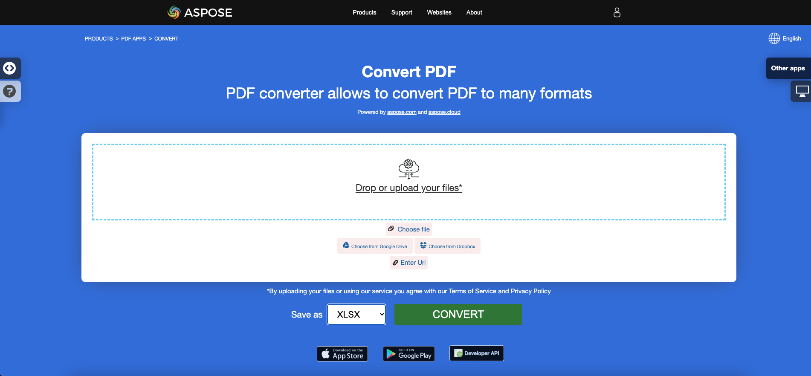

<script type="application/ld+json">
{
    "@context": "https://schema.org",
    "@type": "TechArticle",
    "headline": "Convert PDF to Excel in .NET",
    "alternativeHeadline": "Convert PDF Files to Excel Formats with C#",
    "abstract": "Откройте для себя мощную возможность Aspose.PDF for .NET без усилий конвертировать PDF документы в различные форматы Excel, включая XLS, XLSX, CSV и ODS, используя C#. Эта функция не только позволяет преобразовывать отдельные страницы PDF в отдельные листы Excel, но также предлагает варианты для объединенных листов, предоставляя пользователям гибкость в управлении своими данными PDF эффективно.",
    "author": {
        "@type": "Person",
        "name": "Anastasiia Holub",
        "givenName": "Anastasiia",
        "familyName": "Holub",
        "url": "https://www.linkedin.com/in/anastasiia-holub-750430225/"
    },
    "genre": "pdf document generation",
    "wordcount": "1780",
    "proficiencyLevel": "Beginner",
    "publisher": {
        "@type": "Organization",
        "name": "Aspose.PDF for .NET",
        "url": "https://products.aspose.com/pdf",
        "logo": "https://www.aspose.cloud/templates/aspose/img/products/pdf/aspose_pdf-for-net.svg",
        "alternateName": "Aspose",
        "sameAs": [
            "https://facebook.com/aspose.pdf/",
            "https://twitter.com/asposepdf",
            "https://www.youtube.com/channel/UCmV9sEg_QWYPi6BJJs7ELOg/featured",
            "https://www.linkedin.com/company/aspose",
            "https://stackoverflow.com/questions/tagged/aspose",
            "https://aspose.quora.com/",
            "https://aspose.github.io/"
        ],
        "contactPoint": [
            {
                "@type": "ContactPoint",
                "telephone": "+1 903 306 1676",
                "contactType": "sales",
                "areaServed": "US",
                "availableLanguage": "en"
            },
            {
                "@type": "ContactPoint",
                "telephone": "+44 141 628 8900",
                "contactType": "sales",
                "areaServed": "GB",
                "availableLanguage": "en"
            },
            {
                "@type": "ContactPoint",
                "telephone": "+61 2 8006 6987",
                "contactType": "sales",
                "areaServed": "AU",
                "availableLanguage": "en"
            }
        ]
    },
    "url": "/net/convert-pdf-to-excel/",
    "mainEntityOfPage": {
        "@type": "WebPage",
        "@id": "/net/convert-pdf-to-excel/"
    },
    "dateModified": "2024-11-25",
    "description": "Aspose.PDF может выполнять не только простые и легкие задачи, но также справляться с более сложными целями. Проверьте следующий раздел для продвинутых пользователей и разработчиков."
}
</script>

## Обзор

Эта статья объясняет, как **конвертировать PDF в форматы Excel с использованием C#**. Она охватывает следующие темы.

Следующий фрагмент кода также работает с библиотекой [Aspose.PDF.Drawing](/pdf/ru/net/drawing/).

_Формат_: **XLS**

- [C# PDF в XLS](#csharp-pdf-to-xls)
- [C# Конвертация PDF в XLS](#csharp-pdf-to-xls)
- [C# Как конвертировать PDF файл в XLS](#csharp-pdf-to-xls)

_Формат_: **XLSX**

- [C# PDF в XLSX](#csharp-pdf-to-xlsx)
- [C# Конвертация PDF в XLSX](#csharp-pdf-to-xlsx)
- [C# Как конвертировать PDF файл в XLSX](#csharp-pdf-to-xlsx)

_Формат_: **Excel**

- [C# PDF в Excel](#csharp-pdf-to-xlsx)
- [C# PDF в Excel XLS](#csharp-pdf-to-xls)
- [C# PDF в Excel XLSX](#csharp-pdf-to-xlsx)

_Формат_: **Один лист Excel**

- [C# Конвертация PDF в XLS с одним листом](#csharp-pdf-to-excel-single)
- [C# Конвертация PDF в XLSX с одним листом](#csharp-pdf-to-excel-single)

_Формат_: **XML Spreadsheet 2003 формат**

- [C# PDF в XML Excel](#csharp-pdf-to-excel-xml-2003)
- [C# Конвертация PDF в XML Excel Spreadsheet](#csharp-pdf-to-excel-xml-2003)

_Формат_: **CSV**

- [C# PDF в CSV](#csharp-pdf-to-csv)
- [C# Конвертация PDF в CSV](#csharp-pdf-to-csv)
- [C# Как конвертировать PDF файл в CSV](#csharp-pdf-to-csv)

_Формат_: **ODS**

- [C# PDF в ODS](#csharp-pdf-to-ods)
- [C# Конвертация PDF в ODS](#csharp-pdf-to-ods)
- [C# Как конвертировать PDF файл в ODS](#csharp-pdf-to-ods)

## C# Конвертации PDF в Excel

**Aspose.PDF for .NET** поддерживает функцию конвертации PDF файлов в форматы Excel 2007, CSV и SpeadsheetML.

Aspose.PDF for .NET является компонентом для манипуляции PDF, мы внедрили функцию, которая преобразует PDF файл в рабочую книгу Excel (файлы XLSX). В процессе этой конверсии отдельные страницы PDF файла преобразуются в листы Excel.

{}
**Попробуйте конвертировать PDF в Excel онлайн**

Aspose.PDF for .NET предлагает вам онлайн бесплатное приложение ["PDF в XLSX"](https://products.aspose.app/pdf/conversion/pdf-to-xlsx), где вы можете попробовать исследовать функциональность и качество его работы.

[](https://products.aspose.app/pdf/conversion/pdf-to-xlsx)
{}

Чтобы конвертировать PDF файлы в <abbr title="Microsoft Excel Open XML Spreadsheet">XLSX</abbr> формат, Aspose.PDF имеет класс [ExcelSaveOptions](https://reference.aspose.com/pdf/net/aspose.pdf/excelsaveoptions). Объект класса ExcelSaveOptions передается в качестве второго аргумента в конструктор Document.Save(..).

Следующий фрагмент кода показывает процесс конвертации PDF файла в формат XLS или XLSX с помощью Aspose.PDF for .NET.

<a name="csharp-pdf-to-xls"><strong>Шаги: Конвертация PDF в XLS на C#</strong></a>

1. Создайте экземпляр объекта **Document** с исходным PDF документом.
2. Создайте экземпляр **ExcelSaveOptions**.
3. Сохраните его в формате **XLS**, указав **.xls расширение**, вызвав метод **Document.Save()** и передав ему **ExcelSaveOptions**.

<a name="csharp-pdf-to-xlsx"><strong>Шаги: Конвертация PDF в XLSX на C#</strong></a>

1. Создайте экземпляр объекта **Document** с исходным PDF документом.
2. Создайте экземпляр **ExcelSaveOptions**.
3. Сохраните его в формате **XLSX**, указав **.xlsx расширение**, вызвав метод **Document.Save()** и передав ему **ExcelSaveOptions**.

```csharp
  // For complete examples and data files, visit https://github.com/aspose-pdf/Aspose.PDF-for-.NET
 private static void ConvertPDFtoExcel()
 {
     // The path to the documents directory
     var dataDir = RunExamples.GetDataDir_AsposePdf();

     // Open PDF document
     using (var document = new Aspose.Pdf.Document(dataDir + "input.pdf"))
     {
         // Instantiate ExcelSaveOptions object
         var saveOptions = new Aspose.Pdf.ExcelSaveOptions();

         // Save the file in XLSX format
         document.Save(dataDir + "PDFToXLS_out.xlsx", saveOptions);
     }
 }
```

## Конвертация PDF в XLS с контрольным столбцом

При конвертации PDF в формат XLS в выходной файл добавляется пустой столбец в качестве первого столбца. Опция InsertBlankColumnAtFirst класса ExcelSaveOptions используется для управления этим столбцом. Значение по умолчанию - `false`, что означает, что пустые столбцы не будут вставлены.

```csharp
// For complete examples and data files, visit https://github.com/aspose-pdf/Aspose.PDF-for-.NET
private static void ConvertPDFtoExcelAdvanced_InsertBlankColumnAtFirst()
{
    // The path to the documents directory
    var dataDir = RunExamples.GetDataDir_AsposePdf();

    // Open PDF document
    using (var document = new Aspose.Pdf.Document(dataDir + "input.pdf"))
    {
        // Instantiate ExcelSaveOptions object
        var saveOptions = new Aspose.Pdf.ExcelSaveOptions
        {
            InsertBlankColumnAtFirst = false
        };

        // Save the file in XLSX format
        document.Save(dataDir + "PDFToXLS_out.xlsx", saveOptions);
    }
}
```

## Конвертация PDF в один лист Excel

При экспорте PDF файла с большим количеством страниц в XLS каждая страница экспортируется на отдельный лист в файле Excel. Это происходит потому, что свойство MinimizeTheNumberOfWorksheets по умолчанию установлено в false. Чтобы убедиться, что все страницы экспортируются на один единственный лист в выходном Excel файле, установите свойство MinimizeTheNumberOfWorksheets в true.

<a name="csharp-pdf-to-excel-single"><strong>Шаги: Конвертация PDF в XLS или XLSX с одним листом на C#</strong></a>

1. Создайте экземпляр объекта **Document** с исходным PDF документом.
2. Создайте экземпляр **ExcelSaveOptions** с **MinimizeTheNumberOfWorksheets = true**.
3. Сохраните его в формате **XLS** или **XLSX**, имея один лист, вызвав метод **Document.Save()** и передав ему **ExcelSaveOptions**.

```csharp
 // For complete examples and data files, visit https://github.com/aspose-pdf/Aspose.PDF-for-.NET
private static void ConvertPDFtoExcelAdvanced_MinimizeTheNumberOfWorksheets()
{
    // The path to the documents directory
    var dataDir = RunExamples.GetDataDir_AsposePdf();

    // Open PDF document
    using (var document = new Aspose.Pdf.Document(dataDir + "input.pdf"))
    {
        // Instantiate ExcelSaveOptions object
        var saveOptions = new Aspose.Pdf.ExcelSaveOptions
        {
            MinimizeTheNumberOfWorksheets = true
        };

        // Save the file in XLSX format
        document.Save(dataDir + "PDFToXLS_out.xlsx", saveOptions);
    }
}
```

## Конвертация в другие форматы таблиц

### Конвертация в формат XML Spreadsheet 2003

Начиная с версии 20.8 Aspose.PDF использует формат файла Microsoft Excel Open XML Spreadsheet 2007 по умолчанию для хранения данных. Чтобы конвертировать PDF файлы в формат XML Spreadsheet 2003, Aspose.PDF имеет класс [ExcelSaveOptions](https://reference.aspose.com/pdf/net/aspose.pdf/excelsaveoptions) с [Format](https://reference.aspose.com/pdf/net/aspose.pdf/excelsaveoptions/properties/format). Объект класса [ExcelSaveOptions](https://reference.aspose.com/pdf/net/aspose.pdf/excelsaveoptions) передается в качестве второго аргумента в метод [Document.Save(..)](https://reference.aspose.com/pdf/net/aspose.pdf/document/methods/save/index).

Следующий фрагмент кода показывает процесс конвертации PDF файла в формат XLS Excel 2003 XML.

<a name="csharp-pdf-to-excel-xml-2003"><strong>Шаги: Конвертация PDF в Excel 2003 XML формат на C#</strong></a>

1. Создайте экземпляр объекта **Document** с исходным PDF документом.
2. Создайте экземпляр **ExcelSaveOptions** с **Format = ExcelSaveOptions.ExcelFormat.XMLSpreadSheet2003**.
3. Сохраните его в формате **XLS - Excel 2003 XML формат**, вызвав метод **Document.Save()** и передав ему **ExcelSaveOptions**.

```csharp
  // For complete examples and data files, visit https://github.com/aspose-pdf/Aspose.PDF-for-.NET
 private static void ConvertPDFtoExcelAdvanced_SaveXLS2003()
 {
     // The path to the documents directory
     var dataDir = RunExamples.GetDataDir_AsposePdf();

     // Open PDF document
     using (var document = new Aspose.Pdf.Document(dataDir + "input.pdf"))
     {
         // Instantiate ExcelSaveOptions object
         var saveOptions = new Aspose.Pdf.ExcelSaveOptions
         {
             Format = Aspose.Pdf.ExcelSaveOptions.ExcelFormat.XMLSpreadSheet2003
         };

         // Save the file in XLS format
         document.Save(dataDir + "PDFToXLS_out.xls", saveOptions);
     }
 }
```

### Конвертация в CSV

Конвертация в формат CSV выполняется так же, как и выше. Все, что вам нужно - установить соответствующий формат.

<a name="csharp-pdf-to-csv"><strong>Шаги: Конвертация PDF в CSV на C#</strong></a>

1. Создайте экземпляр объекта **Document** с исходным PDF документом.
2. Создайте экземпляр **ExcelSaveOptions** с **Format = ExcelSaveOptions.ExcelFormat.CSV**.
3. Сохраните его в формате **CSV**, вызвав метод **Document.Save()** и передав ему **ExcelSaveOptions**.

```csharp
// For complete examples and data files, visit https://github.com/aspose-pdf/Aspose.PDF-for-.NET
private static void ConvertPDFToCSV()
{
    // The path to the documents directory
    var dataDir = RunExamples.GetDataDir_AsposePdf();

    // Open PDF document
    using (var document = new Aspose.Pdf.Document(dataDir + "input.pdf"))
    {
        // Instantiate ExcelSaveOptions object
        var saveOptions = new Aspose.Pdf.ExcelSaveOptions
        {
            Format = Aspose.Pdf.ExcelSaveOptions.ExcelFormat.CSV
        };
        
        // Save the file in CSV format
        document.Save(dataDir + "PDFToXLS_out.csv", saveOptions);
    }
}
```

### Конвертация в ODS

<a name="csharp-pdf-to-ods"><strong>Шаги: Конвертация PDF в ODS на C#</strong></a>

1. Создайте экземпляр объекта **Document** с исходным PDF документом.
2. Создайте экземпляр **ExcelSaveOptions** с **Format = ExcelSaveOptions.ExcelFormat.ODS**.
3. Сохраните его в формате **ODS**, вызвав метод **Document.Save()** и передав ему **ExcelSaveOptions**.

Конвертация в формат ODS выполняется так же, как и во все другие форматы.

```csharp
// For complete examples and data files, visit https://github.com/aspose-pdf/Aspose.PDF-for-.NET
private static void ConvertPDFToODS()
{
    // The path to the documents directory
    var dataDir = RunExamples.GetDataDir_AsposePdf();
    
    // Open PDF document
    using (var document = new Aspose.Pdf.Document(dataDir + "input.pdf"))
    {
        // Instantiate ExcelSaveOptions object
        var saveOptions = new Aspose.Pdf.ExcelSaveOptions
        {
            Format = Aspose.Pdf.ExcelSaveOptions.ExcelFormat.ODS
        };

        // Save the file in ODS format
        document.Save(dataDir + "PDFToODS_out.ods", saveOptions);
    }
}
```

## См. также 

Эта статья также охватывает эти темы. Код такой же, как и выше.

_Формат_: **Excel**
- [C# PDF в Excel Код](#csharp-pdf-to-xlsx)
- [C# PDF в Excel API](#csharp-pdf-to-xlsx)
- [C# PDF в Excel Программно](#csharp-pdf-to-xlsx)
- [C# PDF в Excel Библиотека](#csharp-pdf-to-xlsx)
- [C# Сохранить PDF как Excel](#csharp-pdf-to-xlsx)
- [C# Генерировать Excel из PDF](#csharp-pdf-to-xlsx)
- [C# Создать Excel из PDF](#csharp-pdf-to-xlsx)
- [C# PDF в Excel Конвертер](#csharp-pdf-to-xlsx)

_Формат_: **XLS**
- [C# PDF в XLS Код](#csharp-pdf-to-xls)
- [C# PDF в XLS API](#csharp-pdf-to-xls)
- [C# PDF в XLS Программно](#csharp-pdf-to-xls)
- [C# PDF в XLS Библиотека](#csharp-pdf-to-xls)
- [C# Сохранить PDF как XLS](#csharp-pdf-to-xls)
- [C# Генерировать XLS из PDF](#csharp-pdf-to-xls)
- [C# Создать XLS из PDF](#csharp-pdf-to-xls)
- [C# PDF в XLS Конвертер](#csharp-pdf-to-xls)

_Формат_: **XLSX**
- [C# PDF в XLSX Код](#csharp-pdf-to-xlsx)
- [C# PDF в XLSX API](#csharp-pdf-to-xlsx)
- [C# PDF в XLSX Программно](#csharp-pdf-to-xlsx)
- [C# PDF в XLSX Библиотека](#csharp-pdf-to-xlsx)
- [C# Сохранить PDF как XLSX](#csharp-pdf-to-xlsx)
- [C# Генерировать XLSX из PDF](#csharp-pdf-to-xlsx)
- [C# Создать XLSX из PDF](#csharp-pdf-to-xlsx)
- [C# PDF в XLSX Конвертер](#csharp-pdf-to-xlsx)

_Формат_: **CSV**
- [C# PDF в CSV Код](#csharp-pdf-to-csv)
- [C# PDF в CSV API](#csharp-pdf-to-csv)
- [C# PDF в CSV Программно](#csharp-pdf-to-csv)
- [C# PDF в CSV Библиотека](#csharp-pdf-to-csv)
- [C# Сохранить PDF как CSV](#csharp-pdf-to-csv)
- [C# Генерировать CSV из PDF](#csharp-pdf-to-csv)
- [C# Создать CSV из PDF](#csharp-pdf-to-csv)
- [C# PDF в CSV Конвертер](#csharp-pdf-to-csv)

_Формат_: **ODS**
- [C# PDF в ODS Код](#csharp-pdf-to-ods)
- [C# PDF в ODS API](#csharp-pdf-to-ods)
- [C# PDF в ODS Программно](#csharp-pdf-to-ods)
- [C# PDF в ODS Библиотека](#csharp-pdf-to-ods)
- [C# Сохранить PDF как ODS](#csharp-pdf-to-ods)
- [C# Генерировать ODS из PDF](#csharp-pdf-to-ods)
- [C# Создать ODS из PDF](#csharp-pdf-to-ods)
- [C# PDF в ODS Конвертер](#csharp-pdf-to-ods)